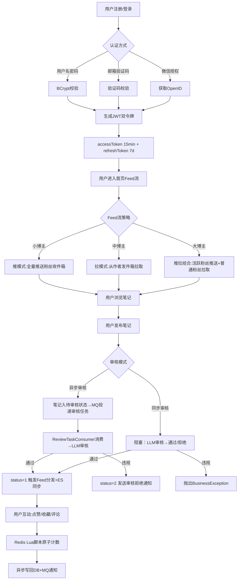

# 理享项目整体架构搭建与技术栈选型深度解析

## 一、项目核心概述

理享（Lixiang）是一个面向男性大学生群体的内容社区平台，定位类似于小红书，但聚焦于男性用户的内容消费与社交互动场景。后端采用 **Spring Boot 3.2 + MyBatis Plus + MySQL 8 + Redis 7 + RabbitMQ 3.12** 为核心技术栈，构建了一套从用户认证、内容发布、Feed 流分发、AI 审核到搜索引擎同步的完整服务链路。

本项目并非简单的 CRUD 单体应用——它在架构设计上充分考虑了社区平台的高并发读写特点：点赞/收藏/浏览等高频计数组件使用 Redis Lua 脚本 + 分布式锁保证原子性；Feed 流推送采用推/拉/推拉结合三种策略适配不同量级博主；内容审核则设计了同步阻塞 + 异步 MQ 双模式以兼容不同场景。本文将从项目顶层视角，拆解其整体架构、技术选型背后的考量、模块划分以及基础设施搭建细节。

## 二、整体架构梳理

以下是项目的分层架构图（文本描述），清晰展示了从前端到后端再到中间件的完整调用链路：

```
┌─────────────────────────────────────────────────────────────────────────┐
│                         前端层 (Vue 3 + Vite)                            │
│                    Nginx 反向代理 → API Gateway                         │
└─────────────────────────────────────────────────────────────────────────┘
                                    │
                                    ▼
┌─────────────────────────────────────────────────────────────────────────┐
│                      控制层 (Controller Layer)                           │
│  AuthController │ NoteController │ FeedController │ UserController      │
│  FollowController │ SearchController │ NotificationController ...       │
│                                                                         │
│  统一入口：@RateLimit注解限流 + JwtAuthenticationFilter认证 + 参数校验    │
└─────────────────────────────────────────────────────────────────────────┘
                                    │
                                    ▼
┌─────────────────────────────────────────────────────────────────────────┐
│                      服务层 (Service Layer)                              │
│  IAuthService │ INoteService │ IFeedService │ ICommentService            │
│  IUserService │ IFollowService │ INotificationService ...               │
│                                                                         │
│  核心设计：Redis计数缓存 + 分布式锁 + 事务同步器 + MQ异步投递           │
└─────────────────────────────────────────────────────────────────────────┘
                                    │
                                    ▼
┌─────────────────────────────────────────────────────────────────────────┐
│                      持久层 (Mapper Layer)                               │
│  NoteMapper │ UserMapper │ FeedPushLogMapper │ NoteReviewMapper ...     │
│  MyBatis Plus BaseMapper + 自定义XML SQL + LambdaQueryWrapper           │
└─────────────────────────────────────────────────────────────────────────┘
                                    │
                                    ▼
┌─────────────────────────────────────────────────────────────────────────┐
│                         基础设施层                                       │
│  ┌──────────┐  ┌──────────┐  ┌──────────┐  ┌──────────┐               │
│  │ MySQL 8  │  │ Redis 7  │  │RabbitMQ  │  │ ES(搜索) │               │
│  │ 主数据   │  │ 缓存/锁  │  │ 异步消息 │  │ 全文索引 │               │
│  └──────────┘  └──────────┘  └──────────┘  └──────────┘               │
│  ┌──────────┐  ┌──────────┐  ┌──────────┐                             │
│  │ OSS存储  │  │ Caffeine  │  │ Redisson │                             │
│  │ 图片视频 │  │ 本地缓存  │  │ 分布式锁 │                             │
│  └──────────┘  └──────────┘  └──────────┘                             │
└─────────────────────────────────────────────────────────────────────────┘
```

包结构设计遵循经典的分层架构，核心划分如下：

```
com.quxiangshe.backend
├── annotation/        # 自定义注解：@RateLimit
├── aspect/            # AOP切面：RateLimitAspect
├── common/            # 公共类：统一响应体R
├── component/         # 组件：SnowflakeIdGenerator、FeedPusher
├── config/            # 配置类：Security、RabbitMQ、Async、Redis、Oss...
├── consumer/          # MQ消费者：ReviewTaskConsumer、FeedPushConsumer...
├── controller/        # 控制器：14个Controller
├── dto/               # 数据传输对象：18个DTO
├── entity/            # 数据库实体：18个Entity
├── exception/         # 异常处理：GlobalExceptionHandler
├── mapper/            # MyBatis Mapper：18个Mapper
├── security/          # 安全相关：JwtAuthenticationFilter
├── service/           # 服务接口 + impl实现：46个类
│   └── sort/          # 排序策略：FullSortStrategy、BucketSortStrategy
├── task/              # 异步任务：ReviewAsyncTask
├── util/              # 工具类：Jwt、Password、RateLimiter、DistributedLock...
└── vo/                # 视图对象：NoteVO、UserVO、LoginVO、PageVO
```

## 三、完整业务流程图

以下使用 Mermaid 描述用户从注册到发布笔记再到内容消费的完整业务流程：



## 四、核心方案落地实现

### 4.1 Spring Boot 3.2 启动类

项目的入口类 `QuxiangsheApplication` 十分简洁，但包含了几个关键注解：

```java
@SpringBootApplication
@MapperScan("com.quxiangshe.backend.mapper")
@EnableConfigurationProperties
@EnableScheduling
public class QuxiangsheApplication {
    public static void main(String[] args) {
        SpringApplication.run(QuxiangsheApplication.class, args);
    }
}
```

- `@MapperScan`：自动扫描 MyBatis Plus 的 Mapper 接口，无需在每个 Mapper 上加 `@Mapper` 注解
- `@EnableScheduling`：开启定时任务支持（如热门榜单定时刷新、浏览数异步回写 DB）
- `@EnableConfigurationProperties`：启用 `@ConfigurationProperties` 绑定

### 4.2 三线程池隔离设计（AsyncConfig）

社区平台的不同异步任务对资源的需求截然不同，如果共用一个线程池，审核任务堆积会拖慢 Feed 推送，反之亦然。因此项目在 `AsyncConfig` 中定义了三个独立线程池：

```java
@Configuration
@EnableAsync
public class AsyncConfig {

    @Bean("pushExecutor")
    public Executor pushExecutor() {
        ThreadPoolTaskExecutor executor = new ThreadPoolTaskExecutor();
        executor.setCorePoolSize(5);
        executor.setMaxPoolSize(10);
        executor.setQueueCapacity(200);
        executor.setThreadNamePrefix("push-");
        executor.setRejectedExecutionHandler(new ThreadPoolExecutor.CallerRunsPolicy());
        executor.initialize();
        return executor;
    }

    @Bean("reviewExecutor")
    public Executor reviewExecutor() {
        ThreadPoolTaskExecutor executor = new ThreadPoolTaskExecutor();
        executor.setCorePoolSize(3);
        executor.setMaxPoolSize(8);
        executor.setQueueCapacity(500);
        executor.setThreadNamePrefix("review-");
        executor.setRejectedExecutionHandler(new ThreadPoolExecutor.CallerRunsPolicy());
        executor.initialize();
        return executor;
    }

    @Bean("feedDistributeExecutor")
    public Executor feedDistributeExecutor() {
        ThreadPoolTaskExecutor executor = new ThreadPoolTaskExecutor();
        executor.setCorePoolSize(2);
        executor.setMaxPoolSize(5);
        executor.setQueueCapacity(100);
        executor.setThreadNamePrefix("feed-dist-");
        executor.setRejectedExecutionHandler(new ThreadPoolExecutor.CallerRunsPolicy());
        executor.initialize();
        return executor;
    }
}
```

三个线程池的职责清晰：

| 线程池名称 | 核心/最大线程 | 队列容量 | 职责 |
|---|---|---|---|
| `pushExecutor` | 5/10 | 200 | Feed 流推送，博主发笔记后推送给粉丝 |
| `reviewExecutor` | 3/8 | 500 | AI 内容审核，队列容量大以应对突发审核 |
| `feedDistributeExecutor` | 2/5 | 100 | 智能分发，按粉丝活跃度优先级分批推送 |

所有线程池均采用 `CallerRunsPolicy` 拒绝策略——当队列满时由调用线程执行，保证任务不丢失。

### 4.3 Docker Compose 一键部署

项目的 `docker-compose.yml` 定义了完整的开发环境：

```yaml
services:
  mysql:
    image: mysql:8.0
    container_name: lixiang-mysql
    ports:
      - "3307:3306"
    volumes:
      - mysql_data:/var/lib/mysql
      - ./scripts/database/init.sql:/docker-entrypoint-initdb.d/init.sql
    healthcheck:
      test: ["CMD", "mysqladmin", "ping", "-h", "localhost"]

  redis:
    image: redis:7-alpine
    container_name: lixiang-redis
    command: redis-server --requirepass ${REDIS_PASSWORD}
    ports:
      - "6380:6379"

  rabbitmq:
    image: rabbitmq:3.12-management-alpine
    container_name: lixiang-rabbitmq
    ports:
      - "5672:5672"
      - "15672:15672"

  backend:
    build:
      context: ./backend
    container_name: lixiang-backend
    ports:
      - "8080:8080"
    depends_on:
      mysql:
        condition: service_healthy
      redis:
        condition: service_healthy
      rabbitmq:
        condition: service_healthy
```

`depends_on` 配合 `healthcheck` 确保后端服务在 MySQL、Redis、RabbitMQ 全部健康后才启动，避免了连接失败导致的启动崩溃问题。

## 五、多方案横向对比

### 5.1 框架选型：Spring Boot vs Spring Cloud

| 维度 | Spring Boot 3.2 | Spring Cloud |
|---|---|---|
| 架构复杂度 | 单体/模块化，部署简单 | 微服务，需服务发现、配置中心、网关 |
| 运维成本 | 低，一个 JAR 即可运行 | 高，需维护注册中心、配置中心 |
| 团队规模要求 | 1-3 人即可 | 至少 5 人以上 |
| 性能开销 | 低，无 RPC 序列化损耗 | 有网络调用和序列化开销 |
| 适用场景 | 中小型项目、快速迭代 | 大型分布式系统 |

### 5.2 ORM 选型：MyBatis Plus vs JPA/Hibernate vs 原生 JDBC

| 维度 | MyBatis Plus 3.5 | JPA/Hibernate | 原生 JDBC |
|---|---|---|---|
| SQL 可控性 | 高，支持自定义 SQL | 低，自动生成 SQL 难以优化 | 最高 |
| 开发效率 | 高，BaseMapper 开箱即用 | 中，注解配置繁琐 | 低，大量模板代码 |
| 复杂查询支持 | LambdaQueryWrapper 链式调用 | JPQL/Criteria API | 手写 SQL |
| 社区生态 | 国内主流，文档丰富 | 国际主流 | - |

### 5.3 存储选型：MySQL vs MongoDB

| 维度 | MySQL 8 | MongoDB |
|---|---|---|
| 事务支持 | ACID 事务完善 | 4.0+ 支持多文档事务但性能差 |
| 关联查询 | JOIN 能力强 | 需要 $lookup，性能受限 |
| 数据结构灵活性 | 固定 Schema | Schema-less JSON 文档 |
| 运维成熟度 | 极高，DBA 生态完善 | 需要额外学习成本 |

## 六、项目选型原因

**选择 Spring Boot 3.2 而非 Spring Cloud 的理由**：理享项目当前处于早期快速迭代阶段，团队规模小，业务边界相对清晰。过早引入微服务架构会带来不必要的分布式事务、服务间通信延迟、运维复杂度等问题。Spring Boot 3.2 的单体模块化架构足够支撑十万级 DAU，未来当单点性能瓶颈出现时，再考虑垂直拆分到 Spring Cloud 也是顺滑的迁移路径——因为我们已经在代码层面按照 controller/service/mapper 做到了清晰的分层解耦。

**选择 MyBatis Plus 而非 JPA 的理由**：内容社区的数据查询场景复杂多变——笔记列表需要多表 JOIN 用户信息、Feed 流需要复杂的分页游标查询、热门榜单需要聚合统计。JPA 的自动 SQL 生成在面对这些复杂查询时往往力不从心，而 MyBatis Plus 的 LambdaQueryWrapper 既提供了类型安全的链式查询，又保留了手写 SQL 的灵活性。`NoteMapper.selectDiscoverNotesWithExclude()` 这种需要排除已展示 ID 列表的查询，在 JPA 中实现会非常痛苦。

**选择 MySQL 而非 MongoDB 的理由**：笔记、用户、关注关系、点赞记录之间存在大量关联查询。例如个人主页需要同时查询用户信息、笔记列表、获赞总数，在 MongoDB 中需要多次 `$lookup`，性能远不如 MySQL 的 JOIN。此外，我们使用 Flyway 做数据库版本管理，MySQL 的 DDL 事务在 8.0 版本已相当成熟。

**选择 RabbitMQ 而非 Kafka 的理由**：理享的消息量级目前并不需要 Kafka 的高吞吐能力。RabbitMQ 的灵活路由（Direct Exchange + DLX）、管理界面友好、Spring AMQP 集成成熟度高，在中小规模场景下是更务实的选择。六组业务队列（Feed 推送、私信、通知、邮件、视频转码、内容审核）清晰划分了消息域。

## 七、踩坑记录与问题解决

**踩坑 1：Redisson 与 spring-boot-starter-data-redis 冲突**

在引入 `redisson-spring-boot-starter` 后，启动时报 `No qualifying bean of type 'RedisConnectionFactory'`。原因是 Redisson starter 默认排除了 Spring Data Redis 的自动配置，但项目中部分代码仍依赖 `StringRedisTemplate`。

**解决方案**：在 pom.xml 中显式排除 Redisson 自带的 Redis 依赖，保留 Spring Data Redis：

```xml
<dependency>
    <groupId>org.redisson</groupId>
    <artifactId>redisson-spring-boot-starter</artifactId>
    <version>3.23.0</version>
    <exclusions>
        <exclusion>
            <groupId>org.springframework.boot</groupId>
            <artifactId>spring-boot-starter-data-redis</artifactId>
        </exclusion>
    </exclusions>
</dependency>
```

**踩坑 2：Spring Boot 3.x 下 `javax.*` 迁移到 `jakarta.*`**

Spring Boot 3.x 基于 Jakarta EE 9，所有 `javax.servlet.*` 包需要替换为 `jakarta.servlet.*`。在 JwtAuthenticationFilter 中使用了 `jakarta.servlet.FilterChain`，但在其他第三方依赖（如部分旧版 Knife4j）中仍有 `javax` 引用。最终引入了 `knife4j-openapi3-jakarta-spring-boot-starter` 的 Jakarta 适配版本解决。

**踩坑 3：MyBatis Plus 乐观锁在 Spring Boot 3.2 下需要显式配置**

MyBatis Plus 的 `@Version` 注解在 Spring Boot 3.2 默认不会自动注册乐观锁拦截器，需要手动配置：

```java
@Configuration
public class MyBatisPlusConfig {
    @Bean
    public MybatisPlusInterceptor mybatisPlusInterceptor() {
        MybatisPlusInterceptor interceptor = new MybatisPlusInterceptor();
        interceptor.addInnerInterceptor(new OptimisticLockerInnerInterceptor());
        return interceptor;
    }
}
```

## 八、性能优化与高并发设计

**1. 三级缓存体系**：Caffeine 本地缓存（5-10 分钟）作为最热数据的第一道防线，Redis 作为二级缓存（热度数据 15 分钟），MySQL 作为数据真相源。本地缓存命中率可达 90%+，大幅降低了 Redis 的网络 IO。

**2. Redis Pipeline 批量操作**：Feed 流批量写入时使用 Redis Pipeline，将多次 Redis 命令打包一次网络往返发送，相比单条发送性能提升 5-10 倍。

**3. 计数器的读写分离**：点赞数、收藏数、浏览数等高频更新字段在 Redis 中维护实时值（Lua 脚本原子操作），数据库中的字段作为异步回写的备份。读取时优先 Redis，Redis 不可用时降级到 DB。这种设计将热点写操作的压力从 MySQL 转移到了 Redis。

**4. 连接池优化**：HikariCP 连接池配置了 `maximumPoolSize=20`、`minimumIdle=5`，配合 MySQL 的 `max_connections=200`，确保连接不会被耗尽。RabbitMQ 消费者配置了 `ConcurrentConsumers=10`、`MaxConcurrentConsumers=20`，动态伸缩以应对消息量波动。

## 九、总结与后续迭代方向

理享项目通过 Spring Boot 3.2 + MyBatis Plus + Redis + RabbitMQ 的技术组合，在保证开发效率的同时，已经具备了一定的高并发处理能力。三线程池隔离设计确保了核心业务（内容审核、Feed 推送、智能分发）不会互相干扰；Docker Compose 一键部署让开发环境的搭建成本降到了最低。

**后续迭代方向**：

1. **服务拆分**：当 DAU 突破 10 万后，拟将用户服务、笔记服务、Feed 服务拆分为独立微服务，使用 Spring Cloud Gateway 做统一网关
2. **接入 Sentinels**：引入阿里 Sentinel 做流量控制和熔断降级，替代当前自研的限流组件
3. **ES 搜索优化**：目前只做了简单的笔记同步，后续需要接入 IK 分词器、拼音搜索、搜索建议
4. **可观测性**：集成 Prometheus + Grafana 做指标监控，SkyWalking 做链路追踪
5. **灰度发布**：使用 Nacos 做配置中心，支持功能开关和灰度策略
