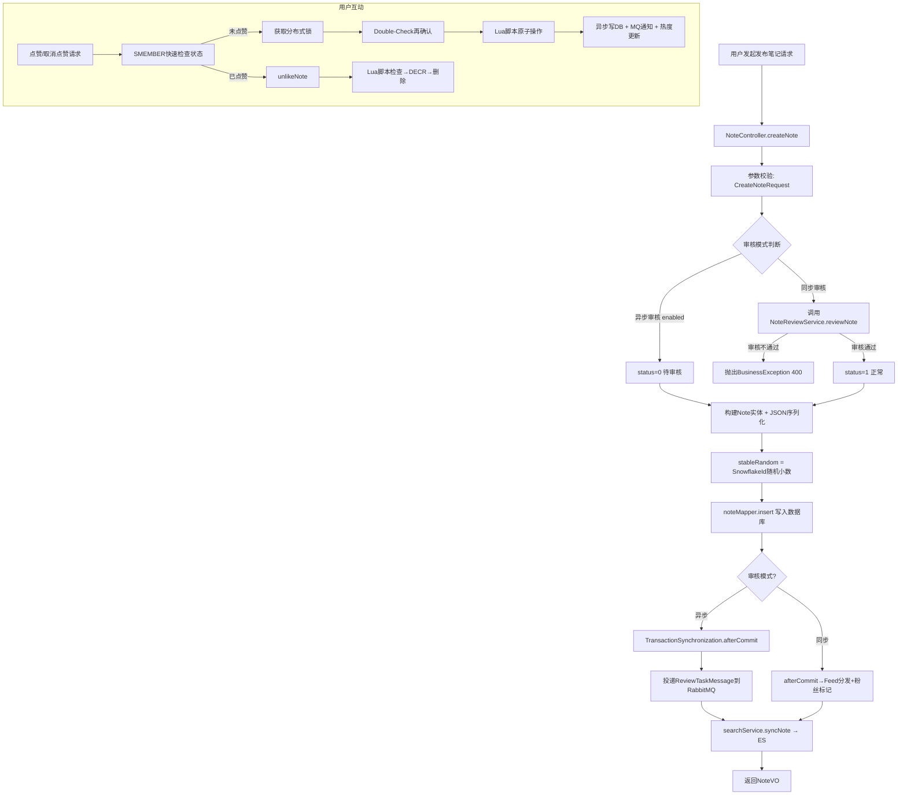

# 趣享社笔记发布功能与数据库设计深度解析

## 一、项目核心概述

​	笔记是趣享社社区的内容载体，也是整个系统的核心业务实体。笔记模块承载了从内容发布、多模态存储（图片/视频）、点赞收藏计数、发现页随机推荐到热度榜单计算的一整条链路。本文聚焦于笔记发布的全流程设计——从 `CreateNoteRequest` 入参校验到 `NoteVO` 响应组装，从图片 JSON 序列化到 SnowflakeId 稳定随机值生成，从 Redis Lua 脚本原子计数到分布式锁防并发重复操作。我们将逐一剖析这些设计的实现细节与工程考量。

## 二、整体架构梳理

笔记模块的架构围绕"Redis 作为实时计数器 + MySQL 作为真相源"的核心原则展开：

```
┌──────────────────────────────────────────────────────────────────────┐
│                    NoteController (REST API)                          │
│  POST /api/note → createNote()                                       │
│  GET  /api/note/{id} → getNoteDetail()                               │
│  POST /api/note/{id}/like → likeNote() (Toggle模式)                  │
│  POST /api/note/{id}/favorite → favoriteNote()                       │
│  GET  /api/discover → getDiscoverNotes() (游标翻页)                  │
└──────────────────────────────────────────────────────────────────────┘
                                    │
                                    ▼
┌──────────────────────────────────────────────────────────────────────┐
│                    NoteServiceImpl (核心业务层)                        │
│  ┌─────────────────────────────────────────────────────────────┐    │
│  │ createNote() 发布笔记                                        │    │
│  │   ├── 构建Note实体 (状态=待审核/正常)                        │    │
│  │   ├── JSON序列化 images[] / tags[]                          │    │
│  │   ├── stableRandom = SnowflakeId随机小数                     │    │
│  │   └── TransactionSynchronization → afterCommit异步审核       │    │
│  ├─────────────────────────────────────────────────────────────┤    │
│  │ likeNote()/favoriteNote() 互动计数                           │    │
│  │   ├── SMEMBER快速检查 (无锁)                                 │    │
│  │   ├── Redisson分布式锁 + Double-Check                        │    │
│  │   ├── Lua脚本原子INCR/DECR + SADD/SREM                       │    │
│  │   └── 异步写回DB + MQ通知                                    │    │
│  └─────────────────────────────────────────────────────────────┘    │
└──────────────────────────────────────────────────────────────────────┘
                                    │
                                    ▼
┌──────────────────────────────────────────────────────────────────────┐
│                    数据存储层                                         │
│  ┌──────────────┐  ┌──────────────────────────────────────────┐    │
│  │ MySQL note表 │  │ Redis 缓存层                              │    │
│  │  主数据+计数 │  │  note:like:count:{id}    点赞计数器       │    │
│  │              │  │  note:liked:{id}        已点赞用户Set     │    │
│  │              │  │  note:favorite:count:{id} 收藏计数器      │    │
│  │              │  │  note:favorited:{id}     已收藏用户Set    │    │
│  │              │  │  note:view:count:{id}    浏览计数器       │    │
│  │              │  │  note:hot               热门榜单ZSet      │    │
│  └──────────────┘  └──────────────────────────────────────────┘    │
└──────────────────────────────────────────────────────────────────────┘
```

## 三、完整业务流程图



## 四、核心方案落地实现

### 4.1 笔记实体设计（Note.java）

```java
@Data
@TableName("note")
public class Note {
    @TableId(type = IdType.AUTO)
    private Long id;
    private Long userId;

    @Version
    private Integer version;       // 乐观锁，防止并发更新覆盖

    private String title;
    private String content;
    private String images;         // JSON数组: ["url1","url2"]
    private String video;
    private String videoCover;
    private String tags;           // JSON数组: ["标签1","标签2"]

    private BigDecimal stableRandom; // 稳定随机排序字段(16位小数)，用于发现页

    private Integer likeCount;
    private Integer commentCount;
    private Integer favoriteCount;
    private Integer viewCount;
    private Integer forwardCount;
    private Double hotScore;       // 热度值: like×1+comment×2+favorite×3+forward×5

    private Integer status;        // 0-待审核 1-正常 2-违规下架
    private LocalDateTime createdAt;
    private LocalDateTime updatedAt;
    private LocalDateTime deletedAt; // 软删除
}
```

关键设计解读：
- **images / tags 存储为 JSON 字符串**：避免建立一对多的关联表，减少 JOIN 查询。序列化和反序列化在 Service 层通过 Jackson 完成
- **stableRandom**：使用 SnowflakeId 生成稳定且全局唯一的随机小数（BigDecimal），用于发现页的"随机但可分页"的游标排序
- **乐观锁 @Version**：防止并发场景下（如热度批量更新）出现丢失更新的问题
- **软删除 deletedAt**：删除笔记时不物理删除记录，而是设置 `deletedAt` 时间戳并更新 `status=2`，方便数据恢复和审计
- **hotScore 热度分**：`hotScore = like × 1 + comment × 2 + favorite × 3 + forward × 5`，用于热门榜单排序

### 4.2 发布笔记核心流程（NoteServiceImpl.createNote）

```java
@Override
@Transactional
public NoteVO createNote(Long userId, CreateNoteRequest request) {
    //构建笔记实体
    Note note = new Note();
    note.setUserId(userId);
    note.setTitle(request.getTitle());
    note.setContent(request.getContent());

    // 根据审核模式设置初始状态
    if (asyncReviewEnabled && reviewAsyncTask != null) {
        note.setStatus(0);  // 异步审核：待审核
    } else {
        // 同步审核：直接调用审核服务，不通过则抛异常
        if (noteReviewService != null) {
            NoteReviewService.ReviewResponse reviewResponse =
                noteReviewService.reviewNote(null, userId, request);
            if (!reviewResponse.isPassed()) {
                throw new BusinessException(400, reviewResponse.getMessage());
            }
        }
        note.setStatus(1);  // 审核通过
    }

    // 初始化计数器为0
    note.setLikeCount(0);
    note.setCommentCount(0);
    note.setFavoriteCount(0);
    note.setStableRandom(generateStableRandom());

    // JSON序列化图片和标签
    if (request.getImages() != null && !request.getImages().isEmpty()) {
        note.setImages(objectMapper.writeValueAsString(request.getImages()));
    }
    if (request.getTags() != null && !request.getTags().isEmpty()) {
        note.setTags(objectMapper.writeValueAsString(request.getTags()));
    }
    noteMapper.insert(note);  // 入库获得自增ID

    // 异步审核模式下：事务提交后通过MQ投递审核任务
    if (asyncReviewEnabled && reviewAsyncTask != null) {
        final Long noteId = note.getId();
        TransactionSynchronizationManager.registerSynchronization(
            new TransactionSynchronization() {
                @Override
                public void afterCommit() {
                    ReviewTaskMessage message = ReviewTaskMessage.builder()
                        .noteId(noteId).userId(userId)
                        .title(request.getTitle()).content(request.getContent())
                        .imageUrls(request.getImages())
                        .submitTime(System.currentTimeMillis()).build();
                    rabbitTemplate.convertAndSend(
                        RabbitMQConfig.REVIEW_EXCHANGE,
                        RabbitMQConfig.REVIEW_ROUTING_KEY, message);
                }
            });
    }

    searchService.syncNote(note.getId());  // 同步到ES
    return buildNoteVO(note, userId);
}
```

**为什么使用 TransactionSynchronization.afterCommit 而不是直接发送 MQ 消息？**

如果在 `@Transactional` 方法内直接发送 MQ 消息，但后续数据库操作失败导致事务回滚，那么 MQ 消息已经发出，消费者会处理一个不存在（或未提交）的笔记。这是一个经典的 **事务消息一致性** 问题。`afterCommit` 确保只有在数据库事务成功提交后，MQ 消息才会被投递。

### 4.3 Redis + Lua 脚本原子点赞（likeNote）

点赞是社区平台最高频的操作之一，直接写 MySQL 在高并发下会成为瓶颈。理享项目用 Redis 作为实时计数器的核心逻辑如下：

**点赞 Lua 脚本**（LIKE_SCRIPT）：
```lua
local current = redis.call('INCR', KEYS[1])    -- 点赞数+1
redis.call('SADD', KEYS[2], ARGV[1])            -- 将用户加入"已点赞该笔记"集合
redis.call('SADD', KEYS[3], KEYS[1])            -- 将该笔记加入"用户已点赞"集合
return current
```

**取消点赞 Lua 脚本**（UNLIKE_SCRIPT），特别注意修复了 DECR 竞态：
```lua
local current = redis.call('GET', KEYS[1])      -- 先获取当前值
if current == false or tonumber(current) <= 0 then
  return 0                                       -- 保护：不会将点赞数减到负数
end
current = redis.call('DECR', KEYS[1])            -- 原子递减
redis.call('SREM', KEYS[2], ARGV[1])            -- 从集合中移除
return current
```

**踩坑修复说明**：初版脚本直接执行 `DECR` 再检查是否为负数，但 DECR 本身就是原子操作，如果计数器已经是 0，DECR 会变成 -1。修复后改为 **先 GET 检查，仅 > 0 时才执行 DECR**。

Java 端完整的并发安全策略（三步走）：

```java
public Map<String, Object> likeNote(Long noteId, Long userId) {
    // 第一层：无锁快速校验，通过Redis判断用户是否已点赞，提升高并发下查询性能
    Boolean hasLiked = redisTemplate.opsForSet()
        .isMember(NOTE_LIKED_USERS_KEY + noteId, userId.toString());
    // 已点赞则执行取消点赞逻辑
    if (Boolean.TRUE.equals(hasLiked)) {
        return unlikeNote(noteId, userId);
    }

    // 第二层：获取分布式锁，防止高并发下重复点赞、数据错乱
    RLock lock = redissonClient.getLock("like:note:" + noteId);
    lock.tryLock(5, 30, TimeUnit.SECONDS);
    try {
        // 第三层：加锁后二次校验（Double-Check），避免并发场景下重复操作
        hasLiked = redisTemplate.opsForSet()
            .isMember(NOTE_LIKED_USERS_KEY + noteId, userId.toString());
        if (Boolean.TRUE.equals(hasLiked)) {
            Long count = getRedisLikeCount(noteId);
            return Map.of("liked", false, "likeCount", count);
        }

        // 执行Redis Lua脚本，保证点赞计数、记录用户行为的原子性操作
        Long newCount = redisTemplate.execute(
            RedisScript.of(LIKE_SCRIPT, Long.class),
            Arrays.asList(likeCountKey, likedUsersKey, userLikedKey),
            userId.toString()
        );

        // 异步将点赞关系持久化到数据库，不阻塞主线程，提升接口响应速度
        asyncSaveLikeRelationToDb(noteId, userId);
        // 笔记热度值+1，用于推荐流排序
        incrementHotScore(noteId, 1);

        // 通过MQ异步发送点赞通知，解耦通知业务，不影响主流程
        rabbitTemplate.convertAndSend(NOTIFICATION_EXCHANGE, NOTIFICATION_ROUTING_KEY, msg);

        // 返回点赞成功结果与最新点赞数
        return Map.of("liked", true, "likeCount", newCount);
    } finally {
        // 释放锁，仅当前线程持有锁时才解锁，防止误解锁
        if (lock.isHeldByCurrentThread()) lock.unlock();
    }
}
```

**为什么选择 Redis 原子计数器而非直接写数据库？**
1. **性能**：Redis 单机 QPS 可达 10 万+，MySQL 写入约 1k-3k TPS
2. **热度联动**：点赞后需要同步更新 Redis ZSet 热度榜，Redis 内操作天然原子
3. **用户状态查询**：判断用户是否已点赞可通过 Redis Set 的 O(1) 时间复杂度完成
4. **最终一致性**：异步写回 DB 保证了数据不丢失，DB 中的计数作为兜底

### 4.4 图片上传与视频处理

​	趣享社支持多图上传（List<String> images），存储方案为**阿里云 OSS**。上传时前端先获取 OSS 临时签名 URL，直传到 OSS 避免流量经过后端服务：

```java
// OssServiceImpl 签名URL生成
public String getSignedUrl(String objectKey) {
    Date expiration = new Date(System.currentTimeMillis() + 3600 * 1000L);
    return ossClient.generatePresignedUrl(
        bucketName, objectKey, expiration).toString();
}
```

视频上传后支持自动转码，通过 MQ 异步投递视频转码任务：

```java
// ReviewAsyncTask.handleReviewResult 中审核通过后的处理
if (note.getVideo() != null && !note.getVideo().isEmpty()) {
    VideoTranscodeMessage msg = VideoTranscodeMessage.builder()
        .noteId(noteId)
        .originalUrl(note.getVideo())
        .targetFormat("mp4")
        .targetWidth(1280).targetHeight(720)
        .build();
    rabbitTemplate.convertAndSend(VIDEO_EXCHANGE, VIDEO_ROUTING_KEY, msg);
}
```

## 五、多方案横向对比

### 5.1 计数器方案：Redis原子操作 vs DB直接更新 vs 异步消息队列

| 维度 | Redis Lua原子操作 | DB直接UPDATE | 异步MQ+批量写 |
|---|---|---|---|
| 实时性 | 毫秒级 | 取决于DB负载 | 秒级延迟 |
| 并发能力 | 10万+ QPS | 1k-3k TPS | 取决于消费者 |
| 数据一致性 | 最终一致(异步回写) | 强一致 | 最终一致 |
| 实现复杂度 | Lua脚本+分布式锁 | 简单 | MQ+消费者 |
| 热点幂等 | 需Double-Check | DB唯一索引 | 消费者去重 |

### 5.2 图片存储：OSS vs 本地存储 vs Base64

| 维度 | 阿里云OSS | 本地存储(NAS) | Base64存DB |
|---|---|---|---|
| 访问速度 | CDN加速，全球覆盖 | 取决于服务器带宽 | 每次传输完整数据 |
| 存储成本 | 按量付费，弹性缩放 | 需提前规划容量 | 数据库膨胀严重 |
| 可靠性 | 99.9999999999% | 需自行备份 | 依赖DB备份 |
| 图片处理 | 内置缩放/裁剪/水印 | 需自行开发 | 不支持 |

## 六、项目选型原因

​	**选择 Redis Lua 脚本计数**的核心原因是社区平台的高频互动特性。以点赞为例，热门笔记每分钟可能产生数千次点赞，直接写 DB 会造成严重的锁竞争和连接池耗尽。Redis 的单线程模型天然适合计数器场景，Lua 脚本保证了对多个 Key 操作的原子性。异步回写 DB 的策略则确保了即使 Redis 故障重启，数据也能从 DB 恢复。

​	**选择 OSS + 签名 URL**的方案主要考量两点：一是图片流量直接走 OSS CDN，不经过后端服务，节省了服务器带宽；二是签名 URL 机制让私有 Bucket 中的图片也能安全地对外暴露——前端无法根据 URL 规律猜测其他用户的图片。

**选择 SnowflakeId 作为 stableRandom**：发现页需要一种"随机但可分页"的排序方式。如果用纯 RAND()，每次翻页结果都会不同（重复或遗漏）。SnowflakeId 生成的 64 位数字天然的全局有序但不连续，转换为 16 位小数后可作为稳定的"随机种子"，配合游标翻页实现了真正的"每次刷新不同，翻页不重复"的效果。

## 七、踩坑记录与问题解决

**踩坑 1：取消点赞 DECR 竞态导致负数**

​	初版取消点赞 Lua 脚本直接执行 `DECR`，但在并发场景下可能出现点赞数为负数的情况。原因是两个并发取消请求都通过了 SMEMBER 检查（第一个执行 DECR 前，第二个也读到了 hasLiked=true）。

**解决方案**：改为"先 GET 当前值，仅 > 0 时 DECR"的策略。虽然单个 Lua 脚本内不存在竞态，但两个脚本调用之间仍可能读到不一致状态——最终通过 **SMEMBER 快速检查 + 分布式锁 + Double-Check** 的三层防护解决。

**踩坑 2：Spring AOP 中注入 @Lazy Bean 的循环依赖**

​	`NoteServiceImpl` 同时依赖了 `IFeedService`、`IOssService`、`INotificationService` 等多个接口，而它们有些又间接依赖 `INoteService`。直接 `@Autowired` 会导致 Bean 创建循环依赖。

**解决方案**：在循环依赖的注入点加上 `@Lazy`：
```java
@Lazy @Autowired private IFeedService feedService;
@Lazy @Autowired private IOssService ossService;
@Lazy @Autowired private INotificationService notificationService;
```
`@Lazy` 让 Spring 注入的是代理对象，只有在首次调用时才真正获取目标 Bean，打破了循环依赖链。

## 八、性能优化与高并发设计

​	**1. 计数器的 Redis-Centric 架构**：所有高频计数操作在 Redis 完成，DB 仅作为异步备份。读取时优先 Redis（SMEMBER 判断状态、GET 获取计数），Redis 不可用时降级到 DB。这种设计将 DB 的写入压力降低了 90% 以上。

​	**2. 分布式锁的精简持有时长**：点赞锁的持有时间仅为 Lua 脚本执行时间（微秒级），30 秒的锁超时是防止死锁的兜底机制，实际锁释放由 `try-finally` 保证。

​	**3. 热点数据本地缓存**：笔记详情中频繁读取的用户信息（头像、昵称）通过 Caffeine 本地缓存（10 分钟），减少了 Redis 的网络 IO。

​	**4. 秒级热榜异步刷新**：热度榜单使用 Redis ZSet 维护，定时任务每分钟增量更新前 100 条笔记的热度分数，避免每次点赞都执行 O(log N) 的 ZADD 操作。

## 九、总结与后续迭代方向

​	趣享社的笔记模块以"Redis 实时计数 + DB 最终一致"为核心设计理念，在互动性能和数据可靠性之间取得了平衡。双模式审核（同步/异步）在发布体验和内容安全之间提供了灵活选择。图片和视频的 OSS 存储方案则让多媒体内容的存储和分发与后端服务充分解耦。

**后续迭代方向**：

1. **热度公式优化**：引入时间衰减因子，让新笔记有更多曝光机会，而非老笔记的计数剪刀差越来越大
2. **点赞分库分表**：当单表数据量超过千万时，按 noteId 做一致性哈希分表
3. **Redis Cluster 迁移**：从单机 Redis 迁移到 Cluster 模式，解决内存容量和单点故障问题
4. **推荐算法接入**：在发现页中引入协同过滤和内容推荐，替代纯随机排序
