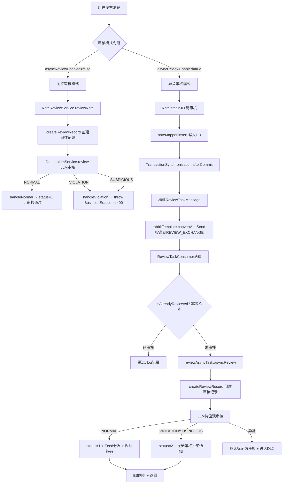

# 趣享社同步审核+异步审核双模式与MQ消息投递深度解析

## 一、项目核心概述

​	内容安全是 UGC 社区平台的生死线。趣享社项目的内容审核模块设计了一套"同步阻塞审核 + 异步 MQ 审核"的双模式方案：对于信任用户可直接在发布接口内完成同步审核（即时反馈），对于普通用户则通过 RabbitMQ 异步投递审核任务（不阻塞发布体验）。审核链路包含三层：第一层 AC 自动机敏感词检测、第二层 RAG 相似案例检索、第三层豆包大模型价值观判定。本文深入探讨这套双模式审核的架构设计、MQ 消息可靠投递、幂等性保障以及死信队列的兜底机制。

## 二、整体架构梳理

```
┌──────────────────────────────────────────────────────────────────────┐
│                    NoteServiceImpl.createNote()                       │
│                                                                      │
│  ┌──────────────────────────────────────────────────────────┐       │
│  │ asyncReviewEnabled && reviewAsyncTask != null ?           │       │
│  │                                                          │       │
│  │  YES ──→ status=0 (待审核)                               │       │
│  │          afterCommit → 投递 ReviewTaskMessage 到 MQ      │       │
│  │                                                          │       │
│  │  NO  ──→ NoteReviewService.reviewNote() 同步审核         │       │
│  │          通过→status=1  违规→throw BusinessException     │       │
│  └──────────────────────────────────────────────────────────┘       │
└──────────────────────────────────────────────────────────────────────┘
                    │                         │
                    │ 同步模式                │ 异步模式
                    ▼                         ▼
┌───────────────────────────┐   ┌──────────────────────────────────────┐
│ NoteReviewService         │   │      RabbitMQ REVIEW_QUEUE            │
│ ├── createReviewRecord()  │   │                                      │
│ ├── DoubaoLlmService      │   │  ┌─────────────────────────────┐     │
│ │   .review(title,content)│   │  │ ReviewTaskConsumer          │     │
│ ├── handleNormal()        │   │  │ ├── isAlreadyReviewed()     │     │
│ └── handleViolation()     │   │  │ │   幂等检查 (幂等性保障)   │     │
└───────────────────────────┘   │  │ ├── reviewAsyncTask        │     │
                                │  │ │   .asyncReview()         │     │
                                │  │ │   调用LLM审核服务         │     │
                                │  │ └── 异常→进入DLX死信队列   │     │
                                │  └─────────────────────────────┘     │
                                │                                      │
                                │  ┌─────────────────────────────┐     │
                                │  │ REVIEW_DLX_QUEUE (死信队列)  │     │
                                │  │ 多次重试失败的消息进入DLX    │     │
                                │  │ 运维人员手动排查+补偿        │     │
                                │  └─────────────────────────────┘     │
                                └──────────────────────────────────────┘
```

## 三、完整业务流程图



## 四、核心方案落地实现

### 4.1 TransactionSynchronizationManager 保障事务一致性

这是异步审核模式中最精妙的设计——**只有在数据库事务成功提交后，MQ 消息才会被投递**：

```java
// NoteServiceImpl.createNote() 中的关键代码
if (asyncReviewEnabled && reviewAsyncTask != null) {
    final Long noteId = note.getId();
    final Long authorId = userId;

    TransactionSynchronizationManager.registerSynchronization(
        new TransactionSynchronization() {
            @Override
            public void afterCommit() {
                ReviewTaskMessage message = ReviewTaskMessage.builder()
                    .noteId(noteId)
                    .userId(authorId)
                    .title(title)
                    .content(content)
                    .imageUrls(images)
                    .submitTime(System.currentTimeMillis())
                    .build();
                rabbitTemplate.convertAndSend(
                    RabbitMQConfig.REVIEW_EXCHANGE,
                    RabbitMQConfig.REVIEW_ROUTING_KEY,
                    message
                );
            }
        });
}
```

**为什么必须这样做？** 假设没有 `afterCommit`，直接在 `noteMapper.insert(note)` 之后发送 MQ 消息：

1. 如果后续某行代码抛异常（如 ES 同步失败、缓存更新异常），导致事务回滚
2. MQ 消息已经发出，消费者开始消费这个 noteId 的审核任务
3. 但数据库中该笔记实际不存在（因为事务回滚了）
4. 消费者报错 → 重试 → 仍然报错 → 进入死信队列

这被称为**事务消息不一致**问题。`afterCommit` 完美解决了它——事务不提交，消息不发；事务提交了，消息才发出。

### 4.2 RabbitMQ 配置：六组业务队列的完整定义

```java
/**
 * RabbitMQ 配置类
 * 配置条件：根据 rabbitmq.enabled 开关决定是否加载，默认开启
 */
@Configuration
@ConditionalOnProperty(name = "rabbitmq.enabled", havingValue = "true", matchIfMissing = true)
public class RabbitMQConfig {

    // ========== 审核队列相关常量定义 ==========
    /** 审核业务交换机 */
    public static final String REVIEW_EXCHANGE = "quxiangshe.review.exchange";
    /** 审核业务队列 */
    public static final String REVIEW_QUEUE = "quxiangshe.review.queue";
    /** 审核路由键 */
    public static final String REVIEW_ROUTING_KEY = "review.task";
    /** 审核死信交换机 */
    public static final String REVIEW_DLX_EXCHANGE = "quxiangshe.review.exchange.dlx";
    /** 审核死信队列 */
    public static final String REVIEW_DLX_QUEUE = "quxiangshe.review.queue.dlx";

    /**
     * 审核业务队列
     * 配置了死信交换机，消息消费失败后会进入死信队列
     */
    @Bean
    public Queue reviewQueue() {
        return QueueBuilder.durable(REVIEW_QUEUE)
            .withArgument("x-dead-letter-exchange", REVIEW_DLX_EXCHANGE)
            .withArgument("x-dead-letter-routing-key", "review.dlq")
            .build();
    }

    /**
     * 死信队列：用于存储审核失败/异常消息
     */
    @Bean
    public Queue reviewDlxQueue() {
        return QueueBuilder.durable(REVIEW_DLX_QUEUE).build();
    }

    /**
     * 消费者工厂配置：定义并发、预取、手动ACK、死信策略
     */
    @Bean
    public SimpleRabbitListenerContainerFactory rabbitListenerContainerFactory(
            ConnectionFactory connectionFactory) {
        SimpleRabbitListenerContainerFactory factory = new SimpleRabbitListenerContainerFactory();
        factory.setConnectionFactory(connectionFactory);
        factory.setMessageConverter(jsonMessageConverter());
        factory.setConcurrentConsumers(10);       // 基础并发消费者10个
        factory.setMaxConcurrentConsumers(20);    // 最大并发消费者20个
        factory.setPrefetchCount(10);             // 每个消费者预取10条消息
        factory.setDefaultRequeueRejected(false); // 消费失败不重回队列，进入死信
        factory.setAcknowledgeMode(AcknowledgeMode.MANUAL); // 手动ACK保证消息可靠
        return factory;
    }
}
```

死信队列（DLX）的触发条件：
1. 消息被消费者拒绝（basic.reject / basic.nack）且 requeue=false
2. 消息 TTL 过期
3. 队列达到最大长度

本项目中设置 `setDefaultRequeueRejected(false)` 确保消费失败的消息直接进入 DLX 而非无限重试。

`@ConditionalOnProperty` 注解让 RabbitMQ 在配置关闭时整个配置模块都不会加载，方便在开发/测试环境中禁用消息队列。

### 4.3 幂等性保障（ReviewTaskConsumer）

消费者最核心的防护就是幂等性检查，防止同一笔记被重复审核：

```java
@Component
@RequiredArgsConstructor
public class ReviewTaskConsumer {

    private final NoteReviewMapper noteReviewMapper;
    private final ReviewAsyncTask reviewAsyncTask;

    /**
     * 监听审核队列，消费笔记审核消息
     * @param message 审核任务消息体
     * @param deliveryTag 消息投递标识，用于手动ACK
     */
    @RabbitListener(queues = RabbitMQConfig.REVIEW_QUEUE)
    public void consumeReviewTask(ReviewTaskMessage message,
                                  @Header(AmqpHeaders.DELIVERY_TAG) long deliveryTag) {
        log.info("收到审核任务: noteId={}, userId={}", message.getNoteId(), message.getUserId());

        try {
            // 幂等校验：防止重复消费，已审核笔记直接跳过
            if (isAlreadyReviewed(message.getNoteId())) {
                log.info("笔记已审核，跳过: noteId={}", message.getNoteId());
                return;
            }

            // 执行异步内容审核（包含违规词检测、LLM审核、违规数据入库）
            reviewAsyncTask.asyncReview(
                message.getNoteId(), message.getUserId(),
                message.getTitle(), message.getContent(),
                message.getImageUrls()
            );

            log.info("审核任务完成: noteId={}", message.getNoteId());
        } catch (Exception e) {
            // 异常捕获：打印错误日志，抛出异常触发死信队列
            log.error("审核任务执行失败: noteId={}", message.getNoteId(), e.getMessage());
            throw e;
        }
    }

    /**
     * 幂等判断：查询数据库确认笔记是否已审核
     * reviewStatus != 0 代表已完成审核（通过/拒绝）
     */
    private boolean isAlreadyReviewed(Long noteId) {
        if (noteId == null) return false;
        NoteReview existing = noteReviewMapper.selectByNoteId(noteId);
        return existing != null && existing.getReviewStatus() != 0;
    }
}
```

​	幂等检查的原理：`note_review` 表中 `note_id` 字段有唯一索引，对于同一个 noteId 只会存在一条审核记录。`reviewStatus != 0`（非"待审核"状态）意味着该笔记已完成审核，无需重复处理。这样即使 MQ 因网络问题重复投递了同一条消息，消费者也能安全跳过。

### 4.4 异步审核执行体（ReviewAsyncTask）

```java
@Component
public class ReviewAsyncTask {

    /**
     * 异步审核核心方法：使用独立线程池执行，不阻塞主线程
     * @param noteId 笔记ID
     * @param userId 发布者ID
     * @param title 笔记标题
     * @param content 笔记内容
     * @param imageUrls 图片列表
     * @return 审核结果
     */
    @Async("reviewExecutor")
    public CompletableFuture<ReviewResult> asyncReview(
            Long noteId, Long userId, String title, String content,
            List<String> imageUrls) {

        log.info("开始异步审核: noteId={}, title={}, images={}",
            noteId, title, imageUrls != null ? imageUrls.size() : 0);
        long startTime = System.currentTimeMillis();

        try {
            // 1. 创建审核记录，初始状态为待审核
            NoteReview review = createReviewRecord(noteId, userId, title, content);

            // 2. 调用LLM价值观审核服务，执行内容合规检测
            ValueReviewService.ValueReviewResult valueResult =
                valueReviewService.review(title, content, null, imageUrls);

            // 3. 合并审核结果，生成最终审核结论
            ReviewResult finalResult = combineResult(review, valueResult);

            // 4. 处理审核结果：更新笔记状态、推送Feed、发送通知等
            handleReviewResult(noteId, finalResult);

            log.info("异步审核完成: noteId={}, passed={}, cost={}ms",
                noteId, finalResult.isPassed(),
                System.currentTimeMillis() - startTime);

            return CompletableFuture.completedFuture(finalResult);
        } catch (Exception e) {
            // 系统异常时默认按违规处理，保证内容安全
            log.error("异步审核异常: noteId={}", noteId, e);
            return CompletableFuture.completedFuture(
                ReviewResult.violation("审核系统异常: " + e.getMessage(),
                    Collections.emptyList())
            );
        }
    }

    /**
     * 处理审核最终结果
     * 违规：笔记标记下架，发送拒绝通知
     * 通过：笔记上架，推送Feed流，视频则异步转码
     */
    private void handleReviewResult(Long noteId, ReviewResult result) {
        Note note = noteMapper.selectById(noteId);
        
        // 违规：标记笔记状态为2（违规下架）
        if ("VIOLATION".equals(result.getStatus())) {
            note.setStatus(2);
            noteMapper.updateById(note);
            
            // 发送审核不通过通知
            NotificationMessage msg = NotificationMessage.builder()
                .type(NotificationMessage.TYPE_REVIEW_REJECTED)
                .userId(note.getUserId())
                .noteId(noteId)
                .extra(result.getReason())
                .build();
            rabbitTemplate.convertAndSend(NOTIFICATION_EXCHANGE,
                NOTIFICATION_ROUTING_KEY, msg);
        } else {
            // 通过：标记笔记状态为1（正常发布）
            note.setStatus(1);
            noteMapper.updateById(note);
            
            // 推送到粉丝Feed流
            feedPusher.pushNote(noteId, note.getUserId());
            
            // 包含视频则投递转码任务
            if (note.getVideo() != null && !note.getVideo().isEmpty()) {
                rabbitTemplate.convertAndSend(VIDEO_EXCHANGE,
                    VIDEO_ROUTING_KEY, transcodeMsg);
            }
        }
    }
}
```

### 4.5 审核结果判定策略（安全优先）

```java
private ReviewResult combineResult(NoteReview review,
        ValueReviewService.ValueReviewResult valueResult) {

    String llmStatus = valueResult.getStatus();

    // 保守策略：违规和疑似违规都判为违规
    if (llmStatus != null &&
        ("VIOLATION".equals(llmStatus) || "SUSPICIOUS".equals(llmStatus))) {
        if ("SUSPICIOUS".equals(llmStatus)) {
            log.warn("内容疑似违规，升级为违规: {}", valueResult.getReason());
        }
        return ReviewResult.violation(valueResult.getReason(), valueResult.getTags());
    }

    return ReviewResult.pass();
}
```

​	审核结论的保守策略是关键设计决策：**宁可误杀不可放过**。当 LLM 返回 `SUSPICIOUS`（疑似违规）时，业务上将与 `VIOLATION` 同等对待——两者都会导致笔记下架。这虽然可能影响部分正常用户的体验（误判），但在内容安全这条红线上，保守是最稳妥的策略。误判的笔记可以通过人工复审申诉渠道恢复。

## 五、多方案横向对比

### 5.1 异步审核方案：MQ vs @Async直接调用 vs 定时任务轮询

| 维度 | RabbitMQ 消息队列 | @Async 直接调用 | 定时任务轮询DB |
|---|---|---|---|
| 可靠性 | 消息持久化+DLX，重启不丢 | 进程重启任务丢失 | 依赖定时任务准确性 |
| 削峰能力 | 强，队列缓冲 | 弱，超过线程池则拒绝 | 取决于拉取间隔 |
| 重试机制 | 内置，自动重试+DLX | 需自行实现 | 需自行实现 |
| 幂等保障 | 需消费者端实现 | 需业务层实现 | 状态机天然幂等 |
| 运维复杂度 | 需维护MQ集群 | 低 | 低 |

### 5.2 事务一致性方案：afterCommit vs 事务消息 vs 本地消息表

| 维度 | TransactionSynchronization afterCommit | RocketMQ事务消息 | 本地消息表+定时扫描 |
|---|---|---|---|
| 实现复杂度 | 极低，Spring内置支持 | 需RocketMQ事务API | 需自行建表+定时任务 |
| 可靠性 | 高（进程崩溃极少发生） | 极高 | 中（依赖定时任务频率） |
| 性能开销 | 几乎为零 | 有额外的半消息检查 | 有定时任务开销 |
| 中间件依赖 | 无额外依赖 | 依赖RocketMQ | 仅依赖DB |

## 六、项目选型原因

​	**选择 afterCommit + MQ 而非 RocketMQ 事务消息**的核心原因在于项目体量和维护成本。趣享社项目使用 RabbitMQ 已经满足了所有消息需求（通知、Feed推送、邮件、审核、转码），引入 RocketMQ 仅为了事务消息特性是过度的架构设计。`TransactionSynchronizationManager.afterCommit` 是 Spring 提供的内置能力，零额外依赖，且在大多数情况下（事务提交后微秒级即回调）完全够用。进程崩溃导致 afterCommit 未执行的极端情况，可以通过定时任务扫描"创建超过 10 分钟且仍为待审核状态"的笔记来兜底补偿。

**选择 MQ 异步审核而非 @Async 直接调用的理由**：
- **持久性**：MQ 消息持久化到磁盘，即使服务重启，消息不会丢失。@Async 提交给线程池的任务在 JVM 崩溃时必然丢失
- **削峰**：深夜流量低谷和白天流量高峰的审核任务量差异巨大，MQ 队列天然提供缓冲
- **解耦**：审核服务和笔记发布服务通过 MQ 解耦，未来审核逻辑升级（如更换 LLM 模型）不需要改动发布侧代码
- **可观测**：RabbitMQ 管理后台可以看到各队列的积压情况，运维人员能直观判断审核链路是否健康

**选择死信队列（DLX）而非无限重试**的理由：无限重试意味着一条"有毒"的消息会永远阻塞消费者，导致后续所有正常消息无法被处理。DLX 将失败消息隔离到专门的队列中，运维人员可以集中查看、手动修复后重新投递，不影响正常消息的消费。

## 七、踩坑记录与问题解决

**踩坑 1：WebSocket 请求进入 JWT Filter 导致认证失败**

将 `JwtAuthenticationFilter` 配置为 `OncePerRequestFilter` 后，WebSocket 握手请求也会经过此过滤器。由于 WebSocket 的 token 在查询参数中而非 Header，导致认证失败。

**解决方案**：在过滤器中增加 `shouldNotFilter` 方法覆盖：
```java
@Override
protected boolean shouldNotFilter(HttpServletRequest request) {
    String path = request.getRequestURI();
    return path.contains("/ws/");  // WebSocket 请求跳过 JWT 认证
}
```

**踩坑 2：RabbitMQ Server 返回 "inequivalent arg 'x-dead-letter-exchange'"**

在已有队列上修改死信交换机配置时，RabbitMQ 拒绝声明队列。原因：队列的属性是不可变的，修改 DLX 相当于修改队列定义。

**解决方案**：通过 RabbitMQ 管理后台手动删除旧队列，或者在代码中使用新的队列名称（如 `feed.push.queue.v2`）避免冲突。生产环境队列名称变更需谨慎，有消息积压时先消费完毕再切换。

**踩坑 3：@Async 方法内部调用 this 方法不生效**

在 `ReviewAsyncTask` 中直接调用 `this.asyncReview(...)` 时发现审核在调用线程同步执行而非异步。原因：Spring AOP 代理仅拦截外部调用，内部 `this.xxx()` 不走代理。

**解决方案**：将调用方注入自己的代理 Bean 或重构为方法不互相调用——项目中 Consumer 直接注入 `ReviewAsyncTask`（走代理），审核方法在代理层面被 `@Async` 拦截。

**踩坑 4：审核异常吞没后笔记永久挂起**

早期版本中 `handleReviewResult` 方法抛出的 RuntimeException 被 try-catch 捕获后只打印日志，导致笔记永远停留在 `status=0`（待审核）状态，用户在个人中心看到笔记发布后始终无法展示。

**解决方案**：将异常捕获后的默认行为改为**标记为违规**（`ReviewResult.violation`），同时让审核系统异常导致笔记被标记为违规后，通知作者通过申诉渠道复核。虽然这可能造成误伤，但比无限期挂起更可控。

## 八、性能优化与高并发设计

​	**1. MQ 消费者并发伸缩**：消费者容器配置了 `ConcurrentConsumers=10, MaxConcurrentConsumers=20`，在队列积压消息增多时自动扩容消费者数量，积压缓解后自动缩容。

​	**2. 手动 ACK + 异常重试**：采用 MANUAL 确认模式，业务逻辑成功执行后才 ACK 消息。异常时消息自动回到队列等待重试，DLX 机制确保重试次数有上限。

​	**3. PrefetchCount=10 的均衡策略**：每个消费者一次预取 10 条消息。值太大会导致负载不均（快的消费者抢占过多消息），值太小会增加网络往返次数。10 是在吞吐量和负载均衡之间的平衡点。

​	**4. 审核线程池隔离**：`reviewExecutor` 独立于推送线程池和分发线程池，核心线程 3、最大线程 8、队列容量 500。审核是一个相对耗时的操作（LLM 调用需要 2-10 秒），大队列确保不会因审核慢而丢弃任务。

## 九、总结与后续迭代方向

​	趣享社的双模式审核体系以"同/异步分离 + MQ 可靠投递 + 幂等消费 + DLX 兜底"四位一体构建了健壮的内容安全防线。同步审核为信任用户提供即时反馈，异步审核保证普通用户的发布体验不阻塞。`afterCommit` 解决了最棘手的事务消息一致性问题，`isAlreadyReviewed` 加 `note_review.note_id` 唯一索引实现了天然的幂等保障。

**后续迭代方向**：

1. **多模型投票制**：使用多个 LLM 模型分别审核，少数服从多数，降低单一模型偏见
2. **审核结果分级**：区分"严重违规（永久下架）"、"轻微违规（修改后可重新发布）"、"内容优化建议（不强制修改）"
3. **人机协同审核**：LLM 审核不通过的自动提交人工审核台，由运营人员做最终判定
4. **审核时效监控**：接入 Prometheus 指标，监控"笔记发布到审核完成"的平均耗时，设定 SLA 告警
5. **案例库自动迭代**：将审核确认为违规的笔记自动入库，持续优化 RAG 检索的案例质量
