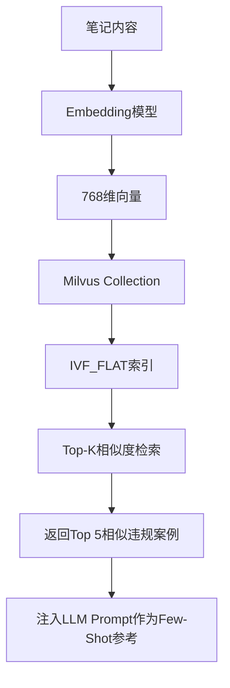
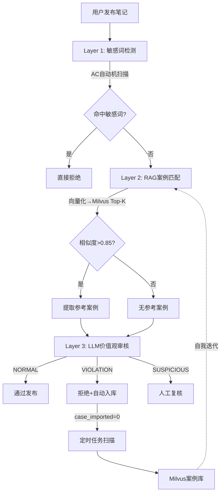

# 趣享社项目技术博客（五）：Milvus向量数据库与违规词库案例库搭建

> 作者：趣享社技术团队  
> 系列：理享——男性大学生内容社区技术揭秘  
> 关键词：Milvus、向量数据库、embedding、相似度检索、违规案例库、RAG

---

## 一、为什么需要向量数据库

在趣享社内容审核体系中，我们面临一个核心挑战：**如何让机器理解"恶意擦边"与"正常表达"之间的微妙差别？**

传统的关键词匹配（如AC自动机）只能检测到显式违禁词，但对于以下场景完全无能为力：

- "读书有什么用？我初中毕业月入十万，大学生还在送外卖"——没有违禁词，但传播读书无用论
- "善良的人注定被欺负，这个社会只认钱"——没有违禁词，但传播扭曲价值观
- "女生过了25就不值钱了，趁年轻赶紧嫁"——没有违禁词，但制造性别焦虑

​	这些"毒鸡汤"需要**语义级别的理解**。而向量数据库正是解决语义匹配问题的核心基础设施——它将文本映射到高维向量空间，使含义相近的文本在空间中距离更近，从而发现那些"形不同而神似"的违规内容。

本章将详细介绍趣享社项目如何基于 Milvus 搭建违规案例库，支撑审核系统的 RAG（检索增强生成）能力。

---

## 二、向量数据库选型：Milvus vs FAISS vs Elasticsearch

团队在技术选型时对比了三类向量存储方案：

| 维度 | FAISS | Elasticsearch Vector | Milvus |
|------|-------|---------------------|--------|
| 定位 | 向量检索库（非数据库） | 搜索引擎 | 专业向量数据库 |
| 数据持久化 | 不支持，内存索引 | 支持 | 支持 |
| 分布式扩展 | 需手动实现 | 原生支持 | 原生支持 |
| 索引类型 | IVF/Flat/HNSW | HNSW | 11种索引（IVF_FLAT/HNSW/DISKANN等） |
| 混合搜索 | 不支持 | 向量+关键词 | 向量+标量过滤 |
| 动态增删 | 重建索引 | 支持 | 支持 |
| 社区生态 | Meta开源 | Elastic公司 | Linux基金会毕业项目 |

**为什么选择 Milvus？**

1. **持久化与动态增删是刚需**：违规案例库需要持续新增案例，FAISS不支持动态增删，每次添加都需要重建索引，这在生产环境中不可接受。

2. **标量过滤能力**：违规案例需要按 `case_type`（违规类型）和 `tags`（标签）进行过滤。Milvus原生支持向量相似度 + 标量过滤的混合查询，而FAISS不具备此能力。

3. **与RAG流水线天然契合**：Milvus作为专业向量数据库，写入延迟低（ms级），支持实时查询，与理享的实时审核流水线完美匹配。

4. **成本可控**：ES的向量功能是Pro付费特性，而Milvus是开源Apache 2.0协议，长期成本更低。



---

## 三、Milvus环境搭建与Collection设计

### 3.1 Docker Compose 部署

在理享的 `docker-compose.yml` 中，Milvus 作为独立服务运行：

```yaml
services:
  milvus:
    image: milvusdb/milvus:v2.3.4
    container_name: milvus
    ports:
      - "19530:19530"
      - "9091:9091"
    environment:
      ETCD_ENDPOINTS: etcd:2379
      MINIO_ADDRESS: minio:9000
    volumes:
      - ./milvus/data:/var/lib/milvus
    depends_on:
      - etcd
      - minio
```

### 3.2 违规案例Collection设计

```java
// ViolationCaseVectorService.java - Collection 创建逻辑

public void createViolationCaseCollection() {
    // 1. 定义字段Schema
    FieldType idField = FieldType.newBuilder()
        .withName("case_id")
        .withDataType(DataType.Int64)
        .withPrimaryKey(true)
        .withAutoID(true)
        .build();

    FieldType embeddingField = FieldType.newBuilder()
        .withName("embedding")
        .withDataType(DataType.FloatVector)
        .withDimension(768)   // bge-large-zh 输出维度
        .build();

    FieldType caseTypeField = FieldType.newBuilder()
        .withName("case_type")
        .withDataType(DataType.VarChar)
        .withMaxLength(50)
        .build();

    FieldType tagsField = FieldType.newBuilder()
        .withName("tags")
        .withDataType(DataType.VarChar)
        .withMaxLength(512)
        .build();

    // 2. 创建Collection
    CollectionSchema schema = CollectionSchema.newBuilder()
        .withFieldTypes(Arrays.asList(idField, embeddingField, caseTypeField, tagsField))
        .withDescription("违规案例向量库-用于RAG相似案例检索")
        .build();

    CreateCollectionParam param = CreateCollectionParam.newBuilder()
        .withCollectionName("violation_case_library")
        .withSchema(schema)
        .build();

    milvusClient.createCollection(param);

    // 3. 创建IVF_FLAT索引（精度优先，后续可切换HNSW）
    IndexParam indexParam = IndexParam.newBuilder()
        .withFieldName("embedding")
        .withIndexType(IndexType.IVF_FLAT)
        .withMetricType(MetricType.IP)  // 内积相似度
        .withExtraParam("{\"nlist\": 128}")
        .build();

    milvusClient.createIndex("violation_case_library", indexParam);
    
    // 4. 加载到内存
    milvusClient.loadCollection("violation_case_library");
}
```

Collection 设计要点：
- **embedding 字段**：768维浮点向量，对应 BAAI/bge-large-zh 模型的输出维度
- **case_type**：违规类型（政治敏感/色情低俗/毒鸡汤/性别对立等）
- **tags**：标签数组（JSON序列化），用于标量过滤
- **IP度量**：内积 (Inner Product) 相似度，配合归一化向量达到cosine效果

---

## 四、向量Embedding生成与存储

### 4.1 Embedding模型选型

趣享社使用 **BAAI/bge-large-zh** 中文嵌入模型，原因如下：

1. **中文语义理解最优**：在C-MTEB中文基准测试中排名前列
2. **768维向量**：在存储成本和精度间取得平衡
3. **最大512 tokens输入**：覆盖绝大多数笔记内容
4. **本地部署**：无需API调用成本，延迟可控（约50ms/条）

### 4.2 EmbeddingService 实现

```java
// EmbeddingService.java - 核心代码

@Slf4j
@Service
public class EmbeddingService {

    @Value("${embedding.model-path}")
    private String modelPath;

    // 使用DJL加载模型（Spring Bean生命周期管理）
    private ZooModel<String, float[]> model;
    private Predictor<String, float[]> predictor;

    @PostConstruct
    public void init() {
        Criteria<String, float[]> criteria = Criteria.builder()
            .setTypes(String.class, float[].class)
            .optModelPath(modelPath)
            .optEngine("PyTorch")
            .build();
        model = criteria.loadModel();
        predictor = model.newPredictor();
    }

    /**
     * 将文本转换为768维向量
     * @param text 输入文本
     * @return 归一化后的768维向量
     */
    public List<Float> encode(String text) {
        try {
            float[] embedding = predictor.predict(text);
            // L2归一化（使IP度量等效Cosine相似度）
            float[] normalized = l2Normalize(embedding);
            List<Float> result = new ArrayList<>(normalized.length);
            for (float v : normalized) {
                result.add(v);
            }
            return result;
        } catch (Exception e) {
            log.error("Embedding生成失败: {}", e.getMessage());
            throw new RuntimeException("向量化失败", e);
        }
    }

    private float[] l2Normalize(float[] vec) {
        double sum = 0;
        for (float v : vec) sum += v * v;
        double norm = Math.sqrt(sum);
        float[] result = new float[vec.length];
        for (int i = 0; i < vec.length; i++) {
            result[i] = (float) (vec[i] / norm);
        }
        return result;
    }
}
```

### 4.3 案例入库流程

```java
// ViolationCaseVectorService.java - 案例入库

public void insertCase(Long caseId, String title, String content, 
                       String caseType, String tags) {
    
    // 1. 拼接文本：标题 + 内容（取前400字符避免超长）
    String fullText = title + " " + 
        (content != null && content.length() > 400 
            ? content.substring(0, 400) : content);

    // 2. 生成向量
    List<Float> embedding = embeddingService.encode(fullText);

    // 3. 构建插入参数
    InsertParam insertParam = InsertParam.newBuilder()
        .withCollectionName("violation_case_library")
        .withFields(Arrays.asList(
            new InsertParam.Field("embedding", Collections.singletonList(embedding)),
            new InsertParam.Field("case_type", Collections.singletonList(caseType)),
            new InsertParam.Field("tags", Collections.singletonList(tags))
        ))
        .build();

    // 4. 写入Milvus（自动flush确保可查询）
    milvusClient.insert(insertParam);
    milvusClient.flush("violation_case_library");
    
    log.info("违规案例入库成功: caseId={}, caseType={}", caseId, caseType);
}
```

同时，MySQL中的 `violation_case_library` 表记录完整元数据：

```sql
CREATE TABLE violation_case_library (
    id BIGINT AUTO_INCREMENT PRIMARY KEY,
    case_type VARCHAR(50) NOT NULL COMMENT '违规类型',
    title VARCHAR(200) NOT NULL COMMENT '案例标题',
    content TEXT NOT NULL COMMENT '案例内容',
    violation_reason VARCHAR(500) NOT NULL COMMENT '违规原因',
    tags VARCHAR(512) COMMENT '违规标签(JSON数组)',
    embedding_id BIGINT COMMENT 'Milvus对应向量ID',
    source_note_id BIGINT COMMENT '来源笔记ID',
    created_at DATETIME DEFAULT CURRENT_TIMESTAMP,
    INDEX idx_case_type (case_type),
    INDEX idx_embedding_id (embedding_id)
) COMMENT='违规案例库-MySQL元数据表';
```

这种 **MySQL + Milvus 双写架构**的优势在于：MySQL负责CRUD管理和关系查询，Milvus负责向量相似度检索，各司其职。

---

## 五、Milvus相似度检索实现

### 5.1 Top-K相似案例检索

RAG审核流水线的核心步骤：将待审核笔记向量化后，在Milvus中检索Top 5最相似的违规案例。

```java
// ViolationCaseVectorService.java - 相似案例检索

public List<SimilarCase> searchSimilarCases(String title, String content, int topK) {
    // 1. 将笔记内容转为向量
    String queryText = (title != null ? title : "") + " " + 
                       (content != null ? content : "");
    List<Float> queryVector = embeddingService.encode(queryText);
    List<List<Float>> vectors = Collections.singletonList(queryVector);

    // 2. Milvus向量检索
    SearchParam searchParam = SearchParam.newBuilder()
        .withCollectionName("violation_case_library")
        .withVectors(vectors)
        .withVectorFieldName("embedding")
        .withTopK(topK)
        .withMetricType(MetricType.IP)      // 内积相似度
        .withParams("{\"nprobe\": 16}")      // 查询时探测的聚类数
        .withOutFields(Arrays.asList("case_type", "tags"))
        .build();

    SearchResults results = milvusClient.search(searchParam);

    // 3. 解析检索结果
    List<SimilarCase> cases = new ArrayList<>();
    for (SearchResults.SearchResult result : results.getResults()) {
        for (int i = 0; i < result.getScores().size(); i++) {
            float score = result.getScores().get(i);
            
            // 相似度阈值过滤（低于0.75的案例参考价值低）
            if (score < 0.75f) continue;

            long caseId = (long) result.getIdField().get(i);
            String caseType = (String) result.getField("case_type", i);
            String tags = (String) result.getField("tags", i);

            // 从MySQL查询完整案例信息
            ViolationCase fullCase = violationCaseMapper.selectById(caseId);
            if (fullCase != null) {
                SimilarCase similar = new SimilarCase();
                similar.setScore(score);
                similar.setCaseId(caseId);
                similar.setTitle(fullCase.getTitle());
                similar.setReason(fullCase.getViolationReason());
                similar.setTags(fullCase.getTags());
                cases.add(similar);
            }
        }
    }

    return cases;
}
```

### 5.2 相似度与LLM判定的协同

检索结果以"参考案例"的形式注入LLM Prompt：

```java
// ValueReviewService.java - 将相似案例注入审核Prompt

public ValueReviewResult review(String title, String content, String similarCases) {
    // ...
    String prompt = String.format(VALUE_REVIEW_PROMPT, title, content);
    
    if (similarCases != null && !similarCases.isEmpty()) {
        prompt += "\n\n## 参考案例（以下为类似违规案例，供参考判定）\n" + similarCases;
    }
    
    String response = callDoubao(prompt, imageUrls);
    return parseResponse(response);
}
```

---

## 六、违规案例库CRUD操作

### 6.1 案例库管理接口

```java
// ViolationCaseController.java

@RestController
@RequestMapping("/admin/violation-case")
public class ViolationCaseController {

    private final ViolationCaseService violationCaseService;

    /**
     * 手动添加违规案例
     */
    @PostMapping
    public R<Long> addCase(@RequestBody AddCaseRequest request) {
        Long caseId = violationCaseService.addCase(
            request.getCaseType(),
            request.getTitle(),
            request.getContent(),
            request.getViolationReason(),
            request.getTags()
        );
        return R.ok(caseId);
    }

    /**
     * 更新案例
     */
    @PutMapping("/{caseId}")
    public R<Void> updateCase(@PathVariable Long caseId, 
                               @RequestBody UpdateCaseRequest request) {
        violationCaseService.updateCase(caseId, request);
        return R.ok();
    }

    /**
     * 删除案例（MySQL软删除 + Milvus物理删除）
     */
    @DeleteMapping("/{caseId}")
    public R<Void> deleteCase(@PathVariable Long caseId) {
        violationCaseService.deleteCase(caseId);
        return R.ok();
    }

    /**
     * 分页查询案例
     */
    @GetMapping
    public R<PageVO<ViolationCase>> listCases(
            @RequestParam(required = false) String caseType,
            @RequestParam(defaultValue = "1") int page,
            @RequestParam(defaultValue = "20") int size) {
        return R.ok(violationCaseService.listCases(caseType, page, size));
    }
}
```

### 6.2 Milvus数据一致性保证

删除操作需要同步MySQL和Milvus：

```java
@Transactional
public void deleteCase(Long caseId) {
    ViolationCase vcase = violationCaseMapper.selectById(caseId);
    if (vcase == null) return;

    // 1. MySQL软删除
    violationCaseMapper.deleteById(caseId);

    // 2. Milvus向量删除（通过主键ID）
    List<Long> deleteIds = Collections.singletonList(vcase.getEmbeddingId());
    milvusClient.delete("violation_case_library", 
        "case_id in [" + vcase.getEmbeddingId() + "]");
}
```

---

## 七、自动入库机制：违规即归档

​	趣享社的违规案例库不是静态词库，而是**自我生长的知识库**。核心设计理念：每当LLM判定一条笔记违规，系统自动提取违规信息并入库。

```java
// CaseAutoImportService.java - 自动入库逻辑

@Slf4j
@Service
public class CaseAutoImportService {

    @Autowired
    private NoteReviewMapper noteReviewMapper;
    @Autowired
    private ViolationCaseVectorService vectorService;
    @Autowired
    private ViolationCaseMapper violationCaseMapper;

    /**
     * 定时任务：每5分钟扫描待导入的违规记录
     */
    @Scheduled(fixedDelay = 300000)
    public void autoImportViolationCases() {
        List<NoteReview> pendingImports = noteReviewMapper.findPendingImport();
        
        log.info("扫描待导入违规案例: count={}", pendingImports.size());

        for (NoteReview review : pendingImports) {
            try {
                importCase(review);
                noteReviewMapper.markAsImported(review.getId());
                log.info("违规案例自动入库完成: reviewId={}", review.getId());
            } catch (Exception e) {
                log.error("自动入库失败: reviewId={}, error={}", 
                    review.getId(), e.getMessage());
            }
        }
    }

    private void importCase(NoteReview review) {
        // 从审核记录中提取违规标签
        List<String> tags = parseTags(review.getViolationTags());
        String caseType = determineCaseType(tags);

        // 写入MySQL + Milvus
        vectorService.insertCase(
            null,                              // case_id自增
            review.getTitle(),
            review.getContent(),
            caseType,
            review.getViolationTags(),
            review.getViolationReason(),
            review.getNoteId()                 // 追溯来源笔记
        );
    }
}
```

NoteReviewMapper 中的 `findPendingImport()` 方法：

```java
// NoteReviewMapper.java:59-60
@Select("SELECT * FROM note_review WHERE review_status = 3 " +
    "AND (case_imported IS NULL OR case_imported = 0) " +
    "AND violation_reason IS NOT NULL ORDER BY review_time DESC LIMIT 100")
List<NoteReview> findPendingImport();

@Update("UPDATE note_review SET case_imported = 1 WHERE id = #{id}")
void markAsImported(@Param("id") Long id);
```

---

## 八、与审核流水线的集成

违规案例库是RAG审核流水线（第二层）的检索源，完整的三层架构如下：



在代码层面，`NoteReview` 实体记录了三个层级的审核结果：

```java
// NoteReview.java 关键字段
@TableField("layer_1_passed")
private Boolean layer1Passed;        // 敏感词检测是否通过

@TableField("layer_2_rag_score")
private Double layer2RagScore;       // RAG相似度得分

@TableField("layer_3_llm_verdict")
private String layer3LlmVerdict;     // LLM判定结果

private Integer caseImported;        // 是否已导入案例库
```

三层分工明确：
- **Layer 1**：AC自动机做快速关键词过滤，<5ms延迟
- **Layer 2**：Milvus向量检索提供相似案例参考，~100ms延迟
- **Layer 3**：豆包LLM结合参考案例做最终价值观判定，~2s延迟

---

## 九、总结与展望

本章介绍了理享项目违规案例库的完整技术实现，核心要点回顾：

1. **向量数据库选型**：Milvus在持久化、动态增删、标量过滤、社区生态方面优于FAISS和ES Vector，是RAG场景的最佳选择。

2. **Embedding方案**：使用BAAI/bge-large-zh本地部署，768维向量，延迟约50ms，支撑实时审核需求。

3. **MySQL+Milvus双写**：MySQL管理业务元数据和CRUD关系，Milvus专注向量相似度检索，职责清晰。

4. **自动入库闭环**：违规内容→定时任务扫描→自动提取入库→丰富案例库→提升后续审核精度，形成正向飞轮。

5. **三层审核协同**：AC自动机（快速过滤）→ Milvus RAG（案例参考）→ LLM（语义判定），层层递进，在延迟和精度间取得平衡。

未来的优化方向包括：引入HNSW索引替代IVF_FLAT提升检索速度、使用DiskANN支持百亿级向量、接入混合Embedding（文本+图片多模态向量）等。

---

*下一篇预告：06-RAG检索增强与LLM价值观审核体系——深度剖析三层审核架构的完整实现*
