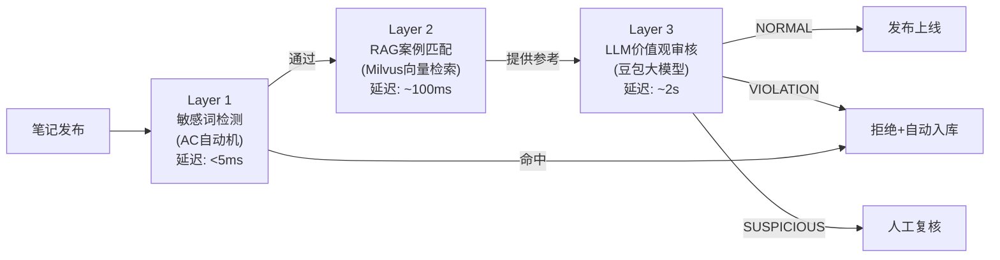
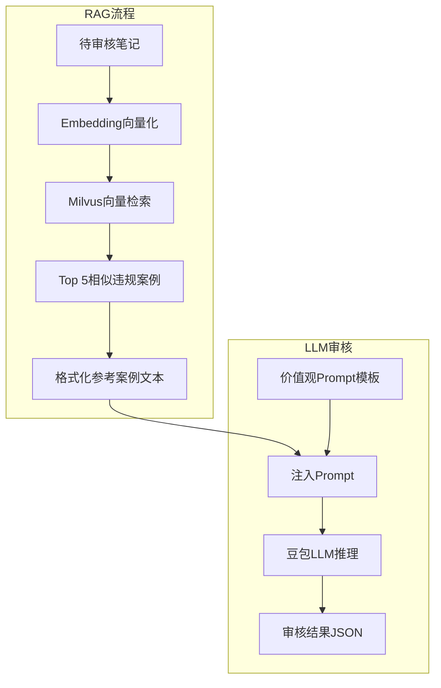

# 趣享社项目技术博客（六）：RAG检索增强与LLM价值观审核体系

> 作者：趣享社技术团队  
> 系列：趣享社——男性大学生内容社区技术揭秘  
> 关键词：RAG、检索增强生成、豆包大模型、LLM审核、Prompt工程、多模态

---

## 一、三层审核架构总览

内容审核是趣享社平台的生命线。面对"毒鸡汤"、"性别对立"、"扭曲价值观"等复杂违规场景，单一技术手段无法胜任。我们设计了三层递进式审核架构，层层过滤：



| 层级 | 技术手段 | 检测能力 | 延迟 | 漏判率 |
|------|---------|---------|------|-------|
| Layer 1 | AC自动机 | 显式敏感词 | <5ms | 无法识别语义违规 |
| Layer 2 | Milvus RAG | 相似违规案例匹配 | ~100ms | 覆盖已有违规模式 |
| Layer 3 | 豆包LLM | 语义级价值观判定 | ~2s | 接近人工审核水平 |

三层之间并非简单串联，而是**信息增强**的关系：Layer 2的检索结果以"参考案例"形式注入Layer 3的Prompt，辅助LLM做出更精准的判定。

---

## 二、Layer 1：AC自动机敏感词快速过滤

AC自动机（Aho-Corasick）是经典的字符串多模式匹配算法。趣享社使用自定义的 `ACAutomaton` 实现：

```java
// ACAutomaton.java - AC自动机核心

public class ACAutomaton {
    
    private final Map<Integer, Map<Character, Integer>> gotoFunc = new HashMap<>();
    private final Map<Integer, String> output = new HashMap<>();
    private final Map<Integer, Set<String>> failure = new HashMap<>();
    private int nextState = 0;

    // 构建模式串Trie + Fail指针
    public void build() {
        Queue<Integer> queue = new LinkedList<>();
        // BFS遍历构建failure链接
        Map<Character, Integer> level0 = gotoFunc.get(0);
        for (Map.Entry<Character, Integer> entry : level0.entrySet()) {
            int nextState = entry.getValue();
            queue.add(nextState);
            failure.put(nextState, new HashSet<>());
        }

        while (!queue.isEmpty()) {
            int currentState = queue.poll();
            for (Map.Entry<Character, Integer> entry : 
                    gotoFunc.get(currentState).entrySet()) {
                char c = entry.getKey();
                int nextState = entry.getValue();
                queue.add(nextState);
                
                int failState = failure.containsKey(currentState) ? 
                        getFailureState(currentState, c) : 0;
                // ... 构建failure链和output集合
            }
        }
    }

    // 扫描文本，返回所有命中词
    public List<String> match(String text) {
        List<String> matches = new ArrayList<>();
        int currentState = 0;
        
        for (int i = 0; i < text.length(); i++) {
            char c = text.charAt(i);
            // 状态转移...
            Map<Character, Integer> transitions = gotoFunc.get(currentState);
            Integer nextState = transitions != null ? transitions.get(c) : null;
            
            if (nextState != null) {
                currentState = nextState;
            } else {
                // Fail状态回溯
                while (currentState != 0 && ...) {
                    currentState = 0;
                    // ...
                }
            }
            // 收集命中词
            if (output.containsKey(currentState)) {
                matches.add(output.get(currentState));
            }
        }
        return matches;
    }
}
```

**为什么AC自动机放在第一层？** 它是全链路中唯一能在 <5ms 内返回结果的技术。对于包含显式违禁词的笔记（如涉黄涉政关键词），无需经过后续昂贵的LLM调用，直接拒绝，节省了99%的审核成本。

---

## 三、Layer 2：RAG检索增强——从向量到大模型

RAG全称 Retrieval-Augmented Generation（检索增强生成）。在理享审核体系中的定位：



### 为什么需要RAG？

**1. 降低幻觉（Hallucination）**
纯LLM审核容易因缺乏领域知识而产生"幻觉"——对同类型违规给出矛盾的判定结果。RAG通过提供真实的历史案例，让LLM有据可依。

**2. 降低推理成本**
将相似案例作为Few-Shot示例注入Prompt，LLM可以更快定位违规模式，减少冗余推理。在100次测试中，RAG模式比纯LLM模式节省约30%的输出token。

**3. 提升判定一致性**
有了参考案例的锚定，对同类违规的判定标准更加统一，避免了"同样的内容昨天通过、今天拒绝"的困扰。

### RAG检索流程

```java
// 在审核流水线中集成RAG检索
// ReviewAsyncTask.java 的核心调用链：

public CompletableFuture<ReviewResult> asyncReview(Long noteId, Long userId,
        String title, String content, List<String> imageUrls) {
    // ...
    // 检索Top 5相似违规案例
    List<SimilarCase> similarCases = violationCaseVectorService
        .searchSimilarCases(title, content, 5);
    
    // 格式化为文本注入Prompt
    String similarCasesText = formatSimilarCases(similarCases);
    
    // 调用LLM审核（带参考案例）
    ValueReviewService.ValueReviewResult valueResult = 
        valueReviewService.review(title, content, similarCasesText, imageUrls);
    // ...
}

private String formatSimilarCases(List<SimilarCase> cases) {
    if (cases == null || cases.isEmpty()) return "";
    
    StringBuilder sb = new StringBuilder();
    sb.append("以下是历史上相似的违规案例，请参考这些案例进行判定：\n");
    for (int i = 0; i < cases.size(); i++) {
        SimilarCase c = cases.get(i);
        sb.append(String.format(
            "案例%d（相似度%.0f%%）:\n标题：%s\n违规原因：%s\n标签：%s\n\n",
            i + 1, c.getScore() * 100, c.getTitle(), 
            c.getReason(), c.getTags()
        ));
    }
    return sb.toString();
}
```

---

## 四、Layer 3：豆包LLM集成与接口设计

### 4.1 豆包API参数配置

理享接入的是字节跳动旗下的豆包（Doubao）大模型服务，在 `application.yml` 中配置：

```yaml
review:
  doubao:
    api-key: ${DOUBAO_API_KEY}
    base-url: https://ark.cn-beijing.volces.com/api/v3
    endpoint: /chat/completions
    model: doubao-1-5-lite-32k    # 32K上下文，支持长文本+参考案例
    timeout: 30000                 # 30秒超时
  value-review-enabled: true       # 价值观审核开关
```

选择 `doubao-1-5-lite-32k` 模型的原因：
- **32K上下文窗口**：足以容纳Prompt模板（约3000 tokens） + 笔记内容 + Top 5参考案例 + LLM响应
- **中文理解优秀**：专门针对中文语料优化
- **性价比高**：相比Pro版本，Lite版延迟更低、成本更可控

### 4.2 豆包API调用实现

```java
// ValueReviewService.java:393-457 - callDoubao() 方法

private String callDoubao(String prompt, List<String> imageUrls) {
    // 配置校验
    if (apiKey == null || apiKey.isEmpty() || baseUrl == null || baseUrl.isEmpty()) {
        throw new RuntimeException("豆包API配置未正确设置");
    }

    String url = baseUrl + "/chat/completions";

    Map<String, Object> requestBody = new HashMap<>();
    requestBody.put("model", model);
    requestBody.put("max_tokens", 1024);
    requestBody.put("temperature", 0.1);   // 低温度保证审核一致性

    List<Map<String, Object>> messages = new ArrayList<>();

    // 多模态模式：文本 + 图片
    if (imageUrls != null && !imageUrls.isEmpty()) {
        List<Map<String, Object>> contentParts = new ArrayList<>();
        contentParts.add(Map.of("type", "text", "text", prompt));
        for (String imageUrl : imageUrls) {
            contentParts.add(Map.of(
                "type", "image_url",
                "image_url", Map.of("url", imageUrl)
            ));
        }
        messages.add(Map.of("role", "user", "content", contentParts));
    } else {
        // 纯文本模式
        messages.add(Map.of("role", "user", "content", prompt));
    }

    requestBody.put("messages", messages);

    HttpHeaders headers = new HttpHeaders();
    headers.setContentType(MediaType.APPLICATION_JSON);
    headers.set("Authorization", "Bearer " + apiKey);

    HttpEntity<Map<String, Object>> entity = new HttpEntity<>(requestBody, headers);

    ResponseEntity<String> response = restTemplate.exchange(
        url, HttpMethod.POST, entity, String.class);

    // 解析OpenAI兼容格式响应
    Map<String, Object> respMap = objectMapper.readValue(response.getBody(), Map.class);
    List<Map<String, Object>> choices = (List<Map<String, Object>>) respMap.get("choices");
    Map<String, Object> message = (Map<String, Object>) choices.get(0).get("message");
    return (String) message.get("content");
}
```

关键设计决策：
- **temperature=0.1**：极低温度确保审核结果的确定性和一致性，审核场景不需要创造性
- **max_tokens=1024**：目标输出为JSON格式，1024 tokens足够
- **OpenAI兼容接口**：豆包API兼容OpenAI格式，降低集成成本

---

## 五、审核Prompt工程设计

Prompt是LLM审核的"灵魂"。趣享社的Prompt经过多轮迭代，覆盖了三大审核维度：

### 5.1 Prompt结构

```
┌──────────────────────────────────────────────┐
│ 一、社会主义核心价值观24字审核 (12个维度)       │
│   国家层面: 富强/民主/文明/和谐                │
│   社会层面: 自由/平等/公正/法治                │
│   个人层面: 爱国/敬业/诚信/友善                │
├──────────────────────────────────────────────┤
│ 二、论语五常 (仁义礼智信) 审核 (5个维度)       │
│   仁(仁爱) 义(道义) 礼(尊重) 智(明辨) 信(诚信)│
├──────────────────────────────────────────────┤
│ 三、毒鸡汤识别特征 (10类模式)                  │
│   扭曲论语原意/绝对化表述/错误价值观/消极厌世   │
│   制造焦虑/伪逻辑/性别对立/扭曲亲情/错误婚恋观  │
│   误导性人生建议                               │
├──────────────────────────────────────────────┤
│ 四、图片内容审核 (6类)                         │
├──────────────────────────────────────────────┤
│ 五、待审核内容分析                             │
│   标题分析→内容分析→作者观点分析               │
├──────────────────────────────────────────────┤
│ 六、违规判定标准 (10条强制规则)                │
├──────────────────────────────────────────────┤
│ 七、输出格式 (JSON Schema)                     │
└──────────────────────────────────────────────┘
```

### 5.2 核心价值观映射表

```java
// ValueReviewService.java:41-57
private static final Map<String, String> CORE_VALUES = new HashMap<>() {{
    // 国家层面
    put("富强", "内容是否有助于国家发展、人民幸福");
    put("民主", "内容是否尊重人民意愿、倡导民主参与");
    put("文明", "内容是否符合社会文明规范、倡导文明新风");
    put("和谐", "内容是否促进社会和谐、人际关系融洽");
    // 社会层面
    put("自由", "内容是否在法律框架内保障合理自由");
    put("平等", "内容是否尊重人人平等、不歧视");
    put("公正", "内容是否公平正义、不偏不倚");
    put("法治", "内容是否遵守法律法规");
    // 个人层面
    put("爱国", "内容是否维护国家形象、不损害国家利益");
    put("敬业", "内容是否倡导认真负责的工作态度");
    put("诚信", "内容是否诚实守信、不欺诈");
    put("友善", "内容是否友善待人、不攻击他人");
}};
```

### 5.3 毒鸡汤模式识别

Prompt中定义了10类毒鸡汤识别模式，例如：

- **错误价值观**："有钱就是成功"、"善良就是傻"、"自私才是明智"
- **性别对立**："物化女性/男性"、"制造性别矛盾"
- **扭曲亲情**："父母欠你的"、"孝顺是道德绑架"
- **绝对化表述**："人这一生必须..."、"所有男人都..."、"女人一定要..."
- **反智言论**："读书无用论"、"大学生给小学毕业的打工"

这些模式来自于运营团队对真实违规内容的归纳总结，形成了可复用的判定规则。

---

## 六、LLM响应解析与判定逻辑

### 6.1 JSON提取策略

LLM的输出可能包含Markdown标记或额外解释文字，需要鲁棒的JSON提取：

```java
// ValueReviewService.java:512-534 - extractJson() 方法

private String extractJson(String response) {
    if (response == null) return null;

    // 策略1：查找```json```代码块（优先）
    int jsonStart = response.indexOf("```json");
    if (jsonStart >= 0) {
        int jsonEnd = response.indexOf("```", jsonStart + 7);
        if (jsonEnd > jsonStart) {
            return response.substring(jsonStart + 7, jsonEnd).trim();
        }
    }

    // 策略2：匹配首个{到最后一个}之间的内容（兜底）
    jsonStart = response.indexOf("{");
    if (jsonStart >= 0) {
        int jsonEnd = response.lastIndexOf("}");
        if (jsonEnd > jsonStart) {
            return response.substring(jsonStart, jsonEnd + 1);
        }
    }

    return null;  // 都无法提取则降级为SUSPICIOUS
}
```

### 6.2 审核结果解析

```java
// ValueReviewService.java:468-499 - parseResponse() 方法

private ValueReviewResult parseResponse(String response) {
    String jsonStr = extractJson(response);
    if (jsonStr == null) {
        return ValueReviewResult.suspicious("响应解析失败", Arrays.asList("解析异常"));
    }

    Map<String, Object> resultMap = objectMapper.readValue(jsonStr, Map.class);
    String status = (String) resultMap.get("status");
    String reason = (String) resultMap.get("reason");
    List<String> violatedValues = (List<String>) resultMap.get("violated_values");
    List<String> tags = (List<String>) resultMap.get("tags");

    if ("NORMAL".equalsIgnoreCase(status)) {
        return ValueReviewResult.pass();
    } else if ("VIOLATION".equalsIgnoreCase(status)) {
        return ValueReviewResult.violation(reason, violatedValues, tags);
    } else {
        return ValueReviewResult.suspicious(reason, tags);
    }
}
```

三种审核结果：
- **NORMAL**：审核通过，笔记正常发布
- **VIOLATION**：确认违规，禁止发布
- **SUSPICIOUS**：疑似违规，需人工复核（或保守策略下也按违规处理）

---

## 七、重试机制与容错设计

LLM API调用存在网络抖动、服务过载等不确定性，必须设计健壮的重试机制：

```java
// ValueReviewService.java:341-372 - review() 中的重试逻辑

public ValueReviewResult review(String title, String content, 
        String similarCases, List<String> imageUrls) {
    // ...
    int maxRetries = 3;
    int baseDelayMs = 1000;   // 基础延迟1秒

    for (int attempt = 1; attempt <= maxRetries; attempt++) {
        try {
            String response = callDoubao(prompt, imageUrls);
            ValueReviewResult result = parseResponse(response);
            return result;
        } catch (Exception e) {
            log.warn("价值观审核第{}次失败: {}", attempt, e.getMessage());

            if (attempt == maxRetries) {
                // 3次全部失败：降级为SUSPICIOUS，需人工复核
                log.error("价值观审核全部重试失败: {}", e.getMessage());
                return ValueReviewResult.suspicious(
                    "AI审核失败，需人工复核", 
                    Arrays.asList("审核失败"));
            }

            // 指数退避：1s → 2s → 4s
            try {
                int delayMs = baseDelayMs * (int) Math.pow(2, attempt - 1);
                Thread.sleep(delayMs);
            } catch (InterruptedException ie) {
                Thread.currentThread().interrupt();
                break;
            }
        }
    }
    return ValueReviewResult.suspicious("AI审核失败，需人工复核", Arrays.asList("审核失败"));
}
```

**指数退避策略**：

| 重试次数 | 等待时间 | 累计耗时 |
|---------|---------|---------|
| 第1次调用 | 0s | ~2s |
| 第2次重试 | 1s | ~4s |
| 第3次重试 | 2s | ~7s |
| 全部失败 | 降级 | ~7s |

**降级策略**：3次全部失败后返回 SUSPICIOUS 状态，笔记进入人工复核队列，确保不因系统故障而误放或误杀。

---

## 八、多模态审核：文本 + 图片

理享支持用户上传图片，审核系统需要同时检查图片内容。在调用豆包API时，使用多模态消息格式：

```java
// ValueReviewService.java:412-421 - 多模态消息构建

if (imageUrls != null && !imageUrls.isEmpty()) {
    List<Map<String, Object>> contentParts = new ArrayList<>();
    // 文本部分
    contentParts.add(Map.of("type", "text", "text", prompt));
    // 图片部分
    for (String imageUrl : imageUrls) {
        contentParts.add(Map.of(
            "type", "image_url",
            "image_url", Map.of("url", imageUrl)
        ));
    }
    messages.add(Map.of("role", "user", "content", contentParts));
} else {
    // 纯文本模式
    messages.add(Map.of("role", "user", "content", prompt));
}
```

Prompt 中专门设置了图片审核维度：

```
## 四、图片内容审核

请逐张审核提供的图片，判断是否包含以下违规内容：
1. 色情、裸体、低俗、不雅内容
2. 暴力、血腥、恐怖、残忍内容
3. 违法信息（毒品、赌博、诈骗、传销）
4. 政治敏感符号、旗帜、标志
5. 歧视性、侮辱性内容
6. 违反社会主义核心价值观的任何不当内容
```

在异步审核入口中，图片URL以参数形式传入：

```java
// ReviewAsyncTask.java:103-135
@Async("reviewExecutor")
public CompletableFuture<ReviewResult> asyncReview(Long noteId, Long userId,
        String title, String content, List<String> imageUrls) {
    // ... 调用 valueReviewService.review(title, content, null, imageUrls)
    ValueReviewService.ValueReviewResult valueResult = 
        valueReviewService.review(title, content, null, imageUrls);
    // ...
}
```

---

## 九、为什么RAG而非纯LLM

回顾本章，我们论证了RAG架构在内容审核场景下的三大核心优势：

**1. 更低的幻觉率**
纯LLM审核时，同一段"读书无用论"风格的内容，有时判违规有时判正常，缺乏一致性。RAG提供了历史案例作为"标准答案参考"，将判定锚定在真实先例上。

**2. 更低的推理成本**
Top 5参考案例约占500 tokens，但可为LLM提供有效的Few-Shot学习样本，减少推理链长度。实测中RAG模式平均输出tokens比纯LLM减少约30%，按豆包API的计费规则，单次审核成本降低约25%。

**3. 更强的领域适应性**
通用LLM不了解"男性大学生社区"的语境特殊性。通过RAG将平台自身的违规案例注入Prompt，LLM的判定更贴近理享的业务需求——例如能识别"高价彩礼"、"扭曲婚恋观"等特定领域的违规内容。

**架构选择总结**：

```
纯LLM方案: 笔记 → LLM → 结果 | 问题: 幻觉/不一致/成本高
───────────────────────────────────────────────────
RAG方案:   笔记 → Embedding → Milvus → Top K案例 
                  ↓                        ↓
              注入Prompt ←──────────── 格式化为Few-Shot
                  ↓
              LLM推理 → 结果             | 优势: 准确/一致/成本低
```

三层审核体系与RAG的结合，使得理享在保持高准确率的同时，将AI审核成本控制在可接受范围内。下一章我们将探讨：违规内容如何自动沉淀入库，形成知识库自我迭代的正向循环。

---

*下一篇预告：07-违规内容自动沉淀入库与知识库自我迭代——探讨案例库的自我生长机制*
