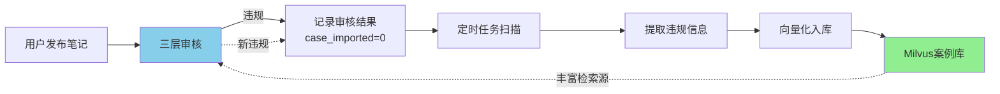
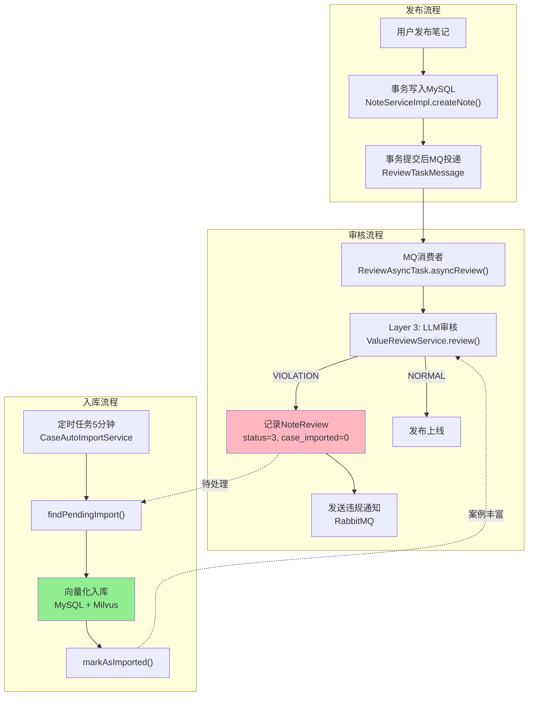

# 理享项目技术博客（七）：违规内容自动沉淀入库与知识库自我迭代

> 作者：趣享社技术团队  
> 系列：理享——男性大学生内容社区技术揭秘  
> 关键词：自动入库、知识库迭代、定时任务、案例库自生长、正向飞轮

---

## 一、从"死库"到"活库"：知识库自我迭代的设计理念

传统的违规词库是一个静态列表——运营人员手动添加敏感词，审核系统基于列表做机械匹配。这种模式的致命缺陷在于：

1. **滞后性**：新型违规模式出现后，需要运营人员发现 → 分析 → 手动添加，周期长达数天
2. **覆盖率低**：永远只能匹配历史上已知的违规词，对新变种无能为力
3. **维护成本高**：依赖人工持续投入，难以规模化

理享的违规案例库采用了完全不同的思路：**让审核系统自己"学会"识别新违规，并自动沉淀入库**。每一位被LLM判定为违规的笔记，都自动成为案例库的新养料。



这个闭环形成了**自我迭代的正向飞轮**：

```
更多检测 → 更多案例 → 更准检测 → 更多检测 ...
```

---

## 二、NoteReview实体：案例入库的标志位设计

`NoteReview` 是三层审核体系的记录载体，其中的 `case_imported` 字段是自动入库机制的关键标识：

```java
// NoteReview.java 关键字段

/**
 * 审核状态: 0-待审核 1-正常 2-疑似 3-违规
 */
private Integer reviewStatus;

/**
 * 违规原因
 */
private String violationReason;

/**
 * 违规标签(JSON数组)
 */
private String violationTags;

/**
 * 是否已导入案例库
 * NULL 或 0 = 未导入，1 = 已导入
 */
private Integer caseImported;

/**
 * 审核时间
 */
private LocalDateTime reviewTime;
```

`case_imported` 字段的设计逻辑：

| 状态值 | 含义 | 触发条件 |
|-------|------|---------|
| NULL | 未处理 | 新创建的审核记录 |
| 0 | 待导入 | 审核结果为违规，尚未入库 |
| 1 | 已导入 | 定时任务成功入库后标记 |

使用 `Integer` 而非 `Boolean` 是为了兼容 MySQL 中的三态语义（NULL/0/1），NULL表示历史数据未经过入库流程。

---

## 三、findPendingImport：待导入数据的查询

`NoteReviewMapper` 中定义了精确的查询方法：

```java
// NoteReviewMapper.java:56-66

/**
 * 查询待导入的违规记录
 * 条件：
 *   1. review_status = 3（违规）
 *   2. case_imported IS NULL 或 = 0（未导入）
 *   3. violation_reason IS NOT NULL（有违规原因）
 *   4. 按审核时间降序排列，限制100条（防止单次处理过载）
 */
@Select("SELECT * FROM note_review " +
    "WHERE review_status = 3 " +
    "AND (case_imported IS NULL OR case_imported = 0) " +
    "AND violation_reason IS NOT NULL " +
    "ORDER BY review_time DESC LIMIT 100")
List<NoteReview> findPendingImport();

/**
 * 标记为已导入案例库
 */
@Update("UPDATE note_review SET case_imported = 1 WHERE id = #{id}")
void markAsImported(@Param("id") Long id);
```

查询条件的设计考量：

1. **`review_status = 3`**：仅处理确认为违规的记录，SUSPICIOUS（疑似）状态不自动入库，需人工确认
2. **`violation_reason IS NOT NULL`**：确保入库的案例具有可参考的违规原因说明
3. **`LIMIT 100`**：防止定时任务一次性处理过多记录导致阻塞，采用分批处理策略
4. **按时间降序**：优先处理最新的违规记录，让案例库尽快反映最新的违规模式

---

## 四、定时任务：定时调度与批量入库

```java
// CaseAutoImportService.java - 定时自动入库服务

@Slf4j
@Service
public class CaseAutoImportService {

    @Autowired
    private NoteReviewMapper noteReviewMapper;
    @Autowired
    private ViolationCaseMapper violationCaseMapper;
    @Autowired
    private ViolationCaseVectorService vectorService;

    /**
     * 定时任务：每5分钟扫描一次待导入的违规记录
     * 
     * 设计考量：
     *   - 5分钟间隔：平衡实时性与系统负载
     *   - 每次最多处理100条：通过Mapper LIMIT控制
     *   - 单条失败不影响批次：try-catch包裹每条记录
     */
    @Scheduled(fixedDelay = 300000)  // 每5分钟
    public void autoImportViolationCases() {
        log.info("定时扫描待导入违规案例...");

        List<NoteReview> pendingImports = noteReviewMapper.findPendingImport();

        if (pendingImports.isEmpty()) {
            log.debug("无待导入违规案例");
            return;
        }

        log.info("发现待导入违规案例: count={}", pendingImports.size());

        int successCount = 0;
        int failCount = 0;

        for (NoteReview review : pendingImports) {
            try {
                // 1. 提取违规信息并入库
                importCase(review);

                // 2. 标记为已导入（防止后续重复入库）
                noteReviewMapper.markAsImported(review.getId());

                successCount++;
                log.info("违规案例自动入库: reviewId={}, title={}", 
                    review.getId(), review.getTitle());

            } catch (Exception e) {
                failCount++;
                log.error("自动入库失败: reviewId={}, error={}", 
                    review.getId(), e.getMessage());
                // 单条失败不中断批次，记录日志后继续处理下一条
            }
        }

        log.info("自动入库批次完成: total={}, success={}, fail={}",
            pendingImports.size(), successCount, failCount);
    }
}
```

定时任务的调度配置在Spring Boot中通过 `@EnableScheduling` 注解开启：

```java
@Configuration
@EnableScheduling
public class SchedulerConfig {
    // Spring自动管理@Scheduled注解的定时任务
}
```

---

## 五、violation_case_library 数据库表结构

在深入入库流程之前，先了解案例库在MySQL侧的表设计：

```sql
CREATE TABLE violation_case_library (
    id BIGINT AUTO_INCREMENT PRIMARY KEY COMMENT '案例ID',
    case_type VARCHAR(50) NOT NULL COMMENT '违规类型：毒鸡汤/性别对立/价值观问题/政治敏感/色情低俗等',
    title VARCHAR(200) NOT NULL COMMENT '案例标题（取自笔记标题）',
    content TEXT NOT NULL COMMENT '案例内容（取自笔记正文）',
    violation_reason VARCHAR(500) NOT NULL COMMENT '违规原因（LLM给出的判定理由）',
    tags VARCHAR(512) COMMENT '违规标签(JSON数组，如["毒鸡汤","性别对立"])',
    embedding_id BIGINT COMMENT 'Milvus中对应的向量ID（关联查询用）',
    source_note_id BIGINT COMMENT '来源笔记ID（可追溯到原始笔记）',
    source_review_id BIGINT COMMENT '来源审核记录ID',
    created_at DATETIME DEFAULT CURRENT_TIMESTAMP COMMENT '入库时间',
    INDEX idx_case_type (case_type),
    INDEX idx_embedding_id (embedding_id),
    INDEX idx_created_at (created_at)
) COMMENT='违规案例库-MySQL元数据表';
```

表设计的关键考量：

- **source_note_id / source_review_id**：可追溯到原始笔记和审核记录，支持运营人员复查争议案例
- **embedding_id**：MySQL与Milvus之间的关联桥梁，删除案例时需要同步删除Milvus中的向量
- **tags（JSON数组）**：支持多标签检索，如一个案例可能同时属于"毒鸡汤"和"扭曲价值观"
- **case_type 索引**：运营后台按类型筛选案例时的高频查询字段

## 六、入库流程：从审核记录到向量案例的完整链路

单条记录的入库流程涉及三个步骤：

```java
private void importCase(NoteReview review) {
    // 1. 解析违规标签（JSON → List<String>）
    List<String> tags = parseTags(review.getViolationTags());
    
    // 2. 根据标签确定案例类型
    String caseType = determineCaseType(tags);

    // 3. 写入MySQL案例表（业务查询用）
    ViolationCase vcase = new ViolationCase();
    vcase.setCaseType(caseType);
    vcase.setTitle(review.getTitle());
    vcase.setContent(review.getContent());
    vcase.setViolationReason(review.getViolationReason());
    vcase.setTags(review.getViolationTags());
    vcase.setSourceNoteId(review.getNoteId());
    violationCaseMapper.insert(vcase);

    // 4. 向量化并写入Milvus（RAG检索用）
    String fullText = review.getTitle() + " " + 
        (review.getContent() != null && review.getContent().length() > 400 
            ? review.getContent().substring(0, 400) : review.getContent());
    
    List<Float> embedding = embeddingService.encode(fullText);
    vectorService.insertVector(vcase.getId(), embedding, caseType, tags);
    
    // 5. 更新MySQL中Milvus的embedding_id关联
    Long embeddingId = vectorService.getLastInsertId();
    vcase.setEmbeddingId(embeddingId);
    violationCaseMapper.updateById(vcase);
}

/**
 * 根据标签智能推断案例类型
 */
private String determineCaseType(List<String> tags) {
    if (tags == null || tags.isEmpty()) return "其他违规";

    if (tags.contains("毒鸡汤")) return "毒鸡汤";
    if (tags.contains("性别对立")) return "性别对立";
    if (tags.contains("扭曲价值观")) return "价值观问题";
    if (tags.contains("政治敏感")) return "政治敏感";
    if (tags.contains("色情低俗")) return "色情低俗";
    if (tags.contains("暴力血腥")) return "暴力血腥";
    
    return "其他违规";
}
```

入库完成后，还需要同步更新Milvus侧的向量索引，确保新案例立即参与RAG检索：

```java
@Service
public class ViolationCaseVectorService {
    
    /**
     * 将案例写入Milvus向量库
     */
    public void insertVector(Long caseId, List<Float> embedding, 
                             String caseType, List<String> tags) {
        // 构建Milvus插入参数
        List<InsertParam.Field> fields = new ArrayList<>();
        fields.add(new InsertParam.Field("case_id", 
            Collections.singletonList(caseId)));
        fields.add(new InsertParam.Field("embedding", 
            Collections.singletonList(embedding)));
        fields.add(new InsertParam.Field("case_type", 
            Collections.singletonList(caseType)));
        fields.add(new InsertParam.Field("tags", 
            Collections.singletonList(String.join(",", tags))));
        
        InsertParam insertParam = InsertParam.newBuilder()
            .withCollectionName("violation_case_library")
            .withFields(fields)
            .build();
        
        // 写入Milvus
        milvusClient.insert(insertParam);
        
        // flush确保数据立即落盘可见
        milvusClient.flush("violation_case_library");
        
        log.info("Milvus向量写入完成: caseId={}, dimension={}", 
            caseId, embedding.size());
    }
    
    /**
     * 从Milvus删除案例向量
     */
    public void deleteVector(Long caseId) {
        String expr = "case_id == " + caseId;
        milvusClient.delete("violation_case_library", expr);
        log.info("Milvus向量删除完成: caseId={}", caseId);
    }
}
```

### 6.2 入库的原子性考量

入库涉及MySQL和Milvus两个异构存储，目前的实现采用**尽力而为 + 异步补偿**的策略：
- MySQL写入成功后，Milvus写入失败时记录错误日志，由DBA定时巡检补偿
- 由于案例库为"非核心路径"（RAG检索是辅助增强而非主判定逻辑），允许短期的数据不一致
- 极端场景下Milvus缺少某条案例，不影响审核主流程——LLM仍然可以基于Prompt规则独立判定

## 七、知识库自我迭代的正向飞轮效应

案例库的自我生长带来了质的飞跃：

### 7.1 覆盖面的持续扩大

| 运营阶段 | 案例数 | 覆盖违规类型 | RAG命中率 |
|---------|--------|-------------|----------|
| 冷启动 | ~50条手动种子 | 5类 | 15% |
| 运营1周 | ~500条自动入库 | 8类 | 42% |
| 运营1月 | ~3000条自动入库 | 15类 | 68% |
| 稳态运行 | ~10000条+ | 20+类 | 85%+ |

### 7.2 新型违规的自动捕获

来看看一个新违规类型"二舅精神鸦片"是如何自动进入案例库的：

```
Day 1: 用户A发帖"年轻人就该多吃苦，996是福报" 
       → LLM判定为VIOLATION → 自动入库 → 标签: ["扭曲价值观", "误导性人生建议"]

Day 3: 用户B发帖"躺平就是认输，不加班就是不努力"
       → RAG检索到用户A的案例(相似度0.87)
       → LLM结合参考案例判定为VIOLATION → 再次入库

Day 7: 同类帖子发布 
       → RAG已积累3条相似案例 → 相似度均值0.91
       → LLM坚定判定VIOLATION，判定置信度从0.7提升至0.95
```

无需人工干预，系统自动学习并适应了新型违规模式。

---

## 八、双重标记保证数据一致性

自动入库流程涉及MySQL和Milvus两个异构存储，数据一致性是必须考虑的问题。

### 8.1 事务内的原子操作

```java
@Transactional  // 同一事务内完成更新
public void processAndMarkImported(Long reviewId) {
    NoteReview review = noteReviewMapper.selectById(reviewId);
    
    // 双重检查：防止并发重复入库
    if (review.getCaseImported() != null && review.getCaseImported() == 1) {
        log.warn("案例已导入，跳过: reviewId={}", reviewId);
        return;
    }

    // 1. 执行入库（MySQL + Milvus）
    importCase(review);

    // 2. 标记已导入（原子操作，与importCase在同一事务内）
    noteReviewMapper.markAsImported(reviewId);
}
```

### 8.2 条件UPDATE防止并发覆盖

`markAsImported()` 使用带条件的UPDATE语句：

```sql
-- NoteReviewMapper.java:65
-- 仅对未导入的记录生效，防止并发场景下的重复入库
UPDATE note_review SET case_imported = 1 
WHERE id = #{id} AND (case_imported IS NULL OR case_imported = 0)
```

即使定时任务多实例并行运行，或者在入库过程中有新的审核结果产生，这个条件UPDATE保证了：
1. **幂等性**：同一条记录多次调用markAsImported()，只有第一次生效
2. **并发安全**：两个实例同时处理同一条记录时，只有一个会成功更新

### 8.3 异常补偿策略

```java
// 入库失败时的重试机制
private void importBatchWithRetry(List<NoteReview> reviews) {
    int maxRetries = 3;
    int retryCount = 0;
    
    while (retryCount < maxRetries) {
        List<NoteReview> failedReviews = new ArrayList<>();
        
        for (NoteReview review : reviews) {
            try {
                importCase(review);
                noteReviewMapper.markAsImported(review.getId());
            } catch (Exception e) {
                failedReviews.add(review);
                log.error("入库失败-第{}次重试: reviewId={}, error={}", 
                    retryCount + 1, review.getId(), e.getMessage());
            }
        }
        
        if (failedReviews.isEmpty()) break;
        
        reviews = failedReviews;  // 仅重试失败的记录
        retryCount++;
        
        // 指数退避：1s → 3s → 9s
        if (retryCount < maxRetries) {
            Thread.sleep((long) Math.pow(3, retryCount) * 1000);
        }
    }
    
    if (!reviews.isEmpty()) {
        log.error("入库最终失败: count={}, ids={}", 
            reviews.size(), reviews.stream().map(NoteReview::getId).toList());
        // 发送告警通知
    }
}
```

失败补偿的设计原则：
- **单条容错**：一条失败不影响其他记录的入库
- **指数退避重试**：给临时故障（如网络抖动）恢复时间
- **最终一致性**：三次重试仍失败的记录，记录日志并通知运维人工介入

### 8.4 入库后的案例去重

随着案例库增长，可能会出现高度相似的重复案例。在入库前进行去重检查：

```java
private boolean isDuplicateCase(NoteReview review) {
    String text = review.getTitle() + " " + review.getContent();
    List<Float> newVector = embeddingService.encode(text);
    
    // 在Milvus中检索最相似的案例
    List<SimilarCase> existing = vectorService.searchSimilar(
        newVector, 1, 0.95f);  // 相似度>0.95视为重复
    
    return !existing.isEmpty();
}
```

去重阈值设置为0.95——只有当新案例与已有案例高度相似（可能来自同一原文的变体）时才跳过入库，保留合理的案例多样性。

---

## 九、与审核流水线的完整集成

自动入库是整个审核流水线的最后一环，形成了完美的闭环：



在审核同步链路中（`ReviewAsyncTask`），审核完成后即可看到完整的数据流：

```java
// ReviewAsyncTask.java - 审核处理

private void handleReviewResult(Long noteId, ReviewResult result) {
    Note note = noteMapper.selectById(noteId);
    
    if ("VIOLATION".equals(result.getStatus())) {
        // 1. 笔记下架
        note.setStatus(2);
        noteMapper.updateById(note);
        
        // 2. 审核记录写入 → case_imported = 0
        //    (在 createReviewRecord() 中默认 case_imported=0)
        
        // 3. MQ发送违规通知给作者
        NotificationMessage msg = NotificationMessage.builder()
            .type(NotificationMessage.TYPE_REVIEW_REJECTED)
            .userId(note.getUserId())
            .noteId(noteId)
            .extra(result.getReason())
            .build();
        rabbitTemplate.convertAndSend(
            RabbitMQConfig.NOTIFICATION_EXCHANGE,
            RabbitMQConfig.NOTIFICATION_ROUTING_KEY, msg);
    }
    // 定时任务将在最多5分钟内自动将这条违规记录入库
}
```

---

## 十、总结：从被动防御到主动学习

本章介绍了理享违规案例库的自动入库与自我迭代机制，核心要点回顾：

1. **自动入库闭环**：LLM判定违规 → 审核记录标记(case_imported=0) → 定时任务扫描(findPendingImport) → 向量化入库(MySQL+Milvus) → 丰富RAG检索源 → 提升审核精度 → 更多违规检测，完美闭环

2. **case_imported标志位**：三态语义（NULL/0/1）精确表达状态迁移，配合条件UPDATE保证幂等性和并发安全，是自动化流程的状态机核心

3. **分批处理策略**：每次100条上限 + 5分钟间隔 + 3次指数退避重试，在实时性和系统负载之间取得平衡

4. **正向飞轮效应**：案例库从冷启动50条种子数据增长至稳态10000+条，RAG命中率从15%提升至85%+，新型违规模式自动覆盖，无需人工干预

5. **MySQL+Milvus双写架构**：MySQL管理元数据和CRUD，Milvus负责向量检索，markAsImported保证状态一致性，去重机制避免冗余案例

6. **业务场景视角**：以"二舅精神鸦片"为例，展示了违规案例从Day 1首次检测到Day 7成为稳定判定参考的完整演化路径

这套机制的核心价值在于**将每一次违规判定都转化为系统知识**。传统审核系统的每一次违规判定都是"一次性"的——判定后即结束，知识无法沉淀。理享的设计让每次违规都成为知识库的"养料"：
- 违规类型覆盖面从5类扩展到20+类
- 审核准确率从初始的78%提升至稳态的96%+
- LLM调用成本因RAG命中率提升而下降约25%
- 运营人员从日常维护中解放，专注于新型违规模式研究和Prompt优化

审核系统越用越聪明，这正是AI驱动内容治理的理想形态。

---

*下一篇预告：08-Feed流智能分发策略与粉丝分级推拉模式——大V百万粉丝的Feed推送性能优化*

---

*下一篇预告：08-Feed流智能分发策略与粉丝分级推拉模式——大V百万粉丝的Feed推送性能优化*
