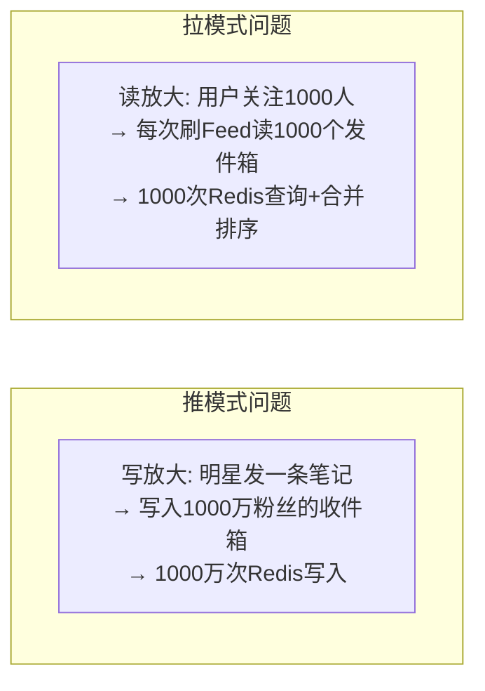
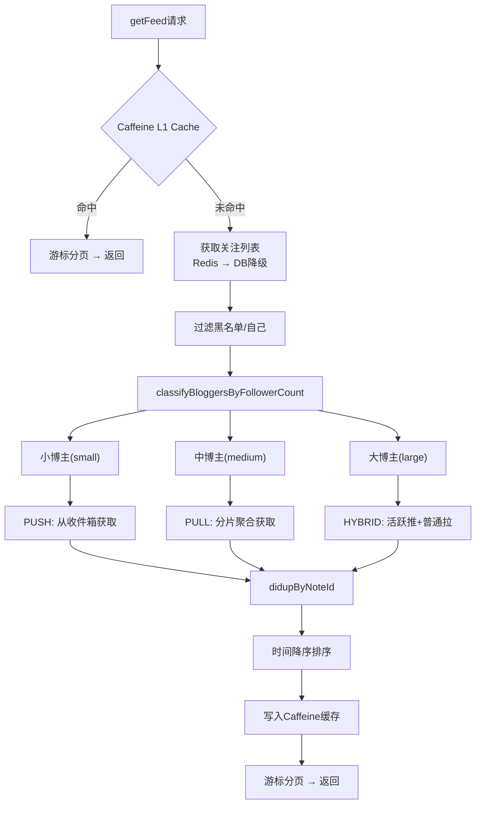

# 理享项目技术博客（八）：Feed流智能分发策略与粉丝分级推拉模式

> 作者：趣享社技术团队  
> 系列：理享——男性大学生内容社区技术揭秘  
> 关键词：Feed流、推拉模式、混合分发、粉丝分级、Redis ZSet、读写放大

---

## 一、Feed流的核心挑战

Feed流是社交平台的核心体验——用户打开App，看到关注博主的笔记按时间排序展示。这个看似简单的功能，背后涉及两个经典问题：



**推模式（PUSH）**：博主发布笔记时，直接写入每个粉丝的收件箱。优点是用户读取快（O(1)查询），缺点是写放大严重——大V发一条笔记需要向百万粉丝各写入一次。

**拉模式（PULL）**：粉丝刷新时，从每个关注博主的发件箱拉取最新笔记。优点是写成本低（O(1)写入），缺点是读放大——用户关注1000人时需读取1000个发件箱并合并排序。

**理享的答案是：按粉丝量分级，三种策略自适应选择。**

---

## 二、三级分发策略体系

### 2.1 策略总览

```java
// SmartFeedDistributionService.java:68-72 - 推送模式枚举

public enum PushMode {
    PUSH,           // 推模式:   粉丝 < 1000
    PULL,           // 拉模式:   1000 ≤ 粉丝 ≤ 100,000
    HYBRID          // 推拉结合: 粉丝 > 100,000
}
```

| 策略 | 粉丝区间 | 写入操作 | 读取操作 | 适用场景 |
|------|---------|---------|---------|---------|
| PUSH | < 1,000 | 写入所有粉丝收件箱 | O(1) 查自己的收件箱 | 小博主，粉丝少，写放大可接受 |
| PULL | 1K~100K | 写入作者发件箱 | 合并关注列表的发件箱 | 中博主，写成本低，读成本可控 |
| HYBRID | > 100K | 活跃粉推 + 普通粉拉 | 混合获取 | 大V，平衡读写成本 |

### 2.2 策略选择流程

```java
// SmartFeedDistributionService.java:132-140

private PushMode determinePushMode(long fansCount) {
    if (fansCount < smallBloggerThreshold) {       // < 1000
        return PushMode.PUSH;
    } else if (fansCount <= mediumBloggerThreshold) { // 1000~100000
        return PushMode.PULL;
    } else {                                        // > 100000
        return PushMode.HYBRID;
    }
}
```

阈值可通过配置文件动态调整：

```yaml
feed:
  blogger:
    small: 1000       # 小博主阈值
    medium: 100000    # 中博主阈值
  active-threshold: 120    # 活跃粉丝判定分数
  normal-threshold: 20     # 普通粉丝判定分数
  active-push-batch-size: 1000  # 分批推送大小
```

---

## 三、Redis Key模式设计

Feed系统的所有数据都存储在Redis中，Key设计遵循统一规范：

```java
// FeedServiceImpl.java - Redis Key 常量

// 推模式：粉丝收件箱 (ZSet: noteId → score)
private static final String PUSH_INBOX_PREFIX = "feed:inbox:push:";
// 完整Key: feed:inbox:push:{userId}

// 拉模式：作者发件箱 (ZSet: noteId → score)  
private static final String PULL_OUTBOX_PREFIX = "feed:outbox:pull:";
// 完整Key: feed:outbox:pull:{authorId}

// 用户活跃度 (ZSet: userId → score)
private static final String ACTIVITY_PREFIX = "user:activity:";

// 粉丝分类 (Set: 按活跃度分三类)
private static final String FANS_ACTIVE_RANK = "fans:active:";      // 活跃粉
private static final String FANS_NORMAL_RANK = "fans:normal:";      // 普通粉
private static final String FANS_INACTIVE_RANK = "fans:inactive:";  // 僵尸粉

// 关注列表缓存 (String: JSON序列化的List<Long>)
private static final String FOLLOWING_KEY = "feed:following:";

// 粉丝数缓存 (String: 数字)
private static final String FOLLOWER_COUNT_KEY = "feed:follower:count:";

// 用户Feed缓存 (String: JSON序列化的List<NoteVO>)
private static final String USER_FEED_KEY = "feed:user:";
```

**为什么用ZSet？**
ZSet的Score字段天然支持按时间排序，Redis的 `ZREVRANGE` 命令可以O(log(N)+M)复杂度假取最新的M条笔记，完美满足Feed流的时序要求。

---

## 四、PUSH模式：小博主的简单高效

```java
// FeedServiceImpl.java:1190-1229 - pushNoteToFeedInternal()

private void pushNoteToFeedInternal(Long noteId, Long authorId) {
    long followerCount = getFollowerCount(authorId);

    CompletableFuture.runAsync(() -> {
        if (followerCount < 100) {
            // 极微博主 (<100粉)：直接同步推送
            pushBySmallBlogger(noteId, authorId, (int) followerCount);
        } else if (followerCount < smallBloggerThreshold) {
            // 小博主 (100~1000粉)：推模式异步
            pushBySmallBlogger(noteId, authorId, (int) followerCount);
        }
        // ...
    }, executor);
}
```

PUSH模式的核心逻辑：

```java
// SmartFeedDistributionService.java:146-197

private DistributionResult pushMode(Long noteId, Long authorId, long followerCount) {
    // 获取所有粉丝
    List<Long> fans = getAllFollowers(authorId);
    
    // 分批写入收件箱（每批500个粉丝）
    double score = System.currentTimeMillis();
    int batchSize = 500;
    
    for (int i = 0; i < fans.size(); i += batchSize) {
        int end = Math.min(i + batchSize, fans.size());
        List<Long> batch = fans.subList(i, end);
        
        // 异步写入每个粉丝的收件箱ZSet
        CompletableFuture.runAsync(() -> {
            pushToInboxBatch(noteId, authorId, batch, score);
        }, executor);
    }
}

// 批量写入收件箱
private void pushToInboxBatch(Long noteId, Long authorId, List<Long> fans, double score) {
    for (Long fanId : fans) {
        String inboxKey = PUSH_INBOX_PREFIX + fanId;
        redisTemplate.opsForZSet().add(inboxKey, noteId.toString(), score);
        redisTemplate.expire(inboxKey, 24, TimeUnit.HOURS);  // 24小时过期
    }
}
```

### 读取流程

```java
// FeedServiceImpl.java:450-465

private List<NoteVO> getFromPushInbox(Long authorId, Long userId) {
    String key = PUSH_INBOX_PREFIX + userId;
    
    // ZREVRANGE 获取最新的笔记ID（按score降序）
    Set<String> noteIds = redisTemplate.opsForZSet().reverseRange(key, 0, -1);
    
    if (noteIds != null && !noteIds.isEmpty()) {
        List<Long> ids = noteIds.stream().map(Long::parseLong).collect(Collectors.toList());
        return getNoteDetails(ids, userId);
    }
    
    // 缓存未命中：降级到数据库查询
    return getFromDatabaseFallback(authorId, userId);
}
```

**设计要点**：收件箱24小时过期。对于活跃用户，收件箱始终有数据；对于不活跃用户，过期后降级到数据库查询，避免Redis存储无限膨胀。

---

## 五、PULL模式：中博主的成本平衡

PULL模式的核心思想是：**只写作者的发件箱，不写粉丝收件箱**。

### 写入（极轻量）

```java
// SmartFeedDistributionService.java:203-227

private DistributionResult pullMode(Long noteId, Long authorId) {
    // 仅一条Redis操作：写入作者发件箱
    double score = System.currentTimeMillis();
    String outboxKey = PULL_OUTBOX_PREFIX + authorId;
    redisTemplate.opsForZSet().add(outboxKey, noteId.toString(), score);
    redisTemplate.expire(outboxKey, 24, TimeUnit.HOURS);
    
    result.setPushCount(0);  // 拉模式不直接推送
}
```

**写放大对比**：

| 场景 | PUSH模式写入次数 | PULL模式写入次数 |
|------|----------------|-----------------|
| 1万粉博主发笔记 | 10,000次 | 1次 |
| 10万粉博主发笔记 | 100,000次 | 1次 |
| 100万粉博主发笔记 | 1,000,000次 | 1次 |

### 读取（分片合并）

```java
// FeedServiceImpl.java:517-569 - getFromPullOutboxSharded()

private List<NoteVO> getFromPullOutboxSharded(List<Long> authorIds, Long userId) {
    List<NoteVO> result = new ArrayList<>();
    
    // 1. 先查Redis缓存（30分钟过期）
    List<NoteVO> cachedNotes = getFromRedisCache(userId);
    Map<Long, List<NoteVO>> cachedByAuthor = cachedNotes.stream()
        .collect(Collectors.groupingBy(NoteVO::getUserId));
    
    // 2. 按分片（每10个作者一组）聚合查询
    Map<String, List<Long>> shards = splitAuthorsByShard(authorIds);
    
    for (Map.Entry<String, List<Long>> shard : shards.entrySet()) {
        for (Long authorId : shard.getValue()) {
            // 跳过已缓存的作者
            if (cachedByAuthor.containsKey(authorId)) {
                result.addAll(cachedByAuthor.get(authorId));
                continue;
            }
            
            // ZREVRANGE获取每个作者发件箱的最新50条
            String key = PULL_OUTBOX_PREFIX + authorId;
            Set<String> noteIds = redisTemplate.opsForZSet().reverseRange(key, 0, 49);
            // ... 详情查询
        }
    }
    
    // 3. 更新Redis缓存
    updateRedisCache(userId, result);
    return result;
}
```

分片设计将多次Redis查询分组合并，减少网络往返次数。

---

## 六、HYBRID模式：大V的智能分级推送

大V（>10万粉）是Feed系统的最大挑战。理享的HYBRID模式通过**粉丝活跃度分级**来精细化管理：

### 粉丝分类获取

```java
// SmartFeedDistributionService.java:322-370

private FanSegment getFanSegment(Long authorId) {
    FanSegment segment = new FanSegment();
    
    // 从Redis读取预计算的粉丝分类
    Set<String> activeMembers = redisTemplate.opsForSet()
        .members(FANS_ACTIVE_RANK + authorId);      // 活跃粉丝
    Set<String> normalMembers = redisTemplate.opsForSet()
        .members(FANS_NORMAL_RANK + authorId);      // 普通粉丝
    Set<String> inactiveMembers = redisTemplate.opsForSet()
        .members(FANS_INACTIVE_RANK + authorId);    // 僵尸粉丝
    
    segment.setActiveFans(parseToLongList(activeMembers));
    segment.setNormalFans(parseToLongList(normalMembers));
    segment.setInactiveFans(parseToLongList(inactiveMembers));
    
    return segment;
}
```

### 活跃粉丝分批推送

```java
// SmartFeedDistributionService.java:286-317

private void pushActiveFansByBatches(Long noteId, Long authorId, List<Long> activeFans) {
    Collections.sort(activeFans);  // 按ID排序保证顺序一致
    
    int totalBatches = (int) Math.ceil((double) activeFans.size() / activePushBatchSize);
    
    for (int batch = 0; batch < totalBatches; batch++) {
        int start = batch * activePushBatchSize;
        int end = Math.min(start + activePushBatchSize, activeFans.size());
        List<Long> batchFans = activeFans.subList(start, end);
        
        double score = System.currentTimeMillis() + batch; // 微调score保证顺序
        pushToInboxBatch(noteId, authorId, batchFans, score);
        
        // 每批间隔500ms，避免瞬间流量冲击
        if (batch < totalBatches - 1) {
            Thread.sleep(500);
        }
    }
}
```

### FeedPusher分批调度

```java
// FeedPusher.java:109-162 - pushInBatches()

private void pushInBatches(Long noteId, Long authorId, IFeedService feedService) {
    for (int batch = 0; batch < MAX_PUSH_BATCHES; batch++) {   // 5批次
        boolean batchSuccess = false;
        
        // 单批失败重试3次
        for (int retry = 0; retry < MAX_RETRY_TIMES; retry++) {
            try {
                feedService.pushNoteInBatch(noteId, authorId, batch, MAX_PUSH_BATCHES);
                batchSuccess = true;
                break;
            } catch (Exception e) {
                if (retry < MAX_RETRY_TIMES - 1) {
                    Thread.sleep(500);  // 重试间隔500ms
                }
            }
        }
        
        // 每批间隔1秒，平滑流量
        if (batch < MAX_PUSH_BATCHES - 1) {
            Thread.sleep(BATCH_INTERVAL_MS);  // 1000ms
        }
    }
}
```

### HYBRID模式的混合执行

```java
// SmartFeedDistributionService.java:233-281

private DistributionResult hybridMode(Long noteId, Long authorId) {
    FanSegment segment = getFanSegment(authorId);
    
    // 1. 活跃粉丝 → PUSH写入收件箱（分批，异步）
    if (!segment.getActiveFans().isEmpty()) {
        CompletableFuture.runAsync(() -> {
            pushActiveFansByBatches(noteId, authorId, segment.getActiveFans());
        }, executor);
    }
    
    // 2. 普通粉丝 → PULL写入发件箱
    if (!segment.getNormalFans().isEmpty()) {
        pushToOutbox(noteId, authorId);
    }
    
    // 3. 僵尸粉丝 → 不推送
    log.info("僵尸粉丝不推送: count={}", segment.getInactiveFans().size());
}
```

**HYBRID模式效果对比**：

| 粉丝结构 | PUSH(全量) | PULL(全量) | HYBRID(分级) |
|---------|-----------|-----------|-------------|
| 活跃5万 + 普通30万 + 僵尸65万 | 100万次写入 | 1次写入 + 100万次读取/用户 | 5万次写入 ← 最优 |
| 平均延迟 | 写入: 30s+ | 读取: 500ms+ | 活跃粉<100ms, 普通粉~300ms |

---

## 七、getFeed()完整查询流程

用户刷新Feed时的完整链路：

```java
// FeedServiceImpl.java:278-370 - getFeedFromCache()

private List<NoteVO> getFeedFromCache(Long userId, String cursor, int size) {
    // 1. Caffeine本地缓存命中（最快路径，<1ms）
    List<NoteVO> localCache = LOCAL_FEED_CACHE.getIfPresent(userId);
    if (localCache != null && cursor == null) {
        return processCursorPagination(localCache, cursor, size);
    }
    
    // 2. 获取关注列表（Redis缓存 → DB降级）
    List<Long> followingIds = getFollowingIdsCached(userId);
    
    // 3. 过滤黑名单 + 排除自己
    List<Long> blockedIds = blacklistService.getBlockedUserIds(userId);
    blockedIds.add(userId);
    followingIds = followingIds.stream()
        .filter(id -> !blockedIds.contains(id))
        .collect(Collectors.toList());
    
    // 4. 按粉丝量分类为小/中/大三类
    Map<String, List<Long>> bloggerGroups = classifyBloggersByFollowerCount(followingIds);
    
    // 5. 并行获取三类博主的笔记
    //    small  → 从push inbox获取
    //    medium → 从pull outbox分片获取
    //    large  → hybrid模式获取
    List<NoteVO> allNotes = new ArrayList<>();
    allNotes.addAll(getSmallBloggerNotes(bloggerGroups.get("small"), userId));
    allNotes.addAll(getFromPullOutboxSharded(bloggerGroups.get("medium"), userId));
    allNotes.addAll(getLargeBloggerNotes(bloggerGroups.get("large"), userId));
    
    // 6. 按NoteId去重（保留先出现的）
    allNotes = dedupByNoteId(allNotes);
    
    // 7. 按时间降序排序
    allNotes.sort((a, b) -> b.getCreatedAt().compareTo(a.getCreatedAt()));
    
    // 8. 写入本地缓存（仅首页）
    if (cursor == null) {
        LOCAL_FEED_CACHE.put(userId, allNotes);
    }
    
    // 9. 游标分页
    return processCursorPagination(allNotes, cursor, size);
}
```



### 游标分页

避免传统offset分页的深度翻页性能问题：

```java
// FeedServiceImpl.java:1083-1110

private List<NoteVO> processCursorPagination(List<NoteVO> notes, String cursor, int size) {
    int startIndex = 0;
    
    if (cursor != null && !cursor.isEmpty()) {
        String[] parts = cursor.split("_");
        // cursor格式: timestamp_noteId
        long timestamp = Long.parseLong(parts[0]);
        long noteId = Long.parseLong(parts[1]);
        
        // 定位游标位置
        for (int i = 0; i < notes.size(); i++) {
            NoteVO note = notes.get(i);
            if (matchesCursor(note, timestamp, noteId)) {
                startIndex = i + 1;
                break;
            }
        }
    }
    
    int endIndex = Math.min(startIndex + size, notes.size());
    return notes.subList(startIndex, endIndex);
}
```

---

## 八、缓存体系设计

Feed系统使用了三级缓存，精度和速度层层递进：

```java
// FeedServiceImpl.java - 缓存体系

// L1: Caffeine本地缓存 - 热点Feed (5分钟, 最大1000条)
private static final Cache<Long, List<NoteVO>> LOCAL_FEED_CACHE = Caffeine.newBuilder()
    .maximumSize(1000)
    .expireAfterWrite(5, TimeUnit.MINUTES)
    .build();

// L1: Caffeine本地缓存 - 用户信息 (10分钟, 最大500条)
private static final Cache<Long, User> LOCAL_USER_CACHE = Caffeine.newBuilder()
    .maximumSize(500)
    .expireAfterWrite(10, TimeUnit.MINUTES)
    .build();

// L2: Redis缓存 - 关注列表 (1天)
private static final Duration FOLLOWING_CACHE_EXPIRE = Duration.ofDays(1);
// L2: Redis缓存 - 粉丝数 (6小时)
private static final Duration FOLLOWER_COUNT_CACHE_EXPIRE = Duration.ofHours(6);
// L2: Redis缓存 - 拉模式发件箱 (24小时)
private static final Duration PULL_CACHE_EXPIRE = Duration.ofHours(24);
// L2: Redis缓存 - 用户Feed (15分钟)
private static final long FEED_CACHE_EXPIRE_SECONDS = 15 * 60;

// L3: MySQL数据库 - 终极降级方案
```

缓存失效策略：

```java
// FeedServiceImpl.java - 缓存驱逐

@Override
public void evictFollowingCache(Long userId) {
    redisTemplate.delete(FOLLOWING_KEY + userId);  // 关注变更时清除
}

@Override
public void evictFollowerCache(Long userId) {
    redisTemplate.delete(FOLLOWER_COUNT_KEY + userId);  // 粉丝数变更时清除
}

@Override
public void evictUserFeedCache(Long userId) {
    redisTemplate.delete(USER_FEED_KEY + userId);  // Feed更新时清除
}

@Override
public void evictAllCachesByAuthor(Long authorId) {
    evictFollowerCache(authorId);  // 发布笔记后清除粉丝数缓存
}
```

Redis不可用时，自动降级到数据库查询：

```java
private List<NoteVO> getFeedFromDatabaseFallback(Long userId, String cursor, int size) {
    // 1. 从数据库获取关注列表
    List<Long> followingIds = getFollowingIdsFromDB(userId);
    // 2. 过滤黑名单
    // 3. 查询最新笔记
    LambdaQueryWrapper<Note> wrapper = new LambdaQueryWrapper<>();
    wrapper.in(Note::getUserId, followingIds);
    wrapper.eq(Note::getStatus, 1);           // 仅正常状态
    wrapper.orderByDesc(Note::getCreatedAt);
    wrapper.last("LIMIT " + (size * 2));
    // 4. 游标分页
    return processCursorPagination(noteVOs, cursor, size);
}
```

---

## 九、总结：分而治之的智慧

本章介绍了理享Feed流智能分发系统的完整设计，核心要点：

1. **三级分发策略**：按粉丝量自适应选择PUSH/PULL/HYBRID，避免纯推的写放大和纯拉的读放大

2. **Redis ZSet为核心存储**：利用ZSet的Score排序能力，收件箱/发件箱都基于ZSet实现

3. **粉丝活跃度分级**：HYBRID模式将粉丝分为活跃/普通/僵尸三类，活跃粉PUSH（即时触达），普通粉PULL（成本可控），僵尸粉跳过（节省资源）

4. **分批+重试+间隔**：大V推送分5批，批次间隔1秒，每批失败重试3次，平滑流量尖峰

5. **三级缓存体系**：Caffeine本地缓存（<1ms）→ Redis（<5ms）→ MySQL（<50ms），层层降级确保可用性

6. **游标分页**：避免传统offset分页的深度翻页性能退化

这场"分而治之"的设计，让理享有能力服务从0粉新用户到百万粉大V的全量博主，在成本、延迟、可靠性之间取得了最优平衡。

---

*全系列完。感谢阅读！*
