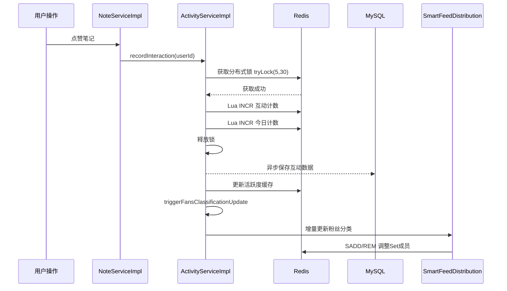

# 粉丝活跃度分层与分批推送实现

> **所属项目**：理享（小蓝书）—— 面向男性大学生群体的内容社交平台  
> **技术栈**：Spring Boot 3.2 + MyBatis Plus + Redis 7 + MySQL 8  
> **核心模块**：用户活跃度管理 / Feed智能分发  
> **关键词**：活跃度评分公式、粉丝分层、分批推送、Redis Set、分布式锁、定时任务衰减

---

## 一、为什么需要粉丝活跃度分层

在内容社交平台中，当一个大V博主拥有百万粉丝时，每次发布笔记如果全量推送到所有粉丝的收件箱，会产生**百万级别的写放大**——Redis需要执行100万次`ZADD`操作。这不仅消耗大量Redis内存和CPU，还会导致推送延迟飙升，拖慢整个Feed系统的响应速度。

更关键的是，并非所有粉丝都值得推送。根据数据分析，社交平台中约**30%-40%的粉丝属于僵尸粉**（长期不登录、不互动），向这些用户推送内容既浪费存储资源，也毫无业务价值。

理享项目引入**粉丝活跃度分层机制**，核心思想是：

通过在推送源头按活跃度过滤，既保证了活跃用户的即时触达体验，又大幅降低了系统的写放大系数。

---

## 二、活跃度评分公式：为什么这样设计

活跃度评分的目的是量化一个用户对平台的"黏性"。我们设计了一个三维加权公式：

```
活跃度分 = 近7天登录次数 × 10 + 近7天互动次数 × 5 + 近30天登录次数 × 1
```

**权重设计理由**：

| 维度 | 权重 | 理由 |
|------|------|------|
| 近7天登录次数 | ×10 | 近期登录是最强活跃信号，权重最高 |
| 近7天互动次数 | ×5 | 互动（点赞/评论/收藏）代表深度参与，但可能单次登录多次互动 |
| 近30天登录次数 | ×1 | 低频长期登录给予基础分，防止纯新用户无法入榜 |

**举例演算**：

| 用户画像 | 7天登录 | 7天互动 | 30天登录 | 得分 | 分层 |
|----------|---------|---------|----------|------|------|
| 重度用户 | 7次 | 15次 | 25次 | 7×10+15×5+25×1=170 | 活跃粉丝 |
| 普通用户 | 5次 | 3次 | 12次 | 5×10+3×5+12×1=77 | 普通粉丝 |
| 偶尔访问 | 2次 | 1次 | 8次 | 2×10+1×5+8×1=33 | 普通粉丝 |
| 已流失 | 0次 | 0次 | 1次 | 0×10+0×5+1×1=1 | 僵尸粉丝 |

**分层阈值设计**：

```java
// ActivityServiceImpl.java - 可配置阈值
@Value("${fans.threshold.active:120.0}")
private double activeThreshold;   // 活跃粉丝：≥120

@Value("${fans.threshold.normal:20.0}")
private double normalThreshold;   // 普通粉丝：20~120
// 僵尸粉丝：<20（不存储）
```

阈值通过Spring的`@Value`注入，运维人员可在`application.yml`中灵活调整，无需重新编译发布。

---

## 三、UserActivity实体设计与分数计算

活跃度数据持久化在`user_activity`表中，对应实体`UserActivity`：

```java
// UserActivity.java
@Data
@TableName("user_activity")
public class UserActivity {
    @TableId(type = IdType.AUTO)
    private Long id;

    @TableField("user_id")
    private Long userId;

    @TableField("login_days")
    private Integer loginDays;           // 累计登录天数

    @TableField("interaction_count")
    private Integer interactionCount;     // 累计互动次数

    @TableField("activity_score")
    private Double activityScore;        // 活跃度分数

    @TableField("last_login_date")
    private LocalDate lastLoginDate;      // 上次登录日期

    @TableField("today_interaction_count")
    private Integer todayInteractionCount; // 今日互动次数

    @TableField("today_interaction_date")
    private LocalDate todayInteractionDate; // 今日互动日期

    // 常量定义
    public static final double BASE_SCORE = 5.0;
    public static final double LOGIN_WEIGHT = 5.0;
    public static final double INTERACTION_WEIGHT = 3.0;
    public static final double MAX_DAILY_INTERACTION_SCORE = 200.0;

    /**
     * 计算活跃分数
     * 公式：5(基础分) + loginDays×5 + min(interactionCount×3, 200)
     */
    public void calculateScore() {
        double interactionScore = Math.min(
            this.interactionCount * INTERACTION_WEIGHT,
            MAX_DAILY_INTERACTION_SCORE
        );
        this.activityScore = BASE_SCORE +
            this.loginDays * LOGIN_WEIGHT +
            interactionScore;
    }
}
```

这里有两点值得注意的设计：

1. **基础分5.0**：确保新用户也有一个非零的起始分数，不会被立即归类为僵尸粉丝。
2. **互动分上限200**：防止刷子用户通过脚本无限互动刷分，确保分数体系的公平性。

---

## 四、Redis中的粉丝分类存储结构

粉丝分类计算完成后，结果存储在Redis Set中，便于Feed分发时快速查询：

**Redis Key设计**：

| Key | 类型 | 含义 | 示例 |
|-----|------|------|------|
| `author:{authorId}:active_fans` | Set | 博主的活跃粉丝ID集合 | `author:10086:active_fans` → {1001,1002,...} |
| `author:{authorId}:normal_fans` | Set | 博主的普通粉丝ID集合 | `author:10086:normal_fans` → {2001,2002,...} |

**注意**：僵尸粉丝（score ≤ 20）不存储在任何Set中——这本身就是一种存储优化。不存=不推。

```java
// ActivityServiceImpl.java - 粉丝分类常量
private static final String FANS_ACTIVE_PREFIX = "author:";
private static final String FANS_ACTIVE_SUFFIX = ":active_fans";
private static final String FANS_NORMAL_SUFFIX = ":normal_fans";

// 分类逻辑核心代码
private void incrementalUpdateFansClassification(
        Long authorId, Long fanId, double newScore) {

    String activeKey = FANS_ACTIVE_PREFIX + authorId + FANS_ACTIVE_SUFFIX;
    String normalKey = FANS_ACTIVE_PREFIX + authorId + FANS_NORMAL_SUFFIX;

    // 检查当前分类
    boolean wasActive = redisTemplate.opsForSet()
        .isMember(activeKey, fanId.toString());
    boolean wasNormal = redisTemplate.opsForSet()
        .isMember(normalKey, fanId.toString());

    // 根据新分数判定新分类
    boolean nowActive = newScore >= activeThreshold;
    boolean nowNormal = newScore > normalThreshold
        && newScore < activeThreshold;

    // 增量更新：只做变化的部分
    if (wasActive && !nowActive) {
        redisTemplate.opsForSet().remove(activeKey, fanId.toString());
        if (nowNormal) {
            redisTemplate.opsForSet().add(normalKey, fanId.toString());
        }
    } else if (wasNormal && !nowNormal) {
        redisTemplate.opsForSet().remove(normalKey, fanId.toString());
        if (nowActive) {
            redisTemplate.opsForSet().add(activeKey, fanId.toString());
        }
    } else if (!wasActive && !wasNormal && (nowActive || nowNormal)) {
        if (nowActive) {
            redisTemplate.opsForSet().add(activeKey, fanId.toString());
        } else {
            redisTemplate.opsForSet().add(normalKey, fanId.toString());
        }
    }
}
```

这种**增量更新**策略相比全量重建有以下优势：
- 只变更发生变化的粉丝，避免全量删除+重写
- O(1)级别的单粉丝迁移，而非O(N)的全量重建
- 可以在用户每次互动后实时触发，而非等待定时任务

---

## 五、recordLogin与recordInteraction：行为记录的双通道

`ActivityServiceImpl`提供了两个核心的行为记录方法：

### 5.1 记录登录行为

```java
// ActivityServiceImpl.java
@Override
public void recordLogin(Long userId) {
    // 分布式锁 + Lua脚本原子递增登录天数
    incrementLoginDaysWithRedis(userId);

    // 异步同步到数据库
    asyncSaveLoginDaysToDb(userId);

    // 更新Redis缓存并触发粉丝分类更新
    UserActivity activity = userActivityMapper.selectByUserId(userId);
    if (activity != null) {
        updateRedisCache(userId, activity);
        triggerFansClassificationUpdate(userId);
    }
}
```

登录记录的防重复设计——**同一自然日多次登录只计一次**：

```java
private void incrementLoginDaysWithRedis(Long userId) {
    RLock lock = redissonClient.getLock("login:user:" + userId);
    lock.tryLock(5, 30, TimeUnit.SECONDS);
    try {
        LocalDate today = LocalDate.now();
        String todayStr = today.toString();

        String lastLoginKey = USER_LOGIN_DAYS_KEY + userId + ":last";
        String lastLoginDate = redisTemplate.opsForValue().get(lastLoginKey);

        // 当日首次登录才递增
        if (lastLoginDate == null || !lastLoginDate.equals(todayStr)) {
            redisTemplate.execute(
                RedisScript.of(INTERACTION_INCREMENT_SCRIPT, Long.class),
                Collections.singletonList(loginDaysKey)
            );
            redisTemplate.opsForValue().set(lastLoginKey, todayStr);
        }
    } finally {
        if (lock.isHeldByCurrentThread()) lock.unlock();
    }
}
```

通过Redis中记录的`user:activity:logindays:{userId}:last`对比当天日期，确保同一天内无论登录多少次，`loginDays`只递增1次。

### 5.2 记录互动行为

```java
@Override
public void recordInteraction(Long userId) {
    incrementInteractionWithRedis(userId);
    asyncSaveInteractionToDb(userId);

    UserActivity activity = userActivityMapper.selectByUserId(userId);
    if (activity != null) {
        updateRedisCache(userId, activity);
        triggerFansClassificationUpdate(userId);
    }
}
```

互动计数同样做了跨日重置处理：

```java
// 今日互动Key格式: user:activity:today:{userId}:2026-05-17
String todayKey = USER_TODAY_INTERACTION_KEY + userId + ":" + dateStr;
String todayValue = redisTemplate.opsForValue().get(todayKey);
if (todayValue == null) {
    // 新的一天，重置计数
    redisTemplate.opsForValue().set(todayKey, "1");
} else {
    // 同一天，递增
    redisTemplate.execute(
        RedisScript.of(INTERACTION_INCREMENT_SCRIPT, Long.class),
        Collections.singletonList(todayKey)
    );
}
```

通过带上日期后缀的Key，天然实现了"跨天自动重置"，无需额外的定时任务。

---

## 六、互动类型加权：不同动作不同价值

并非所有互动行为对活跃度的贡献相同。项目定义了四种互动动作及其对应的分数增量：

```java
// ActivityServiceImpl.java - 互动类型常量
public static final int ACTION_LIKE = 1;      // 点赞 +3分
public static final int ACTION_FAVORITE = 2;  // 收藏 +3分
public static final int ACTION_COMMENT = 3;   // 评论 +5分
public static final int ACTION_FOLLOW = 4;    // 关注 +2分

@Override
public void incrementActivityScore(Long userId, int actionType) {
    int scoreIncrement;
    switch (actionType) {
        case ACTION_LIKE:     scoreIncrement = 3; break;
        case ACTION_FAVORITE: scoreIncrement = 3; break;
        case ACTION_COMMENT:  scoreIncrement = 5; break;
        case ACTION_FOLLOW:   scoreIncrement = 2; break;
        default: return;
    }

    // 增量更新该用户关注的所有博主的粉丝分类
    // ...
}
```

**为什么评论+5分而点赞只+3分？**

```
用户行为成本阶梯：
    转发 > 收藏 > 评论 > 点赞 > 关注

评论需要思考+打字，成本最高 → 权重最高（+5）
点赞/收藏一键操作，成本较低 → 权重次之（+3）
关注属于一次性行为 → 权重最低（+2）
```

这种差异化激励设计引导用户做出更有深度价值的互动行为，也使得活跃度分数更能反映用户的真实参与意愿。

---

## 七、三大定时任务：衰减、重置与同步

活跃度数据不是一成不变的，需要通过定时任务持续维护。项目设计了三个核心定时任务：

### 7.1 每日零时：活跃度衰减

```java
@Scheduled(cron = "0 0 0 * * ?")
public void decayActivityAndRecalculate() {
    List<UserActivity> allActivities = userActivityMapper.selectList(null);

    for (UserActivity activity : allActivities) {
        if (activity.getActivityScore() != null
                && activity.getActivityScore() > 0) {
            // 乘以衰减系数（默认0.8）
            double newScore = activity.getActivityScore() * decayRate;
            activity.setActivityScore(newScore);
        }
    }

    // 分批更新数据库（每批500条，防止长SQL）
    for (int i = 0; i < totalSize; i += dbBatchSize) {
        List<UserActivity> batch = allActivities.subList(i, end);
        userActivityMapper.batchUpdateScore(batch);
    }

    // 对大博主重新计算粉丝分类
    List<Long> bigBloggerIds = followMapper
        .selectBloggerIdsByFollowerCount(bigBloggerThreshold);
    for (Long authorId : bigBloggerIds) {
        updateFansActivityRank(authorId);
    }
}
```

**衰减系数0.8的含义**：如果一个用户今天不再有任何互动，他的活跃分数每天会自动降至前一天的80%。连续7天不互动后，120分用户会降至约25分，从活跃粉丝自动降级为普通粉丝。

### 7.2 每日凌晨4点：重置今日互动计数

```java
@Scheduled(cron = "0 0 4 * * ?")
public void resetDailyInteractionCount() {
    int updated = userActivityMapper.resetTodayInteractionCount();
    log.info("重置每日互动计数完成: 更新{}条", updated);
}
```

选择凌晨4点而非0点执行，是为了错开零时的衰减任务和用户活跃高峰，减少数据库压力。

### 7.3 每小时30分：粉丝分类增量同步

```java
@Scheduled(cron = "0 30 * * * ?")
public void hourlySyncFansClassification() {
    LocalDate today = LocalDate.now();
    List<UserActivity> todayActiveUsers = userActivityMapper
        .selectTodayActiveUsers(today);

    // 找出这些用户的关注博主，增量更新分类
    Set<Long> authorIds = new HashSet<>();
    for (UserActivity activity : todayActiveUsers) {
        // 查询该用户关注了哪些博主
        List<Follow> follows = followMapper.selectList(wrapper);
        for (Follow follow : follows) {
            authorIds.add(follow.getFollowingId());
        }
    }

    for (Long authorId : authorIds) {
        updateFansActivityRank(authorId);
    }
}
```

这个任务确保：用户活跃度变化后，他作为"粉丝"的身份能在1小时内反映到博主的粉丝分类Redis Set中。

---

## 八、分批推送：pushNoteInBatch的高并发设计

当一个大V博主发布笔记后，`SmartFeedDistributionService`负责将笔记分发到粉丝。对于百万粉博主的活跃粉丝（约30万人），直接全量推送会导致Redis瞬间承受海量写请求。

解决方案：**分批推送 + 异步线程池**。

```java
// SmartFeedDistributionService.java
private void pushActiveFansByBatches(
        Long noteId, Long authorId, List<Long> activeFans) {

    // 按粉丝ID排序，保证顺序一致性
    Collections.sort(activeFans);

    int totalBatches = (int) Math.ceil(
        (double) activeFans.size() / activePushBatchSize);  // 每批1000人
    log.info("活跃粉丝分批推送: total={}, batchSize={}, totalBatches={}",
        activeFans.size(), activePushBatchSize, totalBatches);

    for (int batch = 0; batch < totalBatches; batch++) {
        int start = batch * activePushBatchSize;
        int end = Math.min(start + activePushBatchSize, activeFans.size());
        List<Long> batchFans = activeFans.subList(start, end);

        // 复合Score：时间戳 + 批次号，保证同秒笔记不冲突
        double score = System.currentTimeMillis() + batch;

        pushToInboxBatch(noteId, authorId, batchFans, score);

        // 批次间间隔500ms，避免瞬间压力
        if (batch < totalBatches - 1) {
            Thread.sleep(500);
        }
    }
}
```

**关键设计细节解析**：

### 8.1 复合Score防冲突

```java
// FeedServiceImpl.java
private static final long SCORE_SEQUENCE_BITS = 1024L;

private long generateCompositeScore(double timestamp) {
    long sequence = snowflakeIdGenerator.nextId() & 1023;  // 取低10位
    return ((long) timestamp * SCORE_SEQUENCE_BITS) + sequence;
}
```

如果单纯用时间戳作为Redis ZSet的Score，在同一毫秒内发布多条笔记时会产生Score冲突，导致后写入的笔记覆盖前一条。通过`timestamp × 1024 + sequence`的复合格式：
- 高位存储时间戳（保证时序性）
- 低10位存储雪花ID的序列号（保证唯一性）
- 支持**亿级并发**下同一毫秒1024条笔记不冲突

### 8.2 批次间间隔控制

`Thread.sleep(500)`在批次间插入500ms停顿，这是**拥塞控制**策略：
- 防止短时间内Redis连接池耗尽
- 给Redis主从同步留出缓冲时间
- 给下游消费（如通知推送、热点更新）留出处理窗口

### 8.3 线程池隔离

推送任务使用独立的`feedDistributeExecutor`线程池：

```java
// AsyncConfig.java
@Bean("feedDistributeExecutor")
public Executor feedDistributeExecutor() {
    ThreadPoolTaskExecutor executor = new ThreadPoolTaskExecutor();
    executor.setCorePoolSize(2);
    executor.setMaxPoolSize(5);
    executor.setQueueCapacity(100);
    executor.setRejectedExecutionHandler(
        new ThreadPoolExecutor.CallerRunsPolicy());
    return executor;
}
```

- 核心线程2个：日常推送够用，控制资源占用
- 最大线程5个：应对突发流量
- CallerRunsPolicy：队列满时由调用线程执行，保证任务不丢失

---

## 九、分布式锁在活跃度更新中的应用与避坑

活跃度更新是典型的**并发敏感**操作——多个请求可能同时修改同一个用户的活跃度数据。

### 9.1 锁的使用策略

项目中活跃度相关的分布式锁采取**静默跳过**策略：

```java
private void incrementInteractionWithRedis(Long userId) {
    RLock lock = redissonClient.getLock("activity:user:" + userId);
    boolean lockAcquired = lock.tryLock(5, 30, TimeUnit.SECONDS);
    if (!lockAcquired) {
        log.warn("获取互动锁失败（静默跳过）: userId={}", userId);
        return;  // 不抛异常，静默跳过
    }
    try {
        // 执行更新...
    } finally {
        if (lock.isHeldByCurrentThread()) lock.unlock();
    }
}
```

**为什么选择静默跳过而不是抛异常？**

因为活跃度更新是后台辅助功能，不是用户主流程。如果因为锁竞争导致用户"点赞返回系统繁忙"，用户体验极差。静默跳过意味着：活跃度偶尔少计一次可以接受，但不能影响用户的主流程。

### 9.2 锁Key的命名规范

| 锁Key | 用途 | 策略 |
|-------|------|------|
| `login:user:{userId}` | 登录天数更新 | tryLock(5,30) → 静默跳过 |
| `activity:user:{userId}` | 互动计数更新 | tryLock(5,30) → 静默跳过 |
| `like:note:{noteId}` | 点赞计数 | tryLock(5,30) → 抛异常 |

注意：点赞锁用的是**抛异常策略**——因为点赞是用户主流程，计数准确性至关重要。

### 9.3 安全释放：isHeldByCurrentThread

```java
finally {
    if (lock != null && lock.isHeldByCurrentThread()) {
        lock.unlock();
    }
}
```

必须调用`isHeldByCurrentThread()`检查后再释放，原因：
- 如果锁已因`leaseTime`超时被Redisson自动释放，此时再调用`unlock()`会抛出`IllegalMonitorStateException`
- 如果等待超时未获取到锁，`lock`对象仍然存在但未被当前线程持有

### 9.4 活跃度更新的完整链路



整个链路中，用户的点赞请求在分布式锁内完成Redis计数更新后立即返回（< 50ms），而数据库保存和粉丝分类更新全部异步执行，确保用户体验不受影响。

---

## 总结

粉丝活跃度分层是理享项目Feed系统的**核心基础设施**。通过三维评分公式量化用户价值、Redis Set存储分类结果、三大定时任务维护数据新鲜度、分批推送控制系统负载、分布式锁保障并发安全，这套方案在用户体验和系统成本之间取得了精妙的平衡。

从工程角度看，几个值得借鉴的设计原则：
1. **增量优于全量**：粉丝分类更新采用增量迁移，单次操作O(1)而非O(N)
2. **静默降级优于硬失败**：后台任务锁冲突时静默跳过，不阻塞用户主流程
3. **分层存储按需分配**：僵尸粉丝不存储=零成本，活跃粉丝优先推送=最佳体验
4. **定时任务错峰执行**：衰减0点、重置4点、同步每小时30分，分散数据库压力
