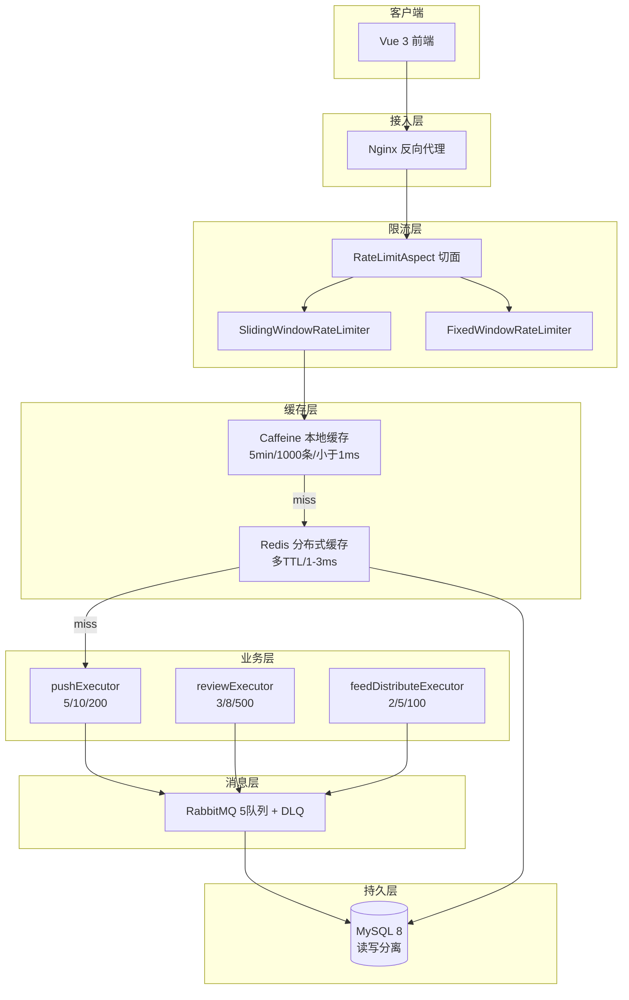
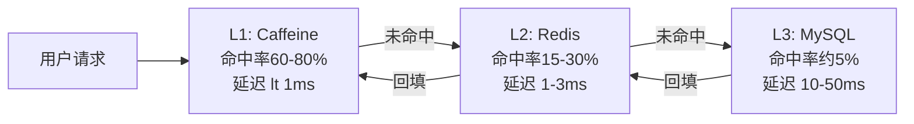
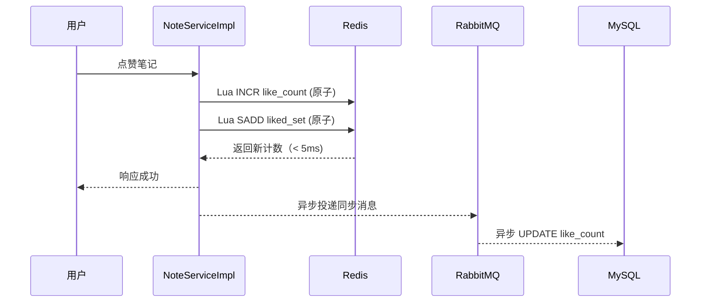
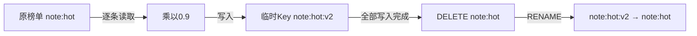
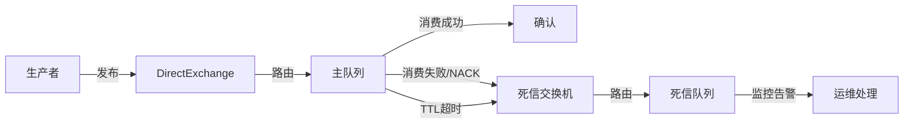
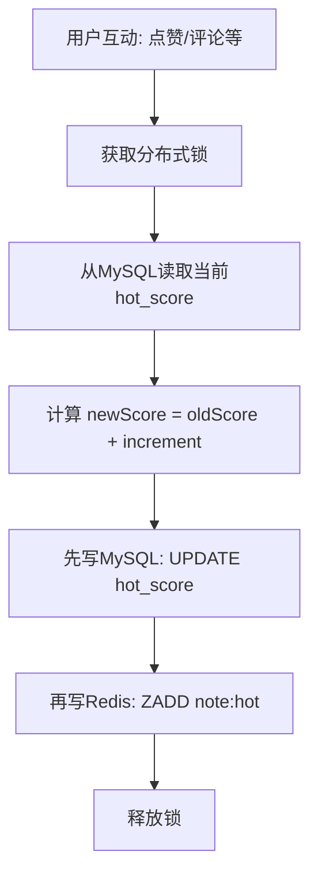

# 全局高并发设计与接口1秒响应优化

> **所属项目**：理享（小蓝书）—— 面向男性大学生群体的内容社交平台  
> **技术栈**：Spring Boot 3.2 + Caffeine + Redis 7 + MySQL 8 + RabbitMQ 3.12  
> **核心模块**：多级缓存体系 / 线程池隔离 / MQ异步解耦 / 热点计算  
> **关键词**：Caffeine、Redis Pipeline、Lua原子脚本、TTL抖动、DB-first、CallerRunsPolicy

---

## 一、性能目标与架构全景

理享作为一个内容社交平台，核心接口必须在高并发下保持低延迟。项目设定的性能目标如下：

| 接口 | P99目标 | 优化手段 |
|------|---------|----------|
| 笔记发布 | < 500ms | 异步审核、事务后置MQ |
| Feed获取 | < 300ms | 三级缓存、并行拉取 |
| 热门列表 | < 200ms | Redis ZSet直读、LRU本地缓存 |
| 笔记详情 | < 100ms | 热点Caffeine缓存、计数分离 |
| 点赞/收藏 | < 50ms | Lua原子脚本、异步写DB |

实现这些目标的整体架构遵循**读写分离、异步解耦、多级缓存**三大原则：



---

## 二、多级缓存架构：L1 Caffeine + L2 Redis + MySQL

缓存是应对高并发的第一道防线。项目采用三级缓存体系：



### 2.1 L1 Caffeine本地缓存

```java
// FeedServiceImpl.java
private static final Cache<Long, List<NoteVO>> LOCAL_FEED_CACHE =
    Caffeine.newBuilder()
        .maximumSize(1000)
        .expireAfterWrite(5, TimeUnit.MINUTES)
        .build();

private static final Cache<Long, User> LOCAL_USER_CACHE =
    Caffeine.newBuilder()
        .maximumSize(500)
        .expireAfterWrite(10, TimeUnit.MINUTES)
        .build();
```

选择Caffeine的理由：基于W-TinyLFU淘汰算法，在命中率和内存占用之间表现最优。1000条上限意味着单JVM进程仅占用约10MB堆外内存。

### 2.2 热点笔记详情缓存

对于笔记详情这种读多写少的场景，项目单独设立了一个热点缓存：

```java
// FeedServiceImpl.java - HOT_NOTE_DETAIL_CACHE
// 热点笔记详情缓存 (5分钟, 1000条)
private static final Cache<Long, NoteVO> HOT_NOTE_DETAIL_CACHE =
    Caffeine.newBuilder()
        .maximumSize(1000)
        .expireAfterWrite(5, TimeUnit.MINUTES)
        .build();
```

当用户访问笔记详情时：
1. 先查`HOT_NOTE_DETAIL_CACHE`（本地，< 1ms）
2. 未命中则查Redis缓存
3. 仍未命中则查MySQL并回填两级缓存

### 2.3 Redis二级缓存TTL策略

| 数据类型 | Redis Key前缀 | TTL | 设计理由 |
|----------|--------------|-----|----------|
| 关注列表 | `feed:following:{uid}` | 24h | 低频变化，长缓存降低DB压力 |
| 粉丝计数 | `feed:follower:count:{aid}` | 6h | 允许短期不准，实时要求不高 |
| Feed收件箱 | `feed:inbox:push:{uid}` | 15min | 平衡新鲜度和Redis内存 |
| 用户Feed | `feed:user:{uid}` | 15min | 高频更新，短TTL保证新鲜度 |
| 热点榜单 | `note:hot` | 7天 | 衰减任务控制，不依赖TTL |
| 发件箱 | `feed:outbox:pull:{aid}` | 24h | 拉模式依赖长缓存 |

---

## 三、计数分离：Redis计数器 + 异步DB同步

传统做法是在每次点赞时直接`UPDATE note SET like_count = like_count + 1`，但MySQL行锁在高并发下会成为瓶颈。理享项目采用**计数分离**架构：



Redis中的计数器Key设计：

| Key | 类型 | 含义 |
|-----|------|------|
| `note:like:count:{noteId}` | String | 笔记点赞总数 |
| `note:liked:{noteId}` | Set | 点赞用户ID集合（用于去重） |
| `note:comment:count:{noteId}` | String | 笔记评论总数 |
| `note:favorite:count:{noteId}` | String | 笔记收藏总数 |

用户看到的点赞数是Redis中的实时值（< 5ms），而数据库中的值会有秒级延迟。这种**最终一致性**模型在社交场景下完全可接受。

异步回写DB的实现：

```java
// CommentServiceImpl.java
private void asyncSaveCommentCountToDb(Long noteId) {
    String commentCountStr = redisTemplate.opsForValue()
        .get(NOTE_COMMENT_COUNT_KEY + noteId);
    if (commentCountStr != null) {
        Note note = new Note();
        note.setId(noteId);
        note.setCommentCount(Integer.parseInt(commentCountStr));
        noteMapper.updateById(note);
    }
}
```

---

## 四、Redis Pipeline批量操作：热点衰减的性能引擎

`HotScoreScheduler`每日凌晨需要将热点榜单中的所有笔记分数乘以衰减系数0.9。如果逐条操作，对1万条数据需要1万次Redis网络往返，耗时可能超过10秒。

解决方案：**Pipeline批量操作**。

```java
// HotScoreScheduler.java - decayHotScore()
// 分批次处理，每批500条
for (List<String> batch : batches) {
    // 步骤1：Pipeline批量读取当前分数
    List<Object> results = redisTemplate.executePipelined(
        (RedisCallback<Object>) connection -> {
            for (String noteId : batch) {
                connection.zSetCommands().zScore(
                    HOT_RANK_KEY.getBytes(),
                    noteId.getBytes()
                );
            }
            return null;
        }
    );

    // 步骤2：逐条计算衰减后的分数并写入临时Key
    int idx = 0;
    for (String noteId : batch) {
        Double score = (Double) results.get(idx++);
        if (score != null && score > 0) {
            double newScore = score * DECAY_FACTOR;
            redisTemplate.opsForZSet()
                .add(tempKey, noteId, newScore);
        }
    }
}

// 步骤3：原子性替换——先删旧Key再重命名
redisTemplate.delete(HOT_RANK_KEY);
redisTemplate.rename(tempKey, HOT_RANK_KEY);
```

**双Key交换机制**是此实现的亮点：



在衰减过程中，原榜单`note:hot`仍然完整可用，用户的查询请求不受影响。只有全部衰减计算完成后，才通过`DELETE + RENAME`做原子替换，确保**读写分离，榜单永不断裂**。

Pipeline将1万次网络往返合并为约20次（500条/批 × 20批），性能提升约500倍。

---

## 五、Lua脚本保证原子操作

在高并发场景下，Redis的多个命令之间可能存在竞态条件。例如点赞操作需要同时完成"递增计数+加入点赞集合+记录用户点赞关系"三个操作，如果分开执行，可能中间被其他线程插入。

Lua脚本在Redis服务端原子执行，天然解决了这个问题：

### 5.1 点赞Lua脚本

```java
// NoteServiceImpl.java
private static final String LIKE_SCRIPT =
    "local current = redis.call('INCR', KEYS[1]) " +  // 递增计数
    "redis.call('SADD', KEYS[2], ARGV[1]) " +         // 加入点赞集合
    "redis.call('SADD', KEYS[3], KEYS[1]) " +         // 记录用户点赞关系
    "return current";
```

三个操作在一次Redis调用中原子完成，耗时仅为单次RTT。

### 5.2 取消点赞Lua脚本（修复DECR竞态）

旧版取消点赞脚本直接`DECR`后再判断是否小于0，存在**竞态条件**：两个线程同时DECR，可能将计数器减到负数。

修复后的版本：

```java
private static final String UNLIKE_SCRIPT =
    "local current = redis.call('GET', KEYS[1]) " +   // 先GET
    "if current == false or tonumber(current) <= 0 then " +
    "  return 0 " +                                    // 已为0，拒绝递减
    "end " +
    "current = redis.call('DECR', KEYS[1]) " +        // 再DECR
    "redis.call('SREM', KEYS[2], ARGV[1]) " +         // 移除关联
    "return current";
```

**先GET后DECR**的策略，即使存在并发，最差情况是多一次无效GET，但计数器永远不会变成负数。

### 5.3 滑动窗口限流Lua脚本

```java
// SlidingWindowRateLimiter.java
private static final String SLIDING_WINDOW_SCRIPT =
    "local key = KEYS[1] " +
    "local now = tonumber(ARGV[1]) " +
    "local window = tonumber(ARGV[2]) " +
    "local limit = tonumber(ARGV[3]) " +
    "local windowStart = now - window " +
    "redis.call('ZREMRANGEBYSCORE', key, 0, windowStart) " +  // 1.删过期
    "local count = redis.call('ZCARD', key) " +                 // 2.计数
    "if count < limit then " +
    "  redis.call('ZADD', key, now, now .. ':' .. math.random()) " +  // 3.记录
    "  redis.call('EXPIRE', key, math.ceil(window/1000) + 1) " +      // 4.设TTL
    "  return 1 " +
    "end " +
    "return 0";
```

这个脚本将**删除过期 + 计数 + 判断 + 添加记录 + 设TTL**五个步骤打包为一次原子操作，是滑动窗口限流准确性的保障。

### 5.4 固定窗口限流Lua脚本

```java
// FixedWindowRateLimiter.java
private static final String FIXED_WINDOW_SCRIPT =
    "local key = KEYS[1] " +
    "local limit = tonumber(ARGV[1]) " +
    "local window = tonumber(ARGV[2]) " +
    "local count = redis.call('INCR', key) " +      // 原子递增
    "if count == 1 then " +
    "  redis.call('EXPIRE', key, window) " +         // 首次设置过期
    "end " +
    "if count <= limit then " +
    "  return 1 " +                                  // 未超限放行
    "end " +
    "return 0";
```

---

## 六、TTL抖动：防止缓存雪崩

缓存雪崩是指大量缓存在同一时刻过期，导致所有请求同时穿透到数据库，造成数据库瞬间压力过大甚至宕机。

理享项目通过`CacheUtil.jitterTtl()`方法在TTL上叠加随机偏移：

```java
// CacheUtil.java
public static long jitterTtl(long baseTtlSeconds) {
    if (baseTtlSeconds <= 0) return baseTtlSeconds;

    // 计算10%的抖动范围
    long jitter = (long) (baseTtlSeconds * 0.1);

    // 在[-jitter, +jitter]范围内随机偏移
    long jitterValue = ThreadLocalRandom.current()
        .nextLong(-jitter, jitter + 1);

    // 确保最终TTL至少为1秒
    return Math.max(1, baseTtlSeconds + jitterValue);
}
```

**效果演示**：如果Feed缓存的基础TTL是15分钟（900秒）：
- 无抖动：所有缓存在`t0 + 900s`同时过期
- 有抖动：缓存在`t0 + 810s`到`t0 + 990s`之间随机分散过期

---

## 七、线程池隔离：互不影响的三大执行器

为防止不同类型的异步任务互相影响，项目配置了三个独立的线程池：

```java
// AsyncConfig.java
@Configuration
@EnableAsync
public class AsyncConfig {

    @Bean("pushExecutor")           // Feed推送: core=5, max=10, queue=200
    public Executor pushExecutor() { ... }

    @Bean("reviewExecutor")        // 内容审核: core=3, max=8, queue=500
    public Executor reviewExecutor() { ... }

    @Bean("feedDistributeExecutor") // Feed分发: core=2, max=5, queue=100
    public Executor feedDistributeExecutor() { ... }
}
```

**设计原则**：

| 线程池 | 核心/最大/队列 | 设计理由 |
|--------|--------------|----------|
| pushExecutor | 5/10/200 | 推送量大但单任务轻，队列200缓冲瞬时高峰 |
| reviewExecutor | 3/8/500 | AI审核耗时长，需要大队列吸收任务，防止丢失 |
| feedDistributeExecutor | 2/5/100 | 分发需要顺序性，核心线程少保证有序 |

**统一的拒绝策略**：`CallerRunsPolicy`

```java
executor.setRejectedExecutionHandler(
    new ThreadPoolExecutor.CallerRunsPolicy());
```

当队列满时，拒绝策略让**调用者线程**直接执行任务，而不是丢弃。这虽然可能导致调用线程阻塞，但保证了**任务不丢失**——在社交场景下，丢一条推送比慢一点更不可接受。

---

## 八、RabbitMQ异步解耦：五队列体系

同步处理在流量洪峰下极易成为瓶颈。理享项目将非核心主流程的操作全部通过RabbitMQ异步化：

```java
// RabbitMQConfig.java - 5个独立的业务域队列
public static final String FEED_PUSH_QUEUE       = "feed.push.queue.v2";           // Feed推送
public static final String NOTIFICATION_QUEUE    = "quxiangshe.notification.queue"; // 通知
public static final String PRIVATE_MESSAGE_QUEUE = "quxiangshe.private-message.queue"; // 私信
public static final String VIDEO_TRANSCODE_QUEUE = "quxiangshe.video.transcode.queue"; // 视频转码
public static final String REVIEW_QUEUE          = "quxiangshe.review.queue";        // 内容审核
```

**每个队列都配备死信队列（DLQ）**：

```java
// RabbitMQConfig.java
@Bean
public Queue feedPushQueue() {
    return QueueBuilder.durable(FEED_PUSH_QUEUE)
        .withArgument("x-dead-letter-exchange", FEED_DLX_EXCHANGE)
        .withArgument("x-dead-letter-routing-key", "feed.push.dlq")
        .build();
}
```

**消息流转路径**：



**条件加载机制**：通过`@ConditionalOnProperty`，当MQ不可用时自动降级：

```java
@Configuration
@ConditionalOnProperty(name = "rabbitmq.enabled",
    havingValue = "true", matchIfMissing = true)
public class RabbitMQConfig { ... }
```

---

## 九、热点分数DB-first策略：先写MySQL再写Redis

热点分数的更新是典型的**读-改-写**操作，在并发场景下极易出现覆盖丢失。项目采用**DB-first**策略：

```java
// NoteServiceImpl.java - incrementHotScore()
public void incrementHotScore(Long noteId, int increment) {
    RLock lock = redissonClient.getLock("hotScore:" + noteId);
    lock.tryLock(5, 30, TimeUnit.SECONDS);
    try {
        // 1. 从DB读取当前分数（真相源）
        Note note = noteMapper.selectById(noteId);
        if (note == null || note.getStatus() != 1) {
            redisTemplate.opsForZSet()
                .remove(HOT_RANK_KEY, noteId.toString());
            return;
        }

        // 2. 计算新分数
        double newScore = (note.getHotScore() != null
            ? note.getHotScore() : 0) + increment;

        // 3. 先写DB（真相源）
        note.setHotScore(newScore);
        noteMapper.updateById(note);

        // 4. 再写Redis（实时展示）
        redisTemplate.opsForZSet()
            .add(HOT_RANK_KEY, noteId.toString(), newScore);

        // 5. 裁剪 + 设置过期
        Long size = redisTemplate.opsForZSet().size(HOT_RANK_KEY);
        if (size > 10000) {
            redisTemplate.opsForZSet()
                .removeRange(HOT_RANK_KEY, 0, size - 10001);
        }
        redisTemplate.expire(HOT_RANK_KEY, 7, TimeUnit.DAYS);
    } finally {
        if (lock.isHeldByCurrentThread()) lock.unlock();
    }
}
```

**DB-first的核心逻辑**：



**为什么是DB-first而非Redis-first？**

| 策略 | 优点 | 风险 |
|------|------|------|
| **DB-first（当前方案）** | MySQL是ACID保障，数据永不会丢 | 多一次DB查询 |
| Redis-first | 性能更好 | Redis重启/主从切换时分数丢失 |
| 仅写Redis | 性能最优 | Redis不可用时分数归零 |

选择DB-first，是因为热点分数直接影响热门榜单排名，属于**核心业务数据**，不容丢失。MySQL的事务保障和持久化能力是最终的安全防线。Redis作为高性能缓存层，即使数据短暂不准，也可通过定时同步任务修复。

---

## 总结

理享项目的全局高并发设计，本质上是**在正确的位置使用正确的工具**：

1. **多级缓存** 让90%+的读请求在内存中完成，避免穿透到数据库
2. **Lua脚本** 让多步Redis操作在一次原子调用中完成，消除竞态窗口
3. **TTL抖动** 让缓存过期时间分散，防止雪崩效应
4. **线程池隔离** 让不同优先级的异步任务互不干扰
5. **MQ异步解耦** 让主流程快速返回，非核心操作后台消化
6. **DB-first策略** 让核心数据以MySQL为真相源，Redis仅做展示加速

这套组合拳的核心哲学是：**写入走MySQL保一致，读取走Redis保性能，异步走MQ保吞吐，限流走Lua保公平**。
