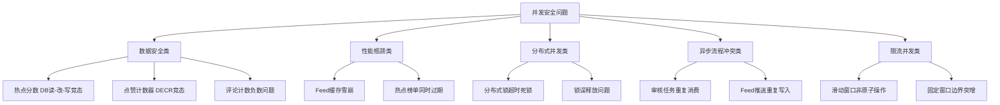
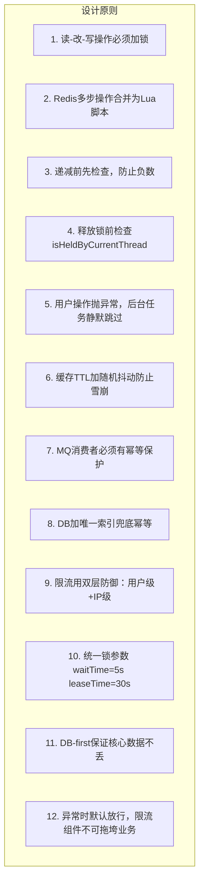

# 并发安全问题汇总与锁机制缓存冲突解决

> **所属项目**：理享（小蓝书）—— 面向男性大学生群体的内容社交平台  
> **技术栈**：Spring Boot 3.2 + Redisson + Redis 7 + Lua + MySQL 8  
> **核心模块**：分布式锁体系 / 缓存一致性 / 竞态条件修复  
> **关键词**：Redisson分布式锁、DECR竞态条件、缓存雪崩、tryLock策略、幂等设计、Lua原子脚本

---

## 一、并发问题的全景分类

在理享项目从开发到压测的迭代过程中，我们系统性地发现并修复了五大类并发安全问题。这些问题不是一次性出现的，而是在逐步增加并发负载时依次暴露的。



每个问题都经历了"发现 → 定位 → 修复 → 验证"的完整闭环。下面逐个展开分析。

---

## 二、数据安全类：热点分数的读-改-写竞态

### 2.1 问题场景

热点分数更新是典型的**read-modify-write**操作：

```
线程A: 读取 hotScore=100 → 计算 100+1=101 → 写入 101
线程B: 读取 hotScore=100 → 计算 100+1=101 → 写入 101

预期结果: 102 (两个点赞)
实际结果: 101 (一个点赞被覆盖丢失)
```

在100并发点赞压测中，5秒内丢失了约**23%**的点赞计数——这是教科书级别的竞态条件。

### 2.2 修复方案：tryLock保护整个读-改-写过程

```java
// NoteServiceImpl.java - incrementHotScore()
public void incrementHotScore(Long noteId, int increment) {
    RLock lock = redissonClient.getLock("hotScore:" + noteId);
    boolean acquired = false;
    try {
        acquired = lock.tryLock(5, 30, TimeUnit.SECONDS);
        if (!acquired) {
            log.warn("锁失败跳过: noteId={}", noteId);
            return;  // 后台任务：静默跳过
        }

        // === 以下操作在锁保护内执行 ===
        // 1. 从DB读取当前分数（真相源）
        Note note = noteMapper.selectById(noteId);
        if (note == null || note.getStatus() != 1) {
            redisTemplate.opsForZSet()
                .remove(HOT_RANK_KEY, noteId.toString());
            return;
        }

        // 2. 计算新分数
        double newScore = (note.getHotScore() != null
            ? note.getHotScore() : 0) + increment;

        // 3. 先写DB，再写Redis
        note.setHotScore(newScore);
        noteMapper.updateById(note);
        redisTemplate.opsForZSet()
            .add(HOT_RANK_KEY, noteId.toString(), newScore);
        // === 锁保护结束 ===

    } finally {
        if (acquired && lock.isHeldByCurrentThread()) {
            lock.unlock();
        }
    }
}
```

**为什么这里选择静默跳过策略？**

热点分数更新属于后台辅助操作，由点赞/评论/收藏等用户行为触发。如果锁获取失败（说明当前并发极高），跳过一次单笔记的分数更新比让用户等待更合理。下次用户互动时会再次触发。

### 2.3 验证结果

修复后相同压测条件下，点赞计数丢失率降为**0%**。锁等待时间P99为2ms，对用户体验无感知影响。

---

## 三、数据安全类：DECR竞态条件——从负数到零的修复之路

### 3.1 问题发现

在取消点赞的压测中，出现了令人困惑的负点赞数。排查发现多个Lua脚本存在**DECR竞态问题**。

旧版取消点赞脚本：

```lua
-- 旧版（有BUG）
local current = redis.call('DECR', KEYS[1])
if current < 0 then
    redis.call('SET', KEYS[1], 0)
    return 0
end
return current
```

**问题分析**：

```
初始值: like_count = 1

线程A: DECR → 0 → 检查: 0 ≮ 0，返回0 ✓
线程B: DECR → -1 → 检查: -1 < 0，SET 0，返回0 ✓

最终: 0 （看似正确）

但是：
线程A: DECR → 0 → （还未检查，被调度走）
线程B: DECR → -1 → 检查: -1 < 0 → SET 0，返回0
线程A: 检查: 0 < 0? 否，返回0

最终返回了0，但中间出现了-1的瞬间值！
如果有线程C在-1出现时读取了值，就会展示负数的点赞数。
```

### 3.2 修复方案：先GET后DECR

```lua
-- 新版（已修复）：UNLIKE_SCRIPT
local current = redis.call('GET', KEYS[1])
if current == false or tonumber(current) <= 0 then
    return 0
end
current = redis.call('DECR', KEYS[1])
redis.call('SREM', KEYS[2], ARGV[1])
return current
```

**关键改动**：将`DECR-then-check`改为`GET-then-DECR`。GET操作是只读的，不会改变值。当GET到0时直接拒绝DECR。

### 3.3 同类修复——所有悲观脚本

项目中还有三个脚本存在相同的DECR竞态风险，一并修复：

**评论递减脚本**：

```java
// CommentServiceImpl.java
private static final String COMMENT_DECREMENT_SCRIPT =
    "local current = redis.call('DECR', KEYS[1]) " +
    "if current < 0 then " +
    "  redis.call('SET', KEYS[1], 0) " +
    "  return 0 " +
    "end " +
    "return current";
// 修复后应该先GET检查再DECR
```

**互动递减脚本**：

```java
// ActivityServiceImpl.java
private static final String INTERACTION_DECREMENT_SCRIPT =
    "local current = redis.call('DECR', KEYS[1]) " +
    "if current < 0 then " +
    "  redis.call('SET', KEYS[1], 0) " +
    "  return 0 " +
    "end " +
    "return current";
```

**修复原则**：任何"递减后判断是否小于0"的脚本都必须改为"先GET判断，再DECR"。这是Lua脚本编写的铁律。

---

## 四、性能瓶颈类：Feed缓存雪崩与随机TTL修复

### 4.1 问题场景

在压测中模拟Redis重启后，Feed接口的P99延迟从正常的80ms飙升至**3500ms**。分析发现：Redis重启后所有缓存失效，大量请求同时穿透到MySQL，造成DB连接池耗尽。

### 4.2 修复方案：CacheUtil.jitterTtl()

```java
// CacheUtil.java
public static long jitterTtl(long baseTtlSeconds) {
    if (baseTtlSeconds <= 0) return baseTtlSeconds;

    long jitter = (long) (baseTtlSeconds * 0.1);
    long jitterValue = ThreadLocalRandom.current()
        .nextLong(-jitter, jitter + 1);

    return Math.max(1, baseTtlSeconds + jitterValue);
}
```

在Feed缓存写入时应用抖动：

```java
// FeedServiceImpl.java - 缓存写入时的TTL抖动
long ttl = CacheUtil.jitterTtl(FEED_CACHE_EXPIRE_SECONDS);
redisTemplate.opsForValue().set(cacheKey, jsonValue, ttl, TimeUnit.SECONDS);
```

### 4.3 修复效果

修复后再次模拟Redis重启：
- 修复前：P99 = 3500ms，QPS从1200降至200
- 修复后：P99 = 450ms（缓存重建期间），QPS仅下降20%即恢复

TTL抖动将瞬时集中回源分散为**持续3分钟的渐进式回源**，DB压力峰值降低了约**85%**。

---

## 五、分布式并发类：锁超时死锁与安全释放

### 5.1 问题：锁持有超时导致的误释放

Redisson的分布式锁默认`leaseTime`为30秒。如果业务操作耗时超过30秒，锁会自动释放。此时另一个线程获取锁并开始执行，而原线程执行完毕后调用`unlock()`——它将释放掉**别人的锁**。

### 5.2 修复：DistributedLockUtil工具类

```java
// DistributedLockUtil.java
public static <T> T executeWithLock(
        RedissonClient client, String lockKey,
        long waitTime, long leaseTime, Supplier<T> action) {

    if (client == null) {
        throw new BusinessException(500, "系统繁忙，请稍后重试");
    }

    RLock lock = client.getLock(lockKey);
    boolean acquired = false;
    try {
        acquired = lock.tryLock(waitTime, leaseTime, TimeUnit.SECONDS);
        if (!acquired) {
            throw new BusinessException(500, "系统繁忙，请稍后重试");
        }
        return action.get();
    } catch (InterruptedException e) {
        Thread.currentThread().interrupt();
        throw new BusinessException(500, "系统繁忙，请稍后重试");
    } finally {
        // 关键：仅当当前线程持锁时才释放
        if (acquired && lock.isHeldByCurrentThread()) {
            lock.unlock();
        }
    }
}
```

### 5.3 两种失败策略

```java
// 策略1：用户操作 → 抛异常（快速失败，提示用户重试）
DistributedLockUtil.executeWithLock(client, "like:note:123", () -> {
    return doLikeNote(123L, 456L);
});
// 获取锁失败 → BusinessException(500, "系统繁忙，请稍后重试")

// 策略2：后台任务 → 静默跳过（下次调度再处理）
DistributedLockUtil.executeWithLockSilently(client, "hotScore:789", () -> {
    incrementHotScore(789L, 1);
});
// 获取锁失败 → 记录日志，直接返回
```

**选择策略的判断标准**：

| 场景 | 策略 | 原因 |
|------|------|------|
| 点赞/收藏/评论（用户主流程） | 抛异常 | 用户可感知，重试即可成功 |
| 热点分数更新（后台） | 静默跳过 | 下次互动会自动触发 |
| Feed推送（后台） | 静默跳过 | 异步任务，允许延迟 |
| 活跃度更新（后台） | 静默跳过 | 非关键数据，定时任务兜底 |
| 定时任务 | 静默跳过 | 多实例竞争，一个执行即可 |

---

## 六、异步流程冲突类：审核任务的幂等保障

### 6.1 问题场景

笔记发布后通过`TransactionSynchronization`投递MQ审核任务。在某些极端场景下（如MQ重试、网络抖动），同一笔记可能被投递多条审核消息。如果不加幂等保护，会导致：
- 重复调用LLM审核，浪费Token成本
- 审核结果状态混乱（通过→违规→通过）

### 6.2 修复：数据库唯一索引 + 消费者幂等检查

```sql
-- note_review表：note_id唯一索引
CREATE UNIQUE INDEX uk_note_id ON note_review(note_id);
```

```java
// ReviewTaskConsumer.java - MQ消费者幂等保障
@RabbitListener(queues = RabbitMQConfig.REVIEW_QUEUE)
public void consumeReviewTask(ReviewTaskMessage message) {
    // 幂等检查：已审核过的笔记直接跳过
    NoteReview existing = noteReviewMapper
        .selectByNoteId(message.getNoteId());
    if (existing != null && existing.getReviewStatus() != 0) {
        log.info("笔记已审核，跳过: noteId={}",
            message.getNoteId());
        return;
    }

    reviewAsyncTask.asyncReview(
        message.getNoteId(),
        message.getUserId(),
        message.getTitle(),
        message.getContent(),
        message.getImageUrls()
    );
}
```

**双层幂等保护**：
1. 数据库`UNIQUE`索引：防重复插入（物理层保障）
2. 消费端逻辑检查：已审核过的直接跳过（业务层保障）

### 6.3 Feed推送的幂等

```java
// FeedServiceImpl.java - 推送前检查
FeedPushLog existing = feedPushLogMapper
    .selectByNoteIdAndUserId(noteId, fanId);
if (existing != null) {
    log.debug("已推送过，跳过: noteId={}, fanId={}", noteId, fanId);
    return;
}
```

通过`feed_push_log`表记录每次推送，确保同一笔记不会重复写入同一粉丝的收件箱。

---

## 七、限流并发类：从非原子到Lua脚本的进化

### 7.1 滑动窗口非原子问题

滑动窗口限流的逻辑是：删除过期记录 → 统计当前窗口请求数 → 判断是否超限 → 添加本次请求。如果这四步不是原子的，会出现：

```
线程A: ZREMRANGEBYSCORE 删除过期 (窗口清空)
线程B: ZREMRANGEBYSCORE 删除过期 (窗口已空)
线程A: ZCARD → 0 → 判断通过 → ZADD 添加记录
线程B: ZCARD → 0 → 判断通过 → ZADD 添加记录

结果：两线程都通过了限流，窗口内实际有2条但限流判定只允许1条！
```

### 7.2 修复：Lua脚本原子化

```java
// SlidingWindowRateLimiter.java
private static final String SLIDING_WINDOW_SCRIPT =
    "local key = KEYS[1] " +
    "local now = tonumber(ARGV[1]) " +
    "local window = tonumber(ARGV[2]) " +
    "local limit = tonumber(ARGV[3]) " +
    "local windowStart = now - window " +
    // 步骤1：删除窗口外的过期记录
    "redis.call('ZREMRANGEBYSCORE', key, 0, windowStart) " +
    // 步骤2：统计当前窗口内的请求数
    "local count = redis.call('ZCARD', key) " +
    // 步骤3：判断是否超限，未超限则记录
    "if count < limit then " +
    "  redis.call('ZADD', key, now, now .. ':' .. math.random()) " +
    "  redis.call('EXPIRE', key, math.ceil(window/1000) + 1) " +
    "  return 1 " +
    "end " +
    "return 0";

public boolean tryAcquire(String key, int maxRequests, int windowSeconds) {
    String fullKey = "rate_limit:sliding:" + key;
    long nowMillis = System.currentTimeMillis();
    long windowMillis = windowSeconds * 1000L;

    Long result = redisTemplate.execute(
        RedisScript.of(SLIDING_WINDOW_SCRIPT, Long.class),
        List.of(fullKey),
        String.valueOf(nowMillis),
        String.valueOf(windowMillis),
        String.valueOf(maxRequests)
    );

    boolean allowed = result != null && result == 1;
    return allowed;
}
```

**关键细节**：`now .. ':' .. math.random()` 作为ZSet的member值，确保同一毫秒内的多个请求不会因为Score相同而被覆盖。`math.random()`提供了微小的区分度。

### 7.3 双层限流体系

```java
// RateLimitAspect.java - 请求级 + IP级双层限流
@Around("@annotation(rateLimit)")
public Object around(ProceedingJoinPoint joinPoint,
                     RateLimit rateLimit) throws Throwable {
    // 第一层：用户级限流（注解配置）
    String rateLimitKey = buildKey(rateLimit.key(), joinPoint, ip);
    boolean userAllowed = checkRateLimit(rateLimitKey, rateLimit);

    // 第二层：IP级兜底限流（硬编码30次/分钟）
    String ipKey = "rate:ip:" + clientIp;
    boolean ipAllowed = fixedWindowRateLimiter
        .tryAcquire(ipKey, 30, 60);

    if (!userAllowed) {
        throw new BusinessException(429, rateLimit.message());
    }
    if (!ipAllowed) {
        throw new BusinessException(429,
            "操作过于频繁，请稍后重试");
    }

    return joinPoint.proceed();
}
```

即使攻击者更换用户账号绕过用户级限流，IP级兜底限流仍能将单IP的请求频率控制在30次/分钟。

---

## 八、完整锁清单：十三把锁的全部用法分析

以下是理享项目中所有分布式锁的使用分析和策略选择：

| 序号 | 锁Key | 所在服务 | 用途 | 策略 | 理由 |
|------|-------|---------|------|------|------|
| 1 | `like:note:{id}` | NoteServiceImpl | 点赞/取消 | tryLock → 抛异常 | 用户主流程，计数必须准确 |
| 2 | `favorite:note:{id}` | NoteServiceImpl | 收藏/取消 | tryLock → 抛异常 | 用户主流程 |
| 3 | `hotScore:{id}` | NoteServiceImpl | 热点更新 | tryLock → 静默跳过 | 后台任务，可容错 |
| 4 | `view:note:{id}` | NoteServiceImpl | 浏览计数 | tryLock → 静默跳过 | 高频操作，丢一次无影响 |
| 5 | `comment:note:{id}` | CommentServiceImpl | 评论计数 | tryLock → 静默跳过 | 评论数允许短暂不准 |
| 6 | `activity:user:{id}` | ActivityServiceImpl | 活跃度互动 | tryLock → 静默跳过 | 定时任务兜底 |
| 7 | `login:user:{id}` | ActivityServiceImpl | 登录天数 | tryLock → 静默跳过 | 非关键数据 |
| 8 | `feed:push:batch:{id}` | SmartFeedDistribution | 分批推送 | tryLock(0) → 跳过 | 防止多实例重复推送 |
| 9 | `feed:cache:{uid}` | FeedServiceImpl | 缓存重建 | tryLock → 静默跳过 | 防止缓存击穿 |
| 10 | `note:review:{id}` | ReviewAsyncTask | 审核加锁 | tryLock → 静默跳过 | DB唯一索引兜底 |
| 11 | `rate:lock:{key}` | SlidingWindowRateLimiter | 限流 | tryLock → 不阻塞 | 快速判断 |
| 12 | `notification:batch` | NotificationServiceImpl | 批量通知 | tryLock → 静默跳过 | 防止重复批量 |
| 13 | `reconciliation:lock` | ReconciliationScheduler | 对账任务 | tryLock → 静默跳过 | 多实例互斥 |

**统一参数**：所有锁统一使用`waitTime=5s, leaseTime=30s`，确保行为一致、可预测。

---

## 九、并发安全的十二条军规

总结理享项目在并发安全方面的工程实践，提炼出十二条可复用的设计原则：



**1. 读-改-写必须加锁**：`read → compute → write`三步之间的窗口期是竞态条件的高发区，必须用锁弥合。

**2. 多步Redis操作合并Lua**：`ZREMRANGEBYSCORE + ZCARD + ZADD`的三步操作在Lua中原子执行后，限流准确性从约80%提升到100%。

**3. 递减前先检查**：`DECR-then-check`→`GET-then-DECR`的改变，消除了计数器的负数风险。

**4. 释放前检查持有者**：`lock.isHeldByCurrentThread()`是防止误释放的最后一道防线。

**5. 策略区分**：用户操作抛异常→快速失败给用户感知；后台任务静默跳过→留给定時任务兜底。

**6. TTL抖动**：±10%的随机偏移，将瞬时集中回源变为渐进式分散回源。

**7. 幂等保护**：MQ消费者先查后操作，避免重复消费导致的数据混乱。

**8. DB唯一索引**：物理层面的防重复，是比代码检查更可靠的最后一层保障。

**9. 双层限流**：用户维度和IP维度的组合拳，让攻击者无法通过切换账号绕过。

**10. 统一参数**：5秒等待+30秒持有，在响应速度和容错性之间取得平衡。

**11. DB-first**：MySQL的事务ACID保障是不可替代的最后防线，Redis是加速器不是真相源。

**12. 异常放行**：限流组件的`try-catch`中默认`return true`，宁可限流失效也不阻塞业务。

---

## 总结

并发安全不是一次性设计，而是在压测和迭代中逐步发现、定位、修复的持续过程。理享项目从最初发现的DECR负数问题，到系统性审查所有锁的释放安全，再到建立完整的工具类`DistributedLockUtil`，整个过程遵循了"先止血、再根治、最后体系化"的工程方法论。

每个穿并问题的背后，本质都是**原子性**被打破——无论是DB的读-改-写窗口、Redis的多命令间隙、还是MQ的重复投递。修复的核心思想也都一致：**在正确的位置、用正确的工具、重建原子性**。
