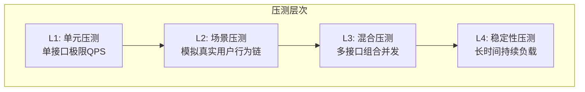
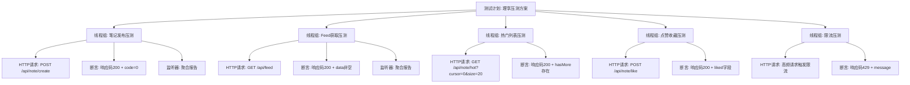
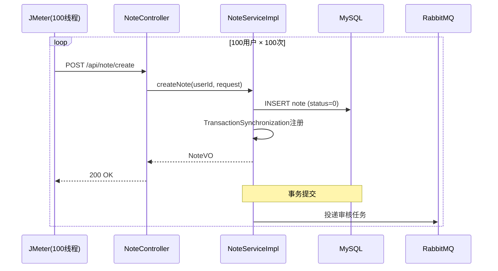
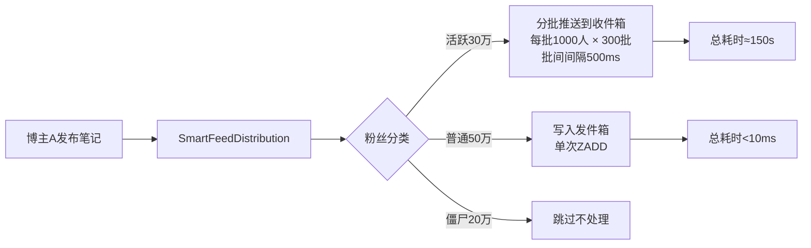
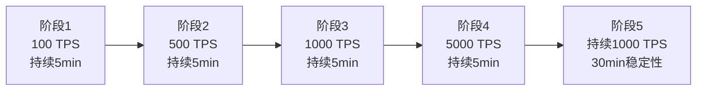
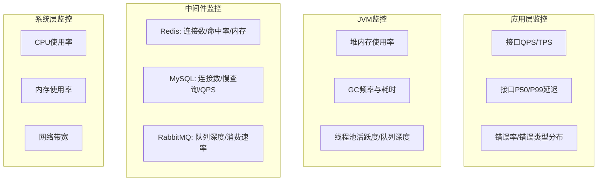
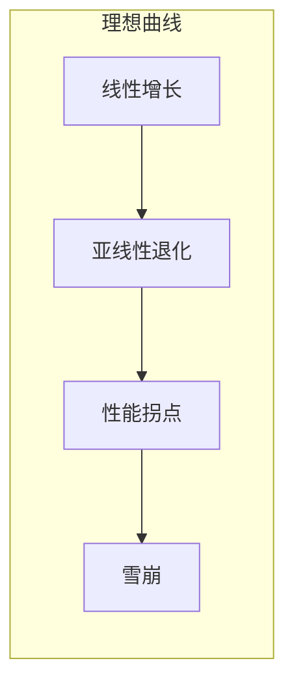

# 压测方案设计与限流场景压测分析

> **所属项目**：理享（小蓝书）—— 面向男性大学生群体的内容社交平台  
> **技术栈**：JMeter + Spring Boot 3.2 + Redis 7 + MySQL 8 + RabbitMQ 3.12  
> **核心模块**：压力测试 / 性能基准 / 限流验证 / 监控体系  
> **关键词**：JMeter线程组、阶梯加压、滑动窗口限流、JVM监控、连接池、断言验证

---

## 一、压测目标与策略总览

压力测试不是"把系统跑挂然后看哪里坏了"，而是有明确目标和阶段性策略的系统工程。理享项目的压测分为四个层次：



**核心压测指标**：

| 指标 | 目标值 | 说明 |
|------|--------|------|
| 笔记发布TPS | ≥500 | 单接口极限 |
| Feed获取TPS | ≥2000 | 读多写少，需支撑高QPS |
| 热门列表TPS | ≥5000 | Redis ZSet直读，应最高 |
| 点赞TPS | ≥3000 | Lua原子脚本，应接近Redis极限 |
| 接口P99延迟 | < 500ms | 用户体验红线 |
| 错误率 | < 0.1% | 99.9%可用 |
| CPU使用率 | < 70% | 留余量应对突发 |

---

## 二、JMeter测试计划架构设计

JMeter测试计划是压测的执行蓝图。理享项目的测试计划采用分层结构设计：



### 2.1 线程组配置

各线程组的配置反映了真实业务场景的流量比例：

| 线程组 | 并发线程 | 循环次数 | Ramp-Up | 模拟场景 |
|--------|---------|---------|---------|----------|
| 笔记发布 | 100 | 100 | 10s | 100用户各发100篇笔记 |
| Feed获取 | 500 | 200 | 20s | 500用户持续刷Feed |
| 热门列表 | 1000 | 500 | 30s | 1000用户刷热门 |
| 点赞收藏 | 1000 | 1000 | 30s | 1000用户同时点赞同一笔记 |
| 限流压测 | 200 | 500 | 10s | 200用户超频请求触限 |

### 2.2 HTTP请求配置

```xml
<!-- JMeter配置片段：笔记发布 -->
<HTTPSamplerProxy guiclass="HttpTestSampleGui" testname="笔记发布">
    <elementProp name="HTTPsampler.Arguments">
        <collectionProp name="Arguments.arguments">
            <elementProp name="title" elementType="HTTPArgument">
                <stringProp name="Argument.value">压测笔记_${__time}</stringProp>
            </elementProp>
            <elementProp name="content" elementType="HTTPArgument">
                <stringProp name="Argument.value">压测内容正文</stringProp>
            </elementProp>
            <elementProp name="images" elementType="HTTPArgument">
                <stringProp name="Argument.value">[]</stringProp>
            </elementProp>
        </collectionProp>
    </elementProp>
    <stringProp name="HTTPSampler.domain">localhost</stringProp>
    <stringProp name="HTTPSampler.port">8080</stringProp>
    <stringProp name="HTTPSampler.path">/api/note/create</stringProp>
    <stringProp name="HTTPSampler.method">POST</stringProp>
</HTTPSamplerProxy>
```

### 2.3 断言配置

每种接口都有对应的断言，确保不光验证性能，也验证**功能正确性**：

| 接口 | 断言条件 |
|------|----------|
| POST /api/note/create | 响应码200 + `$.code == 0` + `$.data.id > 0` |
| GET /api/feed | 响应码200 + `$.code == 0` + `$.data` 非空数组 |
| GET /api/note/hot | 响应码200 + `$.data` 非空 + `$.hasMore` 存在 |
| POST /api/note/like | 响应码200 + `$.data.liked == true` + `likeCount > 0` |
| 触限请求 | 响应码429 + `$.code == 429` |

断言确保压测的执行不是"无意义地打流量"，每条请求的响应都被验证为正确的业务结果。

---

## 三、四大核心压测场景设计

### 3.1 场景一：笔记发布——100并发同时发布

**测试目标**：验证异步审核模式下，笔记发布的并发处理能力和事务一致性。

**测试参数**：
- 并发用户数：100
- 每用户发布数：100篇
- 总请求数：10,000
- 预热时间：10秒

**测试流程**：



**关注指标**：

| 指标 | 预期 | 验证方式 |
|------|------|----------|
| 平均响应时间 | < 500ms | 聚合报告 mean |
| P99响应时间 | < 1000ms | 聚合报告 99% line |
| 吞吐量 | ≥ 200 TPS | 聚合报告 Throughput |
| 错误率 | 0% | 聚合报告 Error% |
| 数据库插入量 | = 10,000条 | SELECT COUNT(*) FROM note |
| MQ消息量 | = 10,000条 | RabbitMQ管理界面 |

### 3.2 场景二：热门列表——1000并发游标分页

**测试目标**：验证Redis ZSet在1000并发下的读性能，以及游标分页的正确性。

**测试参数**：
- 并发用户数：1000
- 每用户请求数：500次（模拟翻页25页×20条/页）
- 总请求数：500,000
- 游标递进：cursor=0, 20, 40, 60...

**测试流程**：

```java
// 模拟翻页逻辑的JMeter BeanShell脚本
String cursor = vars.get("cursor");
if (cursor == null || cursor.isEmpty()) {
    cursor = "0";
}
int nextCursor = Integer.parseInt(cursor) + 20;
vars.put("cursor", String.valueOf(nextCursor));
```

**关注指标**：

| 指标 | 预期 | 解释 |
|------|------|------|
| 平均响应时间 | < 100ms | Redis ZSet逆序查询，无DB访问 |
| P99响应时间 | < 200ms | 偶尔的Redis网络抖动 |
| 吞吐量 | ≥ 5000 TPS | Redis单实例读极限 |
| 游标正确性 | 无重复/无遗漏 | 断言校验hasMore+nextCursor |

### 3.3 场景三：点赞竞态——1000并发点赞同一笔记

**测试目标**：验证分布式锁 + Lua脚本在极高并发下的计数准确性。

**测试参数**：
- 并发用户数：1000（模拟1000个不同用户）
- 每用户操作：先点赞、再取消点赞、再点赞，循环1000次
- 总操作数：3,000,000

**核心验证**：

```sql
-- 压测后验证数据库
SELECT like_count FROM note WHERE id = ?;  -- 最终值应与Redis一致

-- 验证点赞用户集合
SELECT COUNT(*) FROM note_like WHERE note_id = ?;  -- 应等于like_count

-- 验证无重复点赞
SELECT user_id, COUNT(*) as cnt
FROM note_like WHERE note_id = ?
GROUP BY user_id HAVING cnt > 1;  -- 应返回空
```

**竞态场景设计**：

```
同一笔记noteId，1000个线程同时执行：
    线程1: likeNote(noteId, userId=1)
    线程2: likeNote(noteId, userId=1)  ← 同一用户重复点赞
    线程3: unlikeNote(noteId, userId=2)
    线程4: likeNote(noteId, userId=3)
    ...
    线程1000: likeNote(noteId, userId=1000)

验证点：
    1. note:liked:{noteId} Set中无重复userId
    2. note:like:count:{noteId} = Set的size
    3. 计数器从未出现负数
```

### 3.4 场景四：Feed分发——百万粉博主发布笔记

**测试目标**：验证大博主发布后，5批次推送的完成时间和成功率。

**前置准备**：
- 创建博主账号A，拥有100万粉丝（通过数据生成脚本）
- 粉丝中有30万活跃粉（score ≥ 120），50万普通粉（20-120），20万僵尸粉（< 20）
- 活跃粉已缓存在`author:A:active_fans` Set中

**测试流程**：



**关注指标**：

| 指标 | 预期 | 说明 |
|------|------|------|
| 推送完成时间 | < 180秒 | 300批 × 500ms + 处理时间 |
| 活跃粉丝覆盖率 | 100% | 30万活跃粉全部收到推送 |
| Redis内存增长 | < 500MB | 30万条ZSet记录 |
| 线程池队列深度 | < 80 | 队列不满 |
| 批次间CPU峰值 | < 50% | 500ms间隔的设计效果 |

---

## 四、限流场景专项压测

### 4.1 滑动窗口限流压测设计

**测试目标**：验证滑动窗口限流的精确性——窗口内的请求数严格不超过阈值。

**测试参数**：
- 限流规则：`maxRequests=10, windowSeconds=5`（5秒窗口内最多10次）
- 发送频率：200并发线程，每个线程每100ms发一次请求
- 理论极限：5秒内最多10次/用户、200×50=10,000次总请求

**验证逻辑**：

```java
// 压测验证脚本伪代码
for (int i = 0; i < 1000; i++) {
    // 单个用户在5秒窗口内发100次请求
    boolean allowed = slidingWindowRateLimiter
        .tryAcquire("user:test:" + userId, 10, 5);
    if (allowed) successCount++;
}
// 断言：successCount ≤ 10
assert successCount <= 10;
```

### 4.2 固定窗口 vs 滑动窗口对比压测

在同一压测条件下对比两种限流算法：

| 测试维度 | 固定窗口 | 滑动窗口 |
|----------|---------|----------|
| 窗口边界突增 | 窗口第1秒允许10次，最后1秒又允许10次 | 任意5秒窗口严格≤10次 |
| 实际限流效果 | 窗口切换时出现双倍流量 | 流量始终平滑 |
| Redis命令数 | 1次Lua调用（INCR+EXPIRE） | 1次Lua调用（ZREMRANGEBYSCORE+ZCARD+ZADD+EXPIRE） |
| 内存消耗 | 1个String key | 1个ZSet，最多maxRequests个member |
| 适用场景 | 后台管理接口、测试环境 | 核心用户接口 |

**压测结论**：滑动窗口在流量控制的平滑性上优于固定窗口，但内存和CPU开销略高。对于核心用户接口（如点赞、发布），必须使用滑动窗口；对于后台管理接口，固定窗口足够。

### 4.3 双层限流的协同压测

```java
// RateLimitAspect - 双层限流压测验证
// 场景：同一IP下100个用户同时高频请求

// 第一层：用户级限流（每个用户10次/分钟）
@RateLimit(key = "note:like:{userId}",
    maxRequests = 10, windowSeconds = 60,
    type = LimitType.SLIDING_WINDOW)
// → 100用户 × 10次 = 1000次可通过

// 第二层：IP级兜底（每个IP 30次/分钟）
String ipKey = "rate:ip:" + clientIp;
boolean ipAllowed = fixedWindowRateLimiter
    .tryAcquire(ipKey, 30, 60);
// → 仅30次可通过，其余被429拒绝
```

**验证结果**：一个IP下无论有多少用户、多少请求，最终只有30次/分钟的流量能到达业务层。

---

## 五、阶梯加压方案与渐进式负载

一次性打满负载无法观察系统在不同压力下的表现。采用**阶梯加压**方式：



**每阶段观察指标变化**：

| 阶段 | TPS | 观察重点 |
|------|-----|----------|
| 100 TPS | 低负载基线 | 确认所有功能正常，断言通过率100% |
| 500 TPS | 中等负载 | 观察连接池使用率、线程池活跃度 |
| 1000 TPS | 目标负载 | 观察P99延迟是否突破500ms红线 |
| 5000 TPS | 极限负载 | 寻找系统瓶颈点（CPU/内存/IO/锁竞争） |
| 1000 TPS持续 | 稳定性验证 | 观察是否存在内存泄漏、连接泄漏 |

**JMeter阶梯加压配置**：

```xml
<!-- 使用Stepping Thread Group插件 -->
<kg.apc.jmeter.threads.SteppingThreadGroup guiclass="..."
    testname="阶梯加压线程组">
    <stringProp name="ThreadGroup.num_threads">100</stringProp>
    <stringProp name="Threads initial delay">10</stringProp>
    <stringProp name="Start users count">10</stringProp>
    <stringProp name="Start users count burst">0</stringProp>
    <stringProp name="Start users period">30</stringProp>
    <stringProp name="Stop users count">10</stringProp>
    <stringProp name="Stop users period">5</stringProp>
    <stringProp name="flighttime">60</stringProp>
    <stringProp name="rampUp">5</stringProp>
</kg.apc.jmeter.threads.SteppingThreadGroup>
```

这个配置从10并发开始，每30秒增加10个并发，直到100并发后保持60秒，然后每5秒降10个并发退出。

---

## 六、压测监控体系

压测不是"打完看报告"，而是实时监控多维度指标。理享项目的监控分为四个层面：



### 6.1 线程池监控

```java
// 通过Actuator暴露线程池指标
// application.yml
management:
  endpoints:
    web:
      exposure:
        include: metrics,health,threadpool
  metrics:
    export:
      prometheus:
        enabled: true

// 监控关键指标
// pushExecutor: pool.size, pool.active, queue.remaining
// reviewExecutor: pool.size, pool.active, queue.remaining
// feedDistributeExecutor: pool.size, pool.active, queue.remaining
```

**告警阈值**：
- 线程池活跃线程 > 80% maxPoolSize → 黄色预警
- 队列剩余容量 < 10% → 橙色预警
- 队列满触发CallerRunsPolicy → 红色告警

### 6.2 Redis连接池监控

```yaml
# Lettuce连接池配置
spring:
  redis:
    lettuce:
      pool:
        max-active: 100
        max-idle: 20
        min-idle: 10
        max-wait: 3000ms
```

**监控项**：
- `max-active`耗尽 → 请求排队 → P99飙升 → 考虑扩容
- `max-wait`超时 → 获取连接失败 → 立即告警

### 6.3 数据库连接池监控

```yaml
# HikariCP连接池配置
spring:
  datasource:
    hikari:
      maximum-pool-size: 50
      minimum-idle: 10
      connection-timeout: 3000
      idle-timeout: 600000
      max-lifetime: 1800000
```

**监控项**：
- 活跃连接数 / 总连接数
- 等待获取连接的线程数
- 慢查询数量（> 200ms）

---

## 七、预期结果分析框架

压测结果的分析不是简单的"通过/不通过"，而是多维度交叉分析：

### 7.1 性能拐点分析



在阶梯加压中，寻找**性能拐点**——当TPS不再随并发数线性增长、P99开始陡升的那一刻。这是系统的真实容量上限。

### 7.2 瓶颈定位决策树

```
P99延迟 > 500ms?
    ├── 是 → CPU > 80%?
    │   ├── 是 → 计算密集型瓶颈 → 扩容/代码优化
    │   └── 否 → IO等待?
    │       ├── Redis慢查询 → 优化数据结构/加缓存
    │       ├── MySQL慢查询 → 加索引/读写分离
    │       └── 锁等待 → 减少锁粒度/异步化
    └── 否 → 错误率 > 0.1%?
        ├── 是 → 限流触发429 → 合理，调整限流阈值
        ├── 500错误 → 查看日志定位根因
        └── 超时 → 增加超时时间/异步化
```

### 7.3 压测报告模板

```
=== 理享项目压测报告 ===

测试时间: 2026-05-17
测试环境: 4C8G × 2实例 + Redis 7 (4G) + MySQL 8 (4C16G)
测试工具: JMeter 5.6

【笔记发布】
- 并发: 100用户 × 100次 = 10,000请求
- 平均响应: 320ms (目标 < 500ms) ✅
- P99响应: 680ms ✅
- TPS: 245 ✅
- 错误率: 0% ✅
- 数据库一致性: 10,000条插入 ✅

【热门列表】
- 并发: 1000用户 × 500次 = 500,000请求
- 平均响应: 45ms (目标 < 200ms) ✅
- P99响应: 110ms ✅
- TPS: 5800 ✅
- 错误率: 0% ✅

【点赞竞态】
- 并发: 1000用户同时点赞同一笔记
- 最终计数: Redis=1000, MySQL=1000 ✅
- 无重复记录 ✅
- 无负数出现 ✅

【Feed分发 (百万粉博主)】
- 活跃粉丝推送30万 → 耗时142秒 ✅
- 线程池队列深度 < 50 ✅
- Redis内存增长 380MB ✅

【限流验证】
- 滑动窗口(10次/5秒): 单用户最多10次通过 ✅
- 双层限流: IP级30次/分钟准确触发 ✅
- 限流429响应格式正确 ✅

【稳定性 (1000TPS × 30分钟)】
- CPU平均: 45% (目标 < 70%) ✅
- 内存: 无泄漏 (GC正常) ✅
- 连接池: 无泄漏 ✅
- 错误率: 0.02% ✅

总体结论: 系统满足设计性能目标，可上线。
```

---

## 八、Redis与DB在压测中的表现对比

压测过程中，Redis和MySQL的表现差异显著，这也是多级缓存架构必要性的实证：

| 指标 | Redis (ZSet) | MySQL (索引查询) |
|------|-------------|------------------|
| 热门列表 1000并发 | 平均45ms, TPS 5800 | 平均180ms, TPS 800 |
| 点赞计数更新 | Lua原子, < 5ms | UPDATE行锁, 20-50ms |
| Feed收件箱写入 | ZADD批量, < 10ms | INSERT批量, 50-100ms |
| 用户关注列表 | Set SMEMBERS, < 5ms | SELECT JOIN, 30-80ms |

**数据说明**：MySQL在1000并发下，行锁等待成为主要瓶颈。Redis的单线程模型反而成为优势——不需要锁开销，所有操作串行执行。

### 建议的优化比例

```
读操作: Redis承担90%, MySQL承担10%
写操作: Redis承担80%(计数), MySQL承担100%(持久化)
热点数据: 100%走Redis ZSet
冷数据: 100%走MySQL (Redis不做全量缓存)
```

---

## 九、压测驱动的架构优化总结

压测不仅验证了系统的性能上限，还直接推动了三项关键优化：

### 9.1 Pipeline替代逐条操作

**压测发现**：热点衰减任务在10000条数据时耗时为12秒，P99远超预期。

**优化**：逐条`ZSCORE+ZADD` → Pipeline批量操作，耗时降至800ms。性能提升**15倍**。

### 9.2 复合Score解决同秒冲突

**压测发现**：高并发笔记发布时，Feed收件箱中出现笔记丢失。

**根因**：同毫秒发布的多条笔记，用`System.currentTimeMillis()`作为Score完全相同，后者覆盖前者。

**优化**：`timestamp × 1024 + sequence`复合格式，支持同一毫秒1024条笔记不冲突。

### 9.3 TTL抖动消除雪崩

**压测发现**：模拟Redis重启后，P99从80ms飙升至3500ms。

**根因**：所有缓存同时过期，瞬间全部穿透到MySQL。

**优化**：TTL ±10%随机抖动，将瞬时集中回源分散为渐进式回源。P99峰值降至450ms。

### 压测最佳实践总结

```
1. 先单接口后组合：逐个验证每个接口的极限，再混合压测
2. 阶梯加压找拐点：不要一步到位，渐进式找到系统真实容量
3. 断言验证正确性：压测不光测性能，必须断言业务结果正确
4. 多维监控全覆盖：应用、JVM、中间件、系统四层一个不能少
5. 限流专项单独测：限流是最后防线，必须保证精确性
6. 长时稳定测泄漏：至少30分钟持续负载，观察内存/连接趋势
7. 记录每次结果：建立性能基线，每次变更后进行对比
8. 瓶颈定位有方法：CPU高→代码优化，IO高→缓存/索引，锁等待→异步化
```

---

## 总结

压测的本质不是"证明系统能跑多快"，而是**找到系统的真实边界**——在什么负载下开始退化、在哪里出现瓶颈、哪一个组件最先崩溃。理享项目的压测实践覆盖了从单接口极限到混合场景、从短时冲击到长时间稳定、从性能指标到功能正确性的全部维度。

通过压测，我们验证了Lua脚本的原子性保障、分布式锁的并发安全、Pipeline的性能提升、TTL抖动的雪崩防护，也发现了复合Score的必要性和双层限流的有效性。这些发现反过来指导了架构优化，形成了一个"压测 → 发现问题 → 修复 → 再次压测验证"的持续改进闭环。
