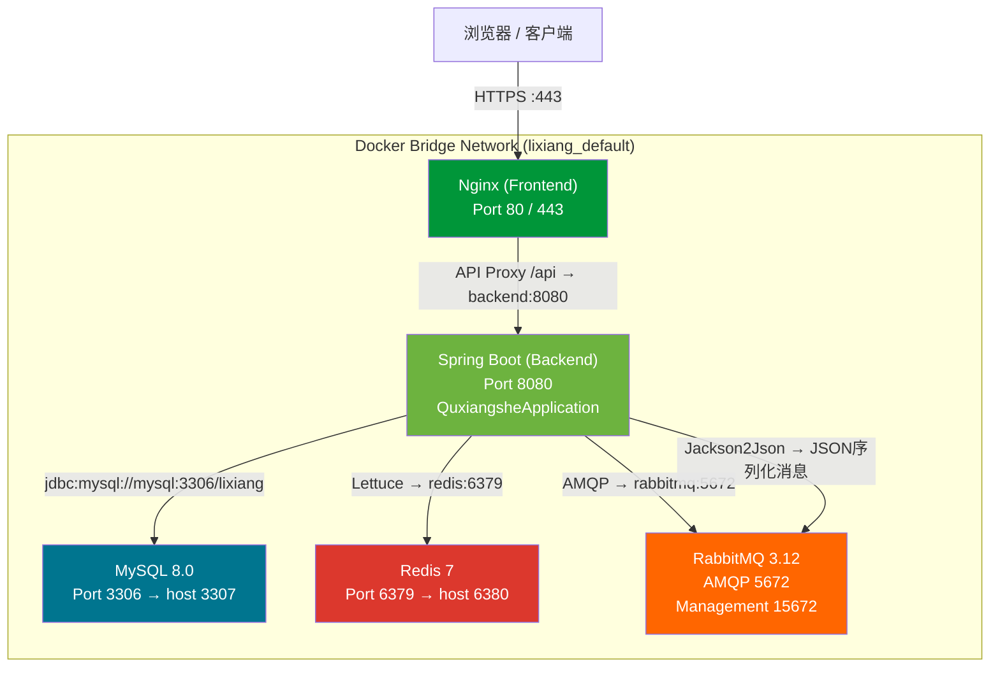

# 理享项目线上部署与Docker配置：从开发环境到生产交付

> 本文是理享系列技术博客第13篇，系统讲解该项目基于 Docker Compose 的一站式部署方案，涵盖中间件编排、环境变量管理、安全加固、健康检查、日志配置及备份策略。

---

## 一、前提回顾：理享的微服务化部署诉求

在前12篇文章中，我们逐步构建了理享校园社交平台的完整后端——从JWT认证体系（`JwtAuthenticationFilter` + `JwtAuthenticationEntryPoint`，见 `SecurityConfig.java:43-46`）、Feed流推拉结合分发（`RabbitMQConfig` 中定义的 `feed.push.exchange` 及六个业务域队列体系），到基于Snowflake算法（`SnowflakeIdGenerator.java:46`）的分布式ID生成、Redisson分布式锁（`DistributedLockUtil`）保障的热点计算并发安全，以及基于豆包大模型的AI内容审核三层递进架构。

这些模块在单机开发环境下通过 `application.yml` 直连本地 MySQL/Redis 即可运行，但上线部署时面临的诉求截然不同：

1. **多中间件协同**：MySQL 8.0、Redis 7、RabbitMQ 3.12 三个核心中间件必须健康就绪后，Spring Boot 后端才能启动；
2. **环境一致性**：开发/测试/生产三套环境的数据库密码、JWT密钥、邮件账号等敏感配置绝对不能硬编码在 `application.yml` 中；
3. **安全管控**：公网暴露的端口需要做好CORS白名单、SSL/TLS加密、BCrypt密码散列等多层次防护；
4. **可观测性**：日志持久化、健康检查端点、备份策略一个不能少。

本文以项目根目录 `docker-compose.yml`（共107行，定义了 mysql / redis / rabbitmq / backend / frontend 五个服务）为核心，展开完整的部署与运维说明。

---

## 二、服务拓扑：一张Mermaid图看清全貌



关键依赖链路：**mysql / redis / rabbitmq 的 `healthcheck` 全部通过后，backend 才启动**（见 `docker-compose.yml:82-88` 的 `depends_on: condition: service_healthy`）。这是 Docker Compose v3 的 `depends_on` 增强语法，避免后端因中间件未就绪而反复重启。

---

## 三、Docker Compose 编排详解

### 3.1 MySQL 8.0 服务

```yaml
mysql:
  image: mysql:8.0
  container_name: lixiang-mysql
  restart: unless-stopped
  environment:
    MYSQL_ROOT_PASSWORD: ${MYSQL_PASSWORD}
    MYSQL_DATABASE: lixiang
  ports:
    - "3307:3306"
  volumes:
    - mysql_data:/var/lib/mysql
    - ./scripts/database/init.sql:/docker-entrypoint-initdb.d/init.sql
  healthcheck:
    test: ["CMD", "mysqladmin", "ping", "-h", "localhost"]
    interval: 10s
    timeout: 5s
    retries: 5
```

要点说明：

- **端口映射 `3307:3306`**：宿主机 3307 映射到容器内 3306，避免与宿主机本地 MySQL 冲突；
- **`mysql_data` volume**：Docker 管理的命名卷，确保数据库文件在容器删除后不丢失；
- **`init.sql` 初始化脚本**：通过 `docker-entrypoint-initdb.d` 机制在 MySQL 首次启动时自动执行建表语句；
- **健康检查**：`mysqladmin ping` 是最轻量的连通性验证，配合10秒间隔+5次重试，约50秒确定状态。

### 3.2 Redis 7 服务

```yaml
redis:
  image: redis:7-alpine
  container_name: lixiang-redis
  restart: unless-stopped
  command: redis-server --requirepass ${REDIS_PASSWORD}
  ports:
    - "6380:6379"
  volumes:
    - redis_data:/data
  healthcheck:
    test: ["CMD", "redis-cli", "ping"]
    interval: 10s
    timeout: 5s
    retries: 5
```

选择 `redis:7-alpine` 而非完整镜像，镜像体积从约120MB降至约30MB，同时 `--requirepass` 参数在启动时即设置密码，避免无密码暴露的 Redis 被外部扫描利用。数据持久化依赖 RDB（默认在 `/data/dump.rdb`），备份策略见第九节。

### 3.3 RabbitMQ 3.12 服务

```yaml
rabbitmq:
  image: rabbitmq:3.12-management-alpine
  environment:
    RABBITMQ_DEFAULT_USER: ${RABBITMQ_USER:-admin}
    RABBITMQ_DEFAULT_PASS: ${RABBITMQ_PASSWORD:-admin123}
  ports:
    - "5672:5672"
    - "15672:15672"
  volumes:
    - rabbitmq_data:/var/lib/rabbitmq
```

选择带有 Management 插件的镜像，启动后可直接通过 `http://宿主机:15672` 访问管理界面。5672 是 AMQP 协议端口供 Spring AMQP（`RabbitTemplate`）使用，15672 是 HTTP 管理控制台。

### 3.4 Spring Boot 后端服务

```yaml
backend:
  build:
    context: ./backend
    dockerfile: Dockerfile
  container_name: lixiang-backend
  env_file:
    - .env
  environment:
    SPRING_DATASOURCE_URL: jdbc:mysql://mysql:3306/lixiang?...&allowPublicKeyRetrieval=true
    SPRING_DATASOURCE_USERNAME: root
    SPRING_DATASOURCE_PASSWORD: ${MYSQL_PASSWORD}
    SPRING_DATA_REDIS_HOST: redis
    SPRING_DATA_REDIS_PASSWORD: ${REDIS_PASSWORD}
    SPRING_RABBITMQ_HOST: rabbitmq
    SPRING_RABBITMQ_USERNAME: ${RABBITMQ_USER:-admin}
    SPRING_RABBITMQ_PASSWORD: ${RABBITMQ_PASSWORD:-admin123}
  ports:
    - "8080:8080"
  depends_on:
    mysql:      { condition: service_healthy }
    redis:      { condition: service_healthy }
    rabbitmq:   { condition: service_healthy }
```

Dockerfile 采用**多阶段构建**（`backend/Dockerfile`）：

- **第一阶段（builder）**：基于 `maven:3.9-eclipse-temurin-17`，执行 `mvn clean package -DskipTests`；
- **第二阶段（runtime）**：基于 `eclipse-temurin:17-jre-alpine`（约180MB），仅复制 JAR 包，使用 JRE 运行而非完整 JDK。

这种分离使得最终镜像体积缩小约 50%，且不包含源码和 Maven 缓存。

`depends_on` 的三重 `service_healthy` 条件确保 MySQL Redis RabbitMQ 的健康检查全部通过后，Spring Boot 才启动。否则会出现 `Caused by: java.net.UnknownHostException: mysql` 或连接拒绝等错误。

### 3.5 Nginx 前端服务

```yaml
frontend:
  build:
    context: ./frontend
    dockerfile: Dockerfile
  ports:
    - "80:80"
    - "443:443"
  depends_on:
    - backend
  volumes:
    - ./frontend/nginx.conf:/etc/nginx/conf.d/default.conf:ro
```

前端 Dockerfile 同理采用两阶段构建：Node Alpine 构建，Nginx Alpine 运行。`nginx.conf` 中配置 `/api` 路径的 `proxy_pass http://backend:8080`，实现前后端同域代理，彻底消除跨域问题——这也是生产环境比开发环境 CORS 白名单更优的方案。

---

## 四、环境变量管理体系

理享项目有三层环境配置结构：

| 层级 | 文件 | 作用 |
|------|------|------|
| Docker Compose 层 | 根目录 `.env` | 定义 `MYSQL_PASSWORD`、`REDIS_PASSWORD` 等 Docker 编排变量 |
| Spring Boot 层 | `application.yml` + `application-prod.yml` | 通过 `${VAR_NAME:default}` 语法读取系统环境变量 |
| 模板层 | `.env.example` | 提供完整变量清单，团队成员 `cp .env.example .env` 后填入真实值 |

关键安全原则：**`application.yml` 中不写明文密码，只写 `${MYSQL_PASSWORD:}` 占位符**。实际值通过 Docker Compose 的 `environment` 或 `env_file` 注入。代码仓库中 `.env` 已被 `.gitignore` 排除，仅 `.env.example` 被追踪。

核心必填变量清单（参考 `ENV_CONFIG.md`）：

| 变量 | 用途 | 安全要求 |
|------|------|----------|
| `MYSQL_PASSWORD` | MySQL root 密码 | 至少12位，含大小写+数字+符号 |
| `REDIS_PASSWORD` | Redis AUTH 密码 | 至少16位随机字符串 |
| `JWT_SECRET` | JWT HMAC 签名密钥 | 至少256位（32字节），用 `openssl rand -base64 64` 生成 |
| `RABBITMQ_PASSWORD` | RabbitMQ 密码 | 避免默认值 `admin123` |
| `MAIL_USERNAME` / `MAIL_PASSWORD` | 邮箱验证码发送账号 | 使用QQ邮箱授权码，非登录密码 |
| `DOUBAO_API_KEY` | 豆包大模型 API Key | 需开通火山引擎 Ark 服务后获取 |

**JWT_SECRET 重要性**：理享的 `JwtUtil.java:32` 中定义了默认值 `quxiangshe-jwt-secret-key-2024-very-long-and-secure`，但这个值一旦泄露，任何人都可以伪造任意用户的 Token 调用所有 API。生产环境**必须**替换为随机生成的强密钥。

---

## 五、安全加固清单

### 5.1 JWT 认证链

理享的 Spring Security 配置集中在 `SecurityConfig.java`，定义了以下核心策略：

- **SessionCreationPolicy.STATELESS**：禁用服务端 Session，每次请求从 `Authorization: Bearer <token>` 头部提取 JWT；
- **`JwtAuthenticationFilter`**（`OncePerRequestFilter`，见 `JwtAuthenticationFilter.java:72-118`）：解析 Token 中的 `sub`（用户ID）、`username`、`role`，构造 `UsernamePasswordAuthenticationToken` 注入 `SecurityContextHolder`；
- **`JwtAuthenticationEntryPoint`**（`JwtAuthenticationEntryPoint.java:39-51`）：未认证访问返回 JSON 格式 `{"code":401,"message":"未授权，请先登录"}`，而非默认的302跳转；
- **URL 权限控制**（`SecurityConfig.java:94-99`）：`/auth/**`、`/ws/**`、`/doc.html` 等公开，其余所有接口需认证。

### 5.2 CORS 跨域白名单

`corsConfigurationSource()` 方法（`SecurityConfig.java:141-159`）从配置项 `cors.allowed-origins` 读取允许源列表。开发环境默认值包含 `localhost:5173`、`localhost:3000`、`localhost:8080` 等；生产环境应改为实际域名：

```properties
# application-prod.yml
cors:
  allowed-origins: ${CORS_ALLOWED_ORIGINS:https://lixiang.example.com}
```

Docker Compose 部署下，前端 Nginx 已通过 `proxy_pass` 代理同一端口（80），前后端同域，理论上不需要 CORS。但保留 CORS 配置作为纵深防御，防止恶意网站通过浏览器跨域请求窃取用户数据。

### 5.3 BCrypt 密码编码

`PasswordUtil.java:18` 使用 Spring Security 内置的 `BCryptPasswordEncoder`（默认强度10）。BCrypt 基于 Blowfish 算法，内置随机盐值，相同明文每次产生不同密文，输出固定60字符。`SecurityConfig` 中注入为 `PasswordEncoder` Bean：

```java
@Bean
public PasswordEncoder passwordEncoder() {
    return new BCryptPasswordEncoder();  // SecurityConfig.java:60-62
}
```

用户注册时调用 `PasswordUtil.encode(rawPassword)`，登录时调用 `PasswordUtil.verify(rawPassword, encodedPassword)`，密码明文从不落盘。

### 5.4 SSL/TLS 配置

前置 Nginx 暴露 443 端口（`docker-compose.yml:98`），实际 SSL 证书配置在 `frontend/nginx.conf` 中完成。推荐部署流程：

1. 使用 Let's Encrypt 的 certbot 工具获取免费 DV 证书；
2. 在 `nginx.conf` 中添加：
   ```
   ssl_certificate     /etc/nginx/certs/fullchain.pem;
   ssl_certificate_key /etc/nginx/certs/privkey.pem;
   ssl_protocols       TLSv1.2 TLSv1.3;
   ```
3. 将 `frontend/nginx.conf` 以 `:ro` 只读模式挂载到容器。

### 5.5 Spring Security 安全响应头

`SecurityConfig.java:102-107` 配置了关键安全响应头：

- **X-XSS-Protection: 1; mode=block**：开启浏览器 XSS 检测，检测到反射型 XSS 时阻止页面加载；
- **X-Frame-Options: DENY**：禁止页面被任何 `<iframe>` 嵌入，防止点击劫持攻击；
- **CSRF 已关闭**：因为前后端分离 + STATELESS 模式，不存在 CSRF Cookie 可被利用的场景。

---

## 六、部署操作手册

### 前置条件

- Docker 20.10+ 且 Docker Compose 2.0+
- 服务器内存 ≥ 4GB（MySQL + Redis + RabbitMQ + JVM 各占约1GB）
- 确认 80 / 8080 / 3307 / 6380 / 15672 端口未被占用

### 标准部署步骤

```bash
# 步骤1：克隆仓库
git clone <仓库地址> lixiang
cd lixiang

# 步骤2：生成环境配置文件
cp .env.example .env
# 编辑 .env，至少修改以下三项：
#   MYSQL_PASSWORD=<强密码>
#   REDIS_PASSWORD=<强密码>
#   JWT_SECRET=<openssl rand -base64 64 的输出>

# 步骤3：一键启动所有服务（-d 后台运行）
docker compose up -d

# 步骤4：等待约60秒（中间件启动+健康检查+Spring Boot构建与启动）
docker compose ps
# 预期输出：5个服务均为 Up 状态

# 步骤5：实时查看后端日志
docker compose logs -f backend
```

Spring Boot 启动成功后控制台输出：

```
╔═══════════════════════════════════════════════════════════╗
║       趣享社后端服务启动成功！                             ║
║       API文档: http://localhost:8080/api/doc.html         ║
╚═══════════════════════════════════════════════════════════╝
```

### 访问端点汇总

| 服务 | 地址 | 说明 |
|------|------|------|
| 前端 Web 页面 | `http://服务器IP` 或 `https://域名` | Nginx 端口 80/443 |
| 后端 API | `http://服务器IP:8080/api` | Spring Boot 端口 8080，context-path=/api |
| API 文档（Knife4j） | `http://服务器IP:8080/api/doc.html` | 基于 Swagger 3 的中文增强文档 |
| RabbitMQ 管控台 | `http://服务器IP:15672` | 默认账号 admin/admin123 |
| 健康检查端点 | `GET /api/auth/health` | 返回 `{"status":"UP","timestamp":...}` |

---

## 七、健康检查体系

### 7.1 容器级健康检查

Docker Compose 中定义了三种容器级健康检查：

- **MySQL**：`mysqladmin ping -h localhost`，10s间隔，5次重试；
- **Redis**：`redis-cli ping`（包含 AUTH，因为设置了 `--requirepass`），预期返回 `PONG`；
- **RabbitMQ**：`rabbitmq-diagnostics check_running`，10s间隔，5次重试。

### 7.2 应用级健康端点

`HealthController.java:16-22` 提供了极简健康检查：

```java
@GetMapping("/api/auth/health")
public ResponseEntity<Map<String, Object>> health() {
    return ResponseEntity.ok(Map.of(
        "status", "UP",
        "timestamp", System.currentTimeMillis()
    ));
}
```

此端点无需认证（位于 `/auth/**` 白名单中），可用于：

- **Kubernetes Liveness Probe**：判断容器是否需要重启；
- **Kubernetes Readiness Probe**：判断 Pod 是否能接收流量；
- **负载均衡器健康检查**：从 upstream 池中剔除异常节点。

当前实现为轻量级探针。未来可扩展为聚合所有中间件连通性的深度健康检查（检测数据源连接池、Redis Ping 延迟、RabbitMQ Channel 状态等）。

---

## 八、日志配置

### 8.1 开发环境日志

`application.yml:199-213` 定义的标准日志配置：

```yaml
logging:
  level:
    root: INFO
    com.quxiangshe: ${LOG_LEVEL:INFO}
  pattern:
    console: "%d{yyyy-MM-dd HH:mm:ss.SSS} [%thread] %-5level %logger{50} - %msg%n"
  file:
    name: logs/quxiangshe.log
    max-size: 10MB
    max-history: 30
```

关键配置说明：
- **`${LOG_LEVEL:INFO}`**：可通过环境变量 `LOG_LEVEL=DEBUG` 动态调整日志级别；
- **`org.apache.ibatis.logging.stdout.StdOutImpl`**（`mybatis-plus.configuration.log-impl`）：开发环境输出 SQL 语句到控制台；
- **日志文件轮转**：单文件最大10MB，保留30天历史。

### 8.2 生产环境日志

`application-prod.yml` 做了关键调整：

```yaml
logging:
  level:
    root: WARN         # 减少第三方库噪音
    com.quxiangshe: INFO
  file:
    name: /var/log/quxiangshe/application.log
    max-size: 100MB    # 更大的单文件上限
    max-history: 60     # 更长的保存周期
mybatis-plus:
  configuration:
    log-impl: org.apache.ibatis.logging.nologging.NoLoggingImpl  # 关闭SQL日志
```

生产环境关闭 SQL 日志的理由：每条 SQL 都打印到文件，在高并发下（100+ QPS）会产生大量磁盘 I/O 和日志膨胀，可能影响性能。仅在排查慢查询时临时开启。

### 8.3 Docker 日志流转

Docker 容器的 stdout/stderr 可通过以下方式查看：

```bash
docker compose logs -f backend        # 实时跟踪
docker compose logs --tail=100 backend # 最近100行
```

生产环境建议接入集中式日志平台（ELK / Loki），将 `application.log` 通过 Filebeat 采集后统一存储和检索。该部分已在第十四篇博客中讨论。

---

## 九、备份策略

### 9.1 MySQL 数据备份

MySQL 的数据存储在 Docker named volume `mysql_data` 中。两种备份方案：

**方案A：mysqldump 逻辑备份（推荐日常）**

```bash
# 从宿主机执行（需通过映射端口3307连接）
mysqldump -h 127.0.0.1 -P 3307 -u root -p lixiang \
  --single-transaction --routines --triggers \
  > /data/backups/lixiang_$(date +%Y%m%d_%H%M%S).sql

# 或从容器内部执行
docker exec lixiang-mysql mysqldump -u root -p${MYSQL_PASSWORD} lixiang \
  > /data/backups/lixiang_$(date +%Y%m%d_%H%M%S).sql
```

`--single-transaction` 参数在不锁表的情况下获得一致性快照（仅 InnoDB 表有效），适合线上不停机备份。

**方案B：volume 物理备份（紧急恢复）**

```bash
# 查看 volume 在宿主机的实际路径
docker volume inspect lixiang_mysql_data
# 输出中的 Mountpoint 即为数据目录，直接 tar 归档
tar -czf /data/backups/mysql_volume_$(date +%Y%m%d).tar.gz /var/lib/docker/volumes/lixiang_mysql_data/_data
```

**定时备份 Crontab 示例**：

```
0 3 * * * /opt/scripts/backup_lixiang.sh  # 每天凌晨3点备份
0 0 * * 0 find /data/backups/ -name "*.sql" -mtime +30 -delete  # 每周日清理30天前的备份
```

### 9.2 Redis 数据备份

Redis 7 默认使用 RDB 持久化（数据快照），文件路径为 `/data/dump.rdb`。该文件存储在 Docker named volume `redis_data` 中。

**手动触发 RDB 备份**：

```bash
# 触发一次 SAVE（同步，会阻塞，数据量小时可用）
docker exec lixiang-redis redis-cli -a ${REDIS_PASSWORD} SAVE

# 或 BGSAVE（异步子进程，推荐线上使用）
docker exec lixiang-redis redis-cli -a ${REDIS_PASSWORD} BGSAVE
```

**备份脚本**：

```bash
# 触发 BGSAVE → 等待完成 → 复制 dump.rdb
docker exec lixiang-redis redis-cli -a ${REDIS_PASSWORD} BGSAVE
sleep 5  # 预留足够时间给 BGSAVE 完成
docker cp lixiang-redis:/data/dump.rdb /data/backups/redis_$(date +%Y%m%d).rdb
```

### 9.3 备份策略总览

| 数据类型 | 备份方式 | 频率 | 保留周期 |
|----------|----------|------|----------|
| MySQL 结构+数据 | mysqldump 逻辑备份 | 每日凌晨 | 30天 |
| MySQL 物理文件 | volume tar 归档 | 每周 | 4周 |
| Redis RDB | BGSAVE + dump.rdb 复制 | 每6小时 | 7天 |
| 配置文件（.env / nginx.conf） | Git 版本控制 | 每次变更 | 永久 |

---

## 结语

通过 Docker Compose 的一键编排，理享项目从零散的五个服务变为了一个可以 `docker compose up -d` 直接交付的完整系统。但需要清醒认识到：当前部署方案是**单机 Docker Compose 模式**，离真正的高可用生产环境仍有距离：

- **单点故障**：MySQL、Redis、RabbitMQ 各有且仅有一个实例；
- **无自动扩缩**：后端只有1个容器实例，流量高峰无弹性应对；
- **无监控告警**：缺少 Prometheus + Grafana 的可视化度量体系；
- **无 CI/CD**：代码到部署仍依赖手动 git pull + docker compose restart。

这些缺憾正是下一篇（第十四篇）**项目整体优化复盘与架构演进方向**的核心议题——我们将从单机走向集群，从 Docker Compose 走向 Kubernetes，从事后排查走向全链路可观测。敬请期待。

---

*下一篇：第十四篇《项目整体优化复盘与架构演进方向》*
