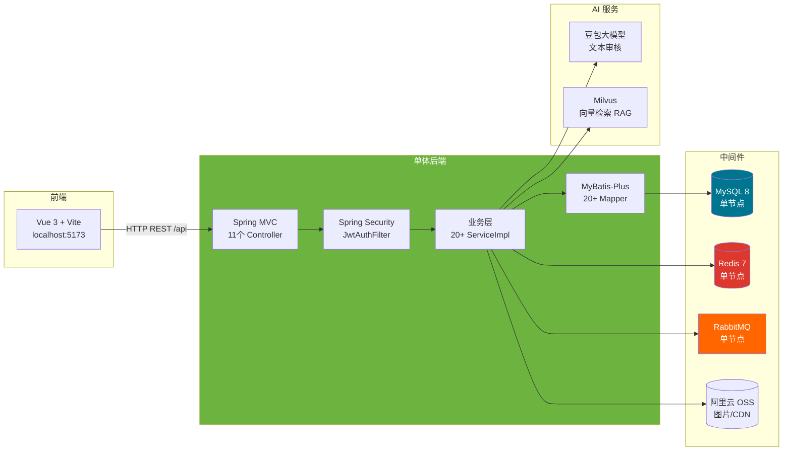
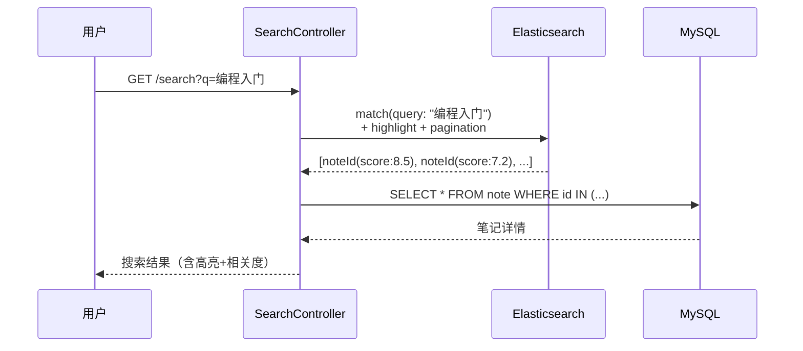
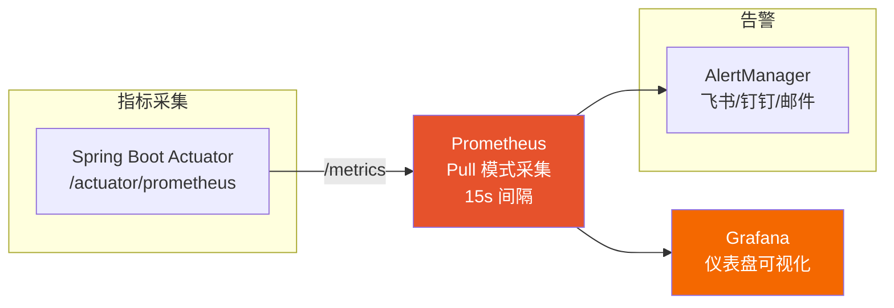
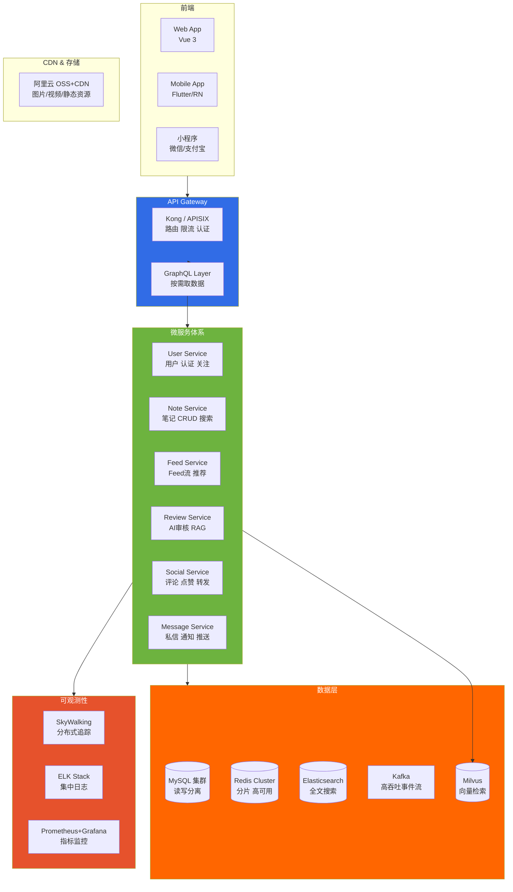
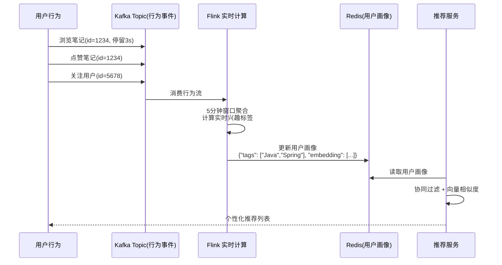
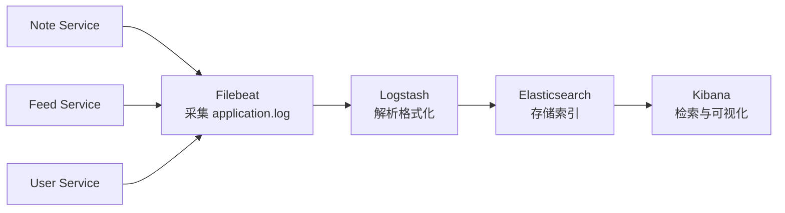

# 理享项目整体优化复盘与架构演进方向

> 本文是理享系列技术博客第14篇，对已完成的功能体系做一次完整复盘，识别当前架构的局限，并绘制面向高可用、高扩展的演进路线图。

---

## 一、项目回顾：我们交出了什么

理享项目经过13篇技术博客的系统构建，交付了一个功能相对完整的校园社交平台后端。按照领域划分，核心成果包括：

### 用户体系
- 基于 Spring Security 3.x + `OncePerRequestFilter` 的 JWT 无状态认证（`JwtAuthenticationFilter.java:72-118`）；
- BCrypt（cost=10）密码编码，`PasswordUtil.java:29` 封装 `BCryptPasswordEncoder.encode()`；
- 邮箱验证码注册/登录（`AuthController` 的 `SendCodeRequest` / `RegisterRequest` / `LoginRequest`）；
- 双 Token 机制：Access Token（15分钟）+ Refresh Token（7天），`JwtUtil.java:52` 的 `createToken()` 支持自定义过期时间。

### 社交互动
- 笔记全生命周期管理（`NoteServiceImpl`）：发布支持图片/视频，编辑，删除，收藏，转发（`ForwardMapper`）；
- 评论多层嵌套（`CommentServiceImpl`）+ 排序策略（`ICommentSortService`，支持热度优先/时间优先双模式）；
- 点赞去重（`CommentLikeMapper`，唯一约束防重复）；
- 关注/取关（`FollowServiceImpl`）+ 黑名单（`BlacklistServiceImpl`）。

### Feed 流与推荐
- 粉丝分化三层分发（`FeedServiceImpl` + `SmartFeedDistributionService`）：PUSH（<1K粉）、PULL（1K-100K粉）、HYBRID（>100K粉）；
- 基于活跃度模型的精准推送：
  ```
  activityScore = 7天登录×10 + 7天互动×5 + 30天登录×1
  ```
  活跃（≥120）PUSH → 普通（20-120）PULL → 僵尸（<20）跳过；
- RabbitMQ 异步投递（`RabbitMQConfig` 定义 `feed.push.exchange` → `feed.push.queue.v2` + DLX）；
- 热榜计算（`HotScoreScheduler` 定时调度）：
  ```
  hotScore = like×1 + comment×2 + favorite×3 + forward×5
  每日 0.9 衰减，防止老笔记长期霸榜
  ```
- Redisson 分布式锁（`DistributedLockUtil`）保障并发安全，DB-first 实现最终一致性。

### 内容安全
- 三层递进 AI 审核（`NoteReviewService` + `ValueReviewService` + `ReviewTaskConsumer`）：
  - 第一层：ACA自动机敏感词检测（`ACAutomaton`）——毫秒级拦截90%违规；
  - 第二层：Milvus 向量检索相似违规案例作为 RAG 上下文参考；
  - 第三层：豆包大模型（`DoubaoLlmService`，temperature=0.1）进行价值观判断；
- 异步审核（`ReviewAsyncTask`）+ RabbitMQ 队列（`quxiangshe.review.queue`）。

### 基础架构
- Snowflake 分布式 ID（`SnowflakeIdGenerator.java:46`，63位，单机百万级QPS）；
- 多级缓存：Caffeine 本地缓存 + Redis 集中缓存（`CacheUtil`）；
- 接口限流：`@RateLimit` 注解 + `RateLimitAspect` AOP，支持固定窗口/滑动窗口两种策略；
- WebSocket 实时通信：私信（`PrivateMessageServiceImpl`）+ 通知（`NotificationServiceImpl`）；
- 定时任务：评论排序补偿（`CommentSortScheduler`）、活跃度更新（`HotScoreScheduler`）、反作弊检测（`AntiCheatScheduler`）、对账修复（`ReconciliationScheduler`）。

这一系统的代码量已超过150个Java文件（Service、Mapper、Controller、Consumer、Scheduler、DTO、VO、Util），是一个有实际学习价值的完整后端项目。

---

## 二、架构现状全景图



当前架构的本质是一个**单体 Spring Boot 应用 + 外挂中间件**的模式。优点明显——开发效率高、调试方便、部署简单（一个 `docker compose up -d` 即可）；但随着用户量和功能膨胀，单体架构的弊端会逐渐显现。

---

## 三、当前局限与改进点

### 3.1 搜索：从 MySQL LIKE 到 Elasticsearch

**现状**：`SearchServiceImpl.java:55-82` 的核心搜索逻辑是：

```java
List<Note> notes = noteMapper.searchNotes(keyword, tags, size, offset);
```

底层 MyBatis Mapper XML 中使用 `content LIKE '%keyword%' OR title LIKE '%keyword%'`。`ISearchService` 接口中预留了 `syncNote()`、`syncUser()`、`createIndexes()` 等 ES 同步方法，当前全部为空实现。

**问题**：
- **全表扫描**：`LIKE '%keyword%'` 无法使用 B+Tree 索引，数据量超过10万时响应时间从毫秒级退化为秒级；
- **中文分词缺失**：无法识别 "苹果手机" 和 "手机苹果" 的语义等价性；
- **相关度排序粗糙**：简单的 `ORDER BY create_time DESC` 无法按内容相关性排序。

**演进方案**：



迁移核心步骤：
1. 安装 IK 分词器 + Pinyin 拼音插件；
2. 实现 `syncAllNotes()` 全量索引初始化；
3. `NoteController.createNote()` 创建笔记后异步调用 `syncNote(noteId)`；
4. 实现搜索请求的双写兼容（同时支持 ES 和 MySQL，通过开关切换）；
5. 灰度切换：先小流量验证 ES 搜索结果质量，确认无回归后全量切换。

### 3.2 Milvus：从部分集成到完整落地

**现状**：Milvus 在 `docker-compose.yml` 中尚未配置为独立服务，仅作为未来的向量数据库被提及。`ValueReviewService` 中的 RAG 案例检索目前依赖占位代码，并未真正接入 Milvus 向量相似度查询。

**演进方案**：
1. 在 `docker-compose.yml` 中新增 milvus-standalone 服务；
2. 将违规案例库向量化（可用 text2vec 或豆包 Embedding API）并灌入 Milvus 集合；
3. `NoteReviewService` 中实现真正的向量检索：笔记文本 → Embedding → Milvus search（TopK=5）→ 相似案例上下文 → 豆包 LLM 审核；
4. 建立违规案例的增量更新 Pipeline（新确认的违规内容自动入库）。

### 3.3 监控：从零到 Prometheus + Grafana

**现状**：理享目前完全没有任何可观测性基础设施。排查问题只能：
- `docker compose logs -f backend` 看日志；
- 登录 MySQL 客户端 `SELECT COUNT(*) FROM note` 估算数据量；
- RabbitMQ 管理界面看队列积压数量。

**演进方案**：



实施步骤：
1. 引入 `micrometer-registry-prometheus` 依赖；
2. 暴露 `/actuator/prometheus` 端点（在 `SecurityConfig` 白名单中添加）；
3. 部署 Prometheus 抓取 JVM 指标（堆内存、GC 暂停时间、http.server.requests 延迟）；
4. Grafana 导入 Spring Boot Dashboard（Dashboard ID: 10280）快速获得可视化面板；
5. 配置 Prometheus Alerting Rules：API 错误率 > 5%、P99 延迟 > 2s、JVM 堆使用率 > 80% 时触发告警。

### 3.4 CI/CD：从手动到自动化

**现状**：部署依赖开发者手动执行 `git pull` → `docker compose up -d --build`，完全没有任何自动化管线。

**演进方案（GitHub Actions）**：

```yaml
name: Deploy to Production
on:
  push:
    branches: [main]
jobs:
  build-and-deploy:
    runs-on: ubuntu-latest
    steps:
      - uses: actions/checkout@v4
      - name: Set up JDK 17
        uses: actions/setup-java@v4
        with: { java-version: '17', distribution: 'temurin' }
      - name: Build with Maven
        run: mvn -f backend/pom.xml clean package -DskipTests
      - name: Build and push Docker image
        run: |
          docker build -t registry.example.com/lixiang-backend:latest ./backend
          docker push registry.example.com/lixiang-backend:latest
      - name: Deploy to server
        uses: appleboy/ssh-action@v1
        with:
          host: ${{ secrets.SSH_HOST }}
          script: |
            docker pull registry.example.com/lixiang-backend:latest
            cd /opt/lixiang && docker compose up -d backend
```

---

## 四、未来架构演进全景图



这个全景图展示了系统从当前单体形态，演进到完整微服务生态后的最终形态。下面逐一展开各演进方向的实现路径。

---

## 五、微服务拆分路线图

单体拆微服务应遵循**渐进式拆分**原则，而非一次全量重构——因为一次重构的爆炸半径太大，且缺少灰度验证的机会。

### 第一阶段（低风险拆离）

优先拆离**独立性强、与核心业务耦合低**的模块：

- **Review Service（AI审核服务）**：审核逻辑自成闭环，输入是笔记文本/图片，输出是审核结果。与主链路的耦合仅通过 RabbitMQ 异步解耦，天然适合独立部署；
- **Message Service（私信/通知服务）**：消息业务的数据模型、访问模式（高频写、顺序读、WebSocket推送）与主业务完全不同，独立后可针对消息场景做专项优化（如 WebSocket 连接池、消息持久化策略）。

### 第二阶段（核心业务解绑）

- **User Service**：用户注册、登录、认证、关注关系管理。JWT 认证逻辑下沉到 Gateway 层而非各服务各自校验；
- **Note Service**：笔记的 CRUD + Elasticsearch 索引同步。与 Feed Service 间通过 Kafka 事件通信；
- **Feed Service**：Feed 流分发、热点计算、推荐排序。消费 Note Service 发布的"新笔记"事件，写入粉丝收件箱。

### 第三阶段（服务治理）

引入 **Kubernetes + Istio Service Mesh** 解决微服务的通信治理难题：

| 需求 | Istio 提供的方案 |
|------|-----------------|
| 服务发现 | K8s DNS + Istio ServiceEntry |
| 负载均衡 | Envoy Sidecar 的 L7 负载均衡（支持一致性哈希、Ring Hash） |
| 流量管理 | VirtualService（金丝雀发布、A/B 测试、流量镜像） |
| 熔断限流 | DestinationRule + ConnectionPoolSettings |
| 安全通信 | mTLS 自动加密服务间通信 |
| 可观测性 | Envoy 自动上报 Trace/Metrics 到 SkyWalking/Prometheus |

---

## 六、实时推荐与大数据计算

当前 Feed 流分发本质上是一种**基于规则的静态推荐**——按粉丝数 + 活跃度分策略投递。要真正实现个性化推荐，需要引入实时计算引擎：



技术选型建议：

| 场景 | 推荐方案 | 理由 |
|------|---------|------|
| 实时行为处理 | Apache Flink | 真正的流式处理，事件时间语义，精确一次保证 |
| 离线批量训练 | Apache Spark MLlib | 成熟的机器学习算法库，周级别模型更新 |
| 特征存储 | Redis Cluster | 低延迟 KV 查询，支持向量索引 |
| 事件总线 | Kafka | 高吞吐持久化，Flink/Spark 的天然数据源 |

**移动推送**：在用户画像完善后，可以引入推送通知服务（如极光推送 JPush、Firebase Cloud Messaging），实现 "你可能感兴趣的新笔记" 的 App Push——这需要在后端新增一个 `push-notification-service`，通过 FCM HTTP v1 API 向移动端推送。

---

## 七、GraphQL API 层

理享目前拥有11个 REST Controller，前端需要调用的接口可能跨越多个 Controller（如笔记详情页需要：笔记内容 + 作者信息 + 评论列表 + 是否已点赞/收藏）。REST 模式下前端需要发起 3-5 个 HTTP 请求拼接数据。

**GraphQL 的核心价值**："一次请求，精确返回客户端需要的字段"。

```graphql
# 一次请求获取笔记详情页全部所需数据
query NoteDetail($id: ID!) {
  note(id: $id) {
    title
    content
    images
    hotScore
    author {
      nickname
      avatar
      isFollowed
    }
    comments(first: 20) {
      edges {
        node {
          content
          user { nickname }
          likeCount
          isLiked
        }
      }
    }
    isCollected
    isForwarded
  }
}
```

实施建议：
- 引入 `graphql-java-kickstart` 或 Netflix DGS 框架，不替换现有 REST Controller，**双协议共存**（REST 保持向后兼容，GraphQL 作为新客户端接入点）；
- 对 N+1 查询问题使用 **DataLoader** 批量加载（如评论列表关联的用户信息），将 N 次单条查询合并为 1 次 IN 查询。

---

## 八、生产就绪检查清单

一个系统从 "能运行" 到 "能交付生产"，需要具备以下能力：

### 8.1 APM（应用性能监控）

| 工具 | 覆盖范围 | 理享适配要点 |
|------|----------|-------------|
| Spring Boot Actuator | JVM 指标、HTTP 指标 | 引入 `micrometer-registry-prometheus` |
| Prometheus | 指标采集与存储 | 15s 抓取间隔，`nacos` 或 `consul` 做服务发现 |
| Grafana | 仪表盘可视化 | 导入 Dashboard 10280 + 12856（RabbitMQ 监控） |

### 8.2 分布式追踪

单体时代排查问题靠线程栈和本地日志，微服务化后一个请求可能经过4-5个服务，需要分布式追踪还原调用链路。

| 工具 | 特点 | 建议 |
|------|------|------|
| Apache SkyWalking | Java Agent 零侵入，中文社区活跃 | 推荐，与 Spring Boot 3.x 兼容好 |
| Jaeger | CNCF 项目，兼容 OpenTracing | 备选 |
| Zipkin | Twitter 出品，经典方案 | 学习价值高，生产可用 |

集成 SkyWalking 仅需在 JVM 启动参数添加：

```bash
java -javaagent:skywalking-agent.jar \
     -DSW_AGENT_NAME=lixiang-note-service \
     -DSW_AGENT_COLLECTOR_BACKEND_SERVICES=skywalking-oap:11800 \
     -jar app.jar
```

### 8.3 集中式日志（ELK Stack）



核心收益：不再需要 `docker compose logs -f backend && docker compose logs -f backend2 && ...`，一次搜索`(lixiang-note-service OR lixiang-feed-service) AND ERROR AND traceId:abc123` 即可定位跨服务错误。

### 8.4 自动化部署（CI/CD Pipeline）

完整 CI/CD 流程建议：

```
代码提交 → GitHub Actions 编译 → 单元测试 → 镜像构建 → 推送镜像仓库
    → ArgoCD 监听镜像变更 → K8s 滚动更新 → 健康检查 → 金丝雀验证 → 全量上线
```

---

## 九、可扩展性进阶

### 9.1 MySQL 读写分离

当前 `application-docker.yml` 中数据源指向单一 MySQL 实例。随着读多写少（笔记浏览 >> 笔记发布）的流量特征显现，应引入读写分离：

```
Spring Boot 路由规则:
  @Transactional(readOnly=true)  → 从库（Slave）
  @Transactional / 无注解       → 主库（Master）
```

推荐使用 **ShardingSphere-JDBC**（与 MyBatis-Plus 兼容好），配置示例：

```yaml
spring:
  shardingsphere:
    datasource:
      names: master, slave0
    rules:
      readwrite-splitting:
        data-sources:
          ds_0:
            write-data-source-name: master
            read-data-source-names: [slave0]
            load-balancer-name: round_robin
```

### 9.2 Redis Cluster 分片

单节点 Redis 的上限是物理内存。当需要缓存的数据超过64GB，或需要高可用免停机时，应升级为 Redis Cluster：

```
Redis Cluster (3主3从，共6节点):
  主节点 A (slot 0-5460)     ←→  从节点 A' (自动故障转移)
  主节点 B (slot 5461-10922)  ←→  从节点 B'
  主节点 C (slot 10923-16383) ←→  从节点 C'
```

Spring Boot 侧的改动很小——将 `spring.data.redis.host` 改为 `spring.data.redis.cluster.nodes`：

```yaml
spring:
  data:
    redis:
      cluster:
        nodes: redis-1:6379,redis-2:6379,redis-3:6379
      password: ${REDIS_PASSWORD}
```

Lettuce 客户端天然支持 Redis Cluster 拓扑感知和自动重定向（Slot 不在当前节点时返回 MOVED 重定向）。

### 9.3 Kafka 替代 RabbitMQ（高吞吐场景）

当前 RabbitMQ 3.12 的吞吐上限约为单队列 20K~50K msg/s（持久化模式）。如果未来笔记发布 QPS 达到万级，Feed 推送的消息量将指数增长（一条笔记 → N 个粉丝 → N 条推送事件）。

Kafka 在此场景下的优势：

| 对比维度 | RabbitMQ | Kafka |
|----------|----------|-------|
| 吞吐量 | 2万~5万 msg/s | 百万级 msg/s |
| 消息持久化 | 内存 + 磁盘 + 索引 | 顺序写磁盘（Page Cache） |
| 消费模式 | Push（Broker推Consumer） | Pull（Consumer按自己节奏拉） |
| 消息回溯 | 不支持 | 支持（按 offset 回放） |
| 适用场景 | 业务命令（注册/发邮件） | 事件流（行为日志/Feed分发） |

渐进迁移策略：
1. Feed 分发的高吞吐子场景先切 Kafka（新增 `feed.push` Topic）；
2. 低吞吐场景（邮件/私信/审核）保留 RabbitMQ，两者共存；
3. 观察 Kafka 生产稳定性后，逐步迁移 RabbitMQ 的其他队列。

### 9.4 CDN 静态资源加速

当前图片/视频通过阿里云 OSS 存储，但访问链接是原始 OSS Endpoint（如 `oss-cn-beijing.aliyuncs.com`），所有流量直穿公网到 OSS 源站。配置 CDN 后：

```
用户请求 → CDN 边缘节点(hit) → 直接返回
用户请求 → CDN 边缘节点(miss) → OSS 源站 → 缓存 → 返回
```

推荐使用阿里云 CDN（与 OSS 原生集成），配置项：
- 回源 OSS Bucket 绑定自定义域名 + CDN CNAME；
- 缓存策略：图片缓存 7 天，视频缓存 30 天（版本号区分更新）；
- HTTPS 证书：CDN 边缘节点开启 HTTPS，全链路加密。

---

## 结语

理享项目从零开始，我们走过了从单体架构设计到 Docker Compose 部署的完整生命周期。本文以诚实的视角审视了当前系统的局限——MySQL LIKE 搜索、未完成的 Milvus 集成、零监控的盲区、手动部署的脆弱——并逐一给出了可落地的演进方案。

从单体到微服务，从 Docker Compose 到 Kubernetes，从 Redis 单机到 Redis Cluster，从 RabbitMQ 到 Kafka+Reactive Streams——这条路没有尽头，但每一步都是有据可循的技术升维。下一篇如果有需要，我们会深入探讨微服务拆分后的具体代码实现（Spring Cloud Alibaba、gRPC 接口定义、Sentinel 流量治理等）。

> **全系列完。感谢阅读。**

---

*上一篇：第十三篇《项目线上部署与Docker配置》*
